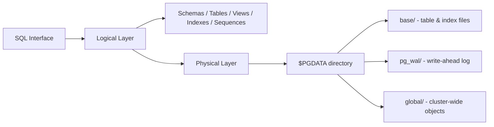
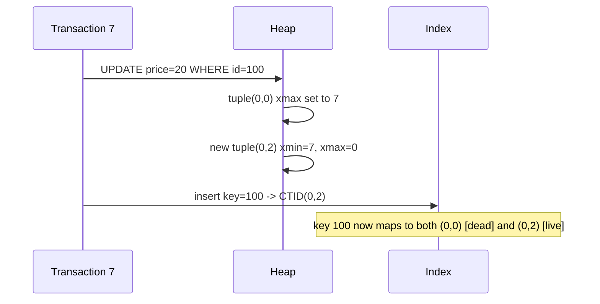

# PostgreSQL Internals: Pages, Tuples, MVCC & Indexes

> Notes on how PostgreSQL physically stores data, handles updates via MVCC, and why index lookups still need a "heap fetch."

---

## 1. Table & Page Architecture on Disk

A PostgreSQL table isn't just a logical concept — it maps directly to a **physical file** on disk.

- That file is broken into fixed-size **pages** (also called blocks).
- Each page is **8 KB** by default.
- Pages are numbered sequentially starting from `0`: Page 0, Page 1, Page 2, ...

**Why fixed-size pages matter:** because every page is exactly 8 KB, Postgres can calculate the exact byte offset of any page from its page number alone. This means it can **seek directly** to the right 8 KB chunk instead of scanning the whole file — keeping reads fast even on huge tables.

```
Table File on Disk (array of 8 KB pages)
+----------+----------+----------+
|  Page 0  |  Page 1  |  Page 2  |  ...
+----------+----------+----------+
```

---

## 2. Tuples, Line Pointers & the Shared Buffer

When a row is read or written, Postgres pulls the relevant 8 KB page from disk into RAM — into a cache called the **Shared Buffer**.

Inside each page, rows are stored as **tuples** (row versions). The page layout is clever: two structures grow toward each other from opposite ends to make full use of space.

| Structure | Location | Grows | Purpose |
|---|---|---|---|
| **Line Pointers** | Top of page | Downward ↓ | Index (0, 1, 2...) → offset pointing to a tuple |
| **Tuples** | Bottom of page | Upward ↑ | Actual row data |
| **The Heap** | — | — | The overall file/memory structure holding raw row data |

```
Cached Page in Shared Buffer (RAM)
+----------------------------------------------------+
| Page Header (metadata + line pointers)              |
|  Line Pointer 0 ───► offset to Tuple A               |
|  Line Pointer 1 ───► offset to Tuple B               |
|  Line Pointer 2 ───► offset to Tuple C               |
|                                                      |
|            [ free space, shrinking ]                |
|                                                      |
|  Tuple C  (id: 100, price: $20)  xmin=7  xmax=0      |
|  Tuple B  (id: 200, price: $5)   xmin=2  xmax=0      |
|  Tuple A  (id: 100, price: $10)  xmin=1  xmax=7      |
+----------------------------------------------------+
```

---

## 3. CTID & B+Tree Indexes

Every tuple has a unique physical address: the **CTID** (Current Tuple ID).

```
CTID = (page_number, line_pointer_index)
```

- `(0, 0)` → Page 0, Line Pointer 0
- `(1, 5)` → Page 1, Line Pointer 5

Postgres's default index type (**B+Tree**) does **not** store row data — only a sorted map of key → CTID.

| Indexed Key | Heap CTID |
|---|---|
| ID: 100 | (0, 0) |
| ID: 100 | (0, 2) |
| ID: 200 | (0, 1) |
| ID: 700 | (1, 5) |

**Lookup flow:** traverse the B+Tree → find the key → get the CTID → seek that exact page → fetch the tuple.

---

## 4. MVCC: Why Updates Are Never "In-Place"

PostgreSQL's core design decision: **it never overwrites a row in place.** Instead it uses **MVCC (Multi-Version Concurrency Control)**, allowing readers and writers to never block each other.

### System headers on every tuple

| Header | Meaning |
|---|---|
| `xmin` | Transaction ID that **created** this tuple version |
| `xmax` | Transaction ID that **ended** (deleted/updated) this version. `0` if still alive |

### Update lifecycle (example: item `100`, price `$10 → $20`, run in Transaction 7)

1. The old tuple at `(0, 0)` is **not overwritten**.
2. Its `xmax` is set to `7` — marking it as logically ended.
3. A **new tuple** is written to free space on the page (ideally the same page), with `xmin = 7`, `xmax = 0`.
4. A **new index entry** is added pointing to the new CTID `(0, 2)`.

Result: both `(0, 0)` and `(0, 2)` now exist in the index for key `100` — one dead, one live.

### Visibility resolution ("the horizon")

Each transaction sees the data as of its own **snapshot**. Two transactions can legitimately see different values for the same row at the same time:

**Transaction 10 (started after Tx 7 committed):**
- Sees CTIDs `(0,0)` and `(0,2)`.
- `(0,0)`: created by Tx 1, ended by Tx 7 → in the past → **ignored**.
- `(0,2)`: created by Tx 7, still alive → **valid** → returns **$20**.

**Transaction 5 (started *before* Tx 7 began):**
- Sees the same two CTIDs.
- `(0,0)`: `xmin=1`, `xmax=7` — but Tx 7 happened *after* Tx 5's snapshot was taken, so Tx 7 is "the future" from Tx 5's point of view.
- Tx 5 **ignores** the update entirely → returns **$10**.

> This is the mechanism that guarantees: **readers never block writers, writers never block readers.**

---

## 5. The Heap Fetch Bottleneck

An index lookup alone is usually **not enough** to answer a query. Postgres must also visit the heap ("Heap Fetch") for two reasons:

1. **Visibility check** — `xmin`/`xmax` live on the tuple in the heap, not in the index, so Postgres must check the heap to know if a version is visible to your snapshot.
2. **Column retrieval** — if you select columns that aren't part of the index (e.g. `price` when only `id` is indexed), Postgres must go to the heap to read them.

*(This is the underlying reason "index-only scans" and covering indexes exist — they try to avoid this extra heap trip.)*

---

## 6. Vacuum, Snapshot Pinning & Table Bloat

Because updates leave old tuple versions behind, tables accumulate garbage over time.

- A tuple no longer visible to **any** active transaction is a **dead tuple**.
- **Vacuum** is the background process that cleans up dead tuples and reclaims space inside pages.
- **Snapshot pinning**: a long-running transaction (like Tx 5 above) keeps needing an old tuple — so that tuple **cannot** be vacuumed while the transaction is open.
- **Table bloat**: while that old transaction stays open, Vacuum can't clean up *anything* modified after it started. New writes keep allocating fresh 8 KB pages while old dead tuples pile up unreclaimed — the table grows larger than the "live" data would require.

> **Practical takeaway:** long-running transactions (e.g. an app holding open a transaction, or a forgotten `BEGIN`) are a common real-world cause of table bloat.

---

## 7. Seeing It Yourself: SQL Demo

Postgres exposes these internals as hidden system columns: `ctid`, `xmin`, `xmax`.

```sql
-- 1. Create a simple table with a primary key (and therefore an index)
CREATE TABLE items (
    id    INT PRIMARY KEY,
    price NUMERIC
);

-- 2. Insert initial rows
INSERT INTO items (id, price) VALUES (100, 10.00);
INSERT INTO items (id, price) VALUES (200, 5.00);

-- 3. Inspect the hidden physical metadata
SELECT ctid, xmin, xmax, id, price FROM items;
```

```text
  ctid  | xmin | xmax | id  | price
--------+------+------+-----+-------
 (0,1)  |  101 |    0 | 100 | 10.00   -- created by Tx 101, still active (xmax=0)
 (0,2)  |  101 |    0 | 200 |  5.00   -- created by Tx 101, still active (xmax=0)
```

```sql
-- 4. Update item 100 (runs as a new transaction, e.g. Tx 105)
UPDATE items SET price = 20.00 WHERE id = 100;

-- 5. Inspect again
SELECT ctid, xmin, xmax, id, price FROM items;
```

```text
  ctid  | xmin | xmax | id  | price
--------+------+------+-----+-------
 (0,2)  |  101 |    0 | 200 |  5.00   -- unchanged
 (0,3)  |  105 |    0 | 100 | 20.00   -- brand-new tuple, xmin=105, ctid moved (0,1) -> (0,3)
```

> If you open a long-running transaction in a second session *before* step 4, and query from there, you'd still see the old tuple with `xmin = 101`, `xmax = 0` (or `xmax = 105` once the update commits and is visible to a later reader), demonstrating MVCC snapshot isolation in action.

---

## Quick-Reference Summary

| Concept         | One-line summary                                                    |
| --------------- | ------------------------------------------------------------------- |
| Page            | 8 KB fixed-size disk block; tables are arrays of pages              |
| Tuple           | A physical row version stored inside a page                         |
| Line Pointer    | Slot at top of page pointing to a tuple's offset                    |
| CTID            | `(page, line_pointer)` — a tuple's physical address                 |
| B+Tree Index    | Sorted map of `key → CTID`, no row data stored                      |
| `xmin` / `xmax` | Transaction IDs marking a tuple's birth / death                     |
| MVCC            | No in-place updates; old + new versions coexist until vacuumed      |
| Heap Fetch      | Extra trip to the heap for visibility checks / non-indexed columns  |
| Vacuum          | Background cleanup of dead tuples                                   |
| Table Bloat     | Dead tuples pile up when long transactions pin the snapshot horizon |

# PostgreSQL Internals — Storage, MVCC & Indexing

> Consolidated notes on how PostgreSQL physically stores data, how MVCC works, how B-Tree indexes are implemented, and how everything maps onto disk. Pure data-structure theory for B/B+ Trees lives in the companion file `btree-and-bplustree.md` — this file is about **how Postgres specifically uses them**.

---

## 1. Logical vs Physical Structure

Postgres separates two concerns:

- **Logical structure** — what you interact with via SQL: databases, schemas, tables, views, indexes, sequences, functions, triggers, tablespaces.
- **Physical structure** — how that logical structure is actually laid out as files, pages, and logs on disk.



### 1.1 Schemas
Namespaces inside a database that group related objects (tables, views, indexes, functions), preventing name collisions and simplifying permissions. Every database ships with a default `public` schema.

```sql
CREATE SCHEMA finance;
CREATE TABLE finance.transactions (...);
```

### 1.2 Heap Tables
Postgres's default table storage is a **heap table** — rows go wherever there's free space, with no guaranteed physical order. Because of MVCC, several versions ("tuples") of the same logical row can exist at once; old ones become **dead tuples** until `autovacuum` reclaims them.

### 1.3 Views
Stored queries, not stored data. Every read re-executes the underlying SQL. Useful for hiding complex joins, enforcing row/column-level security, and centralizing business logic. Postgres has no native "synonym" object (unlike Oracle) — the same effect is achieved with a view or by adjusting `search_path`.

### 1.4 Sequences
Concurrency-safe counters, typically backing auto-incrementing primary keys.

```sql
CREATE SEQUENCE emp_id_seq START 1 INCREMENT 1;
-- or, the shorthand that does the same thing implicitly:
CREATE TABLE employees (
    emp_id SERIAL PRIMARY KEY,
    name   TEXT
);
```
Gaps in a sequence (e.g. from a rolled-back transaction) are normal — Postgres never reuses a skipped value, since that would require locking.

### 1.5 Functions, Procedures & Triggers
Functions (PL/pgSQL, SQL, or extension languages like PL/Python) push business logic into the database. Triggers fire functions automatically on `INSERT`/`UPDATE`/`DELETE`, commonly used for audit logging and cascading consistency rules.

### 1.6 Tablespaces
Map logical objects to physical disk locations, letting DBAs put hot tables/indexes on fast storage (SSD) and cold data on cheap storage. Built-ins are `pg_default` (`$PGDATA/base/`) and `pg_global` (`$PGDATA/global/`); custom ones are created explicitly:

```sql
CREATE TABLESPACE fast_ssd LOCATION '/mnt/fast_ssd';
CREATE TABLE large_table (id SERIAL PRIMARY KEY, data TEXT) TABLESPACE fast_ssd;
```

---

## 2. Physical Storage — Inside `$PGDATA`

| Directory | Purpose |
|---|---|
| `base/` | Actual table/index data, one subfolder per database OID; each object stored as a file named by its own OID; files over ~1 GB split into segments |
| `global/` | Cluster-wide objects — roles, permissions, cluster settings, system catalogs shared across all databases |
| `pg_wal/` (was `pg_xlog`) | **Write-Ahead Log** — every change is logged here *before* being applied to data files, enabling crash recovery, point-in-time recovery, and streaming replication |
| `pg_xact/` (was `pg_clog`) | Commit/abort status of every transaction — the backbone MVCC uses to know which tuple versions are valid |
| `pg_commit_ts/` | Optional per-transaction commit timestamps (`track_commit_timestamp = on`), useful for logical-replication conflict resolution |
| `pg_logical/` | State for logical replication — replication slots and how far each subscriber has consumed the WAL stream |
| `pg_stats/` | Planner statistics (row counts, histograms, correlation) used to pick query plans; kept fresh via `ANALYZE`/`VACUUM ANALYZE` |
| `pg_tblspc/` | Symlinks to custom tablespace locations outside `$PGDATA` |

Example file path: `$PGDATA/base/16384/24576` → database OID `16384`, object (table/index) OID `24576`.

Three special databases live in `base/`: **template0** (pristine, read-only, used for fully clean new databases), **template1** (customizable default template new databases copy from), and **postgres** (the default admin workspace).

---

## 3. Pages & Tuples

Every table maps to a physical file broken into fixed-size **pages** (8 KB by default), numbered from 0. Because every page is the same size, Postgres can compute the exact byte offset of any page and seek straight to it — no need to scan the whole file.

```
Table File on Disk (array of 8 KB pages)
+----------+----------+----------+
|  Page 0  |  Page 1  |  Page 2  |  ...
+----------+----------+----------+
```

When a page is needed, it's pulled into RAM into the **Shared Buffer** (Postgres's page cache). Inside a cached page, two structures grow toward each other:

| Structure | Location | Grows | Purpose |
|---|---|---|---|
| Line Pointers | Top of page | Downward | Slot index → byte offset of a tuple |
| Tuples | Bottom of page | Upward | Actual row data |

```
Cached Page in Shared Buffer (RAM)
+----------------------------------------------------+
| Page Header                                          |
|  Line Pointer 0 ───► offset to Tuple A                |
|  Line Pointer 1 ───► offset to Tuple B                |
|  Line Pointer 2 ───► offset to Tuple C                |
|            [ free space, shrinking ]                 |
|  Tuple C  (id: 100, price: $20)  xmin=7  xmax=0       |
|  Tuple B  (id: 200, price: $5)   xmin=2  xmax=0       |
|  Tuple A  (id: 100, price: $10)  xmin=1  xmax=7       |
+----------------------------------------------------+
```

### CTID — a tuple's physical address
```
CTID = (page_number, line_pointer_index)
```
`(0, 0)` → page 0, line pointer 0. This is the value Postgres's B-Tree index stores instead of a copy of the row.

---

## 4. MVCC — Why Postgres Never Updates In-Place

Postgres's defining design choice: **it never overwrites a row.** Every tuple carries two system headers:

| Header | Meaning |
|---|---|
| `xmin` | Transaction ID that **created** this version |
| `xmax` | Transaction ID that **ended** it (0 if still alive) |

### Update lifecycle (item `id=100`, price `$10 → $20`, run as Tx 7)
1. Old tuple at `(0,0)` is left untouched on disk.
2. Its `xmax` is set to `7`.
3. A **new tuple** is appended into free space (ideally the same page): `xmin=7, xmax=0`.
4. A **new index entry** is added, pointing the key `100` at the new CTID `(0,2)`.



### Snapshot visibility ("the horizon")
Each transaction reads a consistent snapshot from the moment it started, so two transactions can legitimately see different values for the same row simultaneously:

- **Tx 10** (started after Tx 7 committed): sees `(0,0)` as dead (`xmax=7` is in its past → ignored) and `(0,2)` as live → returns **$20**.
- **Tx 5** (started *before* Tx 7 began): Tx 7's changes are "the future" relative to Tx 5's snapshot, so the update is ignored entirely → returns **$10**.

This is exactly what lets **readers never block writers, and writers never block readers.**

---

## 5. The Heap Fetch Bottleneck

An index hit alone usually isn't enough to answer a query — Postgres still needs a trip to the heap, for two reasons:

1. **Visibility check** — `xmin`/`xmax` live on the heap tuple, not in the index, so Postgres must check the heap to know whether *your* snapshot can see that version.
2. **Column retrieval** — if the query selects columns the index doesn't cover (e.g. `price` when only `id` is indexed), the actual values only exist in the heap.

This extra trip is exactly why **index-only scans** and **covering indexes** exist — they're attempts to avoid it.

---

## 6. Vacuum, Snapshot Pinning & Bloat

- A tuple no longer visible to *any* active transaction is a **dead tuple**.
- **Vacuum** (usually `autovacuum`) reclaims dead tuples' space.
- **Snapshot pinning**: a long-running transaction (like Tx 5 above) may still need an old tuple, so Vacuum cannot remove anything that transaction might still read.
- **Table bloat**: while that old transaction stays open, new writes keep allocating fresh pages while old dead tuples pile up unreclaimed — the table grows well beyond what the live data actually needs.

> **Practical takeaway:** a forgotten open transaction (e.g. an app holding a connection with `BEGIN` never committed) is one of the most common real-world causes of table bloat.

---

## 7. B-Tree Indexes in Postgres Specifically

Postgres's default index type is a **B+Tree** (see the companion file for the general data structure). A few Postgres-specific details:

- **Index entries point directly at the heap tuple** via CTID `(page, line_pointer)` — not at a separate primary-key lookup. This is the key architectural difference from MySQL/InnoDB, covered below.
- Each B+Tree node is sized to fit one 8 KB page, same as a heap page — this keeps I/O predictable and lets much of the upper tree (root + internal nodes) live comfortably in memory.
- `CREATE INDEX` sorts the target column's values and builds the balanced tree bottom-up, keeping all leaves at the same depth.

```sql
CREATE INDEX idx_publication_year ON books (publication_year);
```

**Lookup flow:** traverse the B+Tree → find the key → read its CTID → seek that exact heap page → fetch the tuple (the "heap fetch" from §5).

### Demonstration: `EXPLAIN ANALYZE` before/after an index

Without an index, a range filter forces a full **Seq Scan**:
```
Seq Scan on books  (cost=0.00..2357.12 rows=50851 width=36) (actual time=0.010..21.469 rows=50451 loops=1)
  Filter: ((publication_year >= 2008) AND (publication_year <= 2018))
  Rows Removed by Filter: 50557
Execution Time: 24.513 ms
```

After `CREATE INDEX idx_publication_year ON books (publication_year);`, the planner switches to a **Bitmap Index Scan** feeding a **Bitmap Heap Scan**:
```
Bitmap Heap Scan on books  (cost=701.52..2306.28 rows=50851 width=36) (actual time=2.957..11.328 rows=50451 loops=1)
  Recheck Cond: ((publication_year >= 2008) AND (publication_year <= 2018))
  Heap Blocks: exact=842
  ->  Bitmap Index Scan on idx_publication_year  (actual time=2.843..2.843 rows=50451 loops=1)
Execution Time: 13.730 ms
```
Roughly a 44% reduction in execution time on 100k rows — from an unavoidable full-table Seq Scan to targeted index traversal + heap fetch.

### Why the optimizer sometimes *skips* the index
Postgres's planner will choose a Seq Scan over an index when it estimates most rows will be touched anyway — e.g. no `WHERE` clause, a low-selectivity filter (`status = 'active'` when 90% of rows match), a function wrapped around the indexed column (`WHERE LOWER(name) = 'paul'`), or an `OR` spanning unindexed columns. Always confirm with `EXPLAIN ANALYZE` rather than assuming an index is being used.

### Other Postgres index types (beyond B+Tree)
| Type | Best for |
|---|---|
| B-tree (default) | Equality & range queries, sorting, primary/unique keys |
| Hash | Equality-only lookups (rarely chosen over B-tree in practice) |
| GIN | Full-text search, arrays, JSONB |
| GiST | Spatial/geometric data, range types |
| SP-GiST | Hierarchical or non-balanced data — IP ranges, subnets |
| BRIN | Very large, naturally-ordered, append-only tables; tiny storage footprint, less precise |

---

## 8. Postgres vs MySQL/InnoDB: Secondary Index Storage

This is the single biggest architectural fork between the two systems, and it comes down to what a secondary index's leaf value actually *is*:

| | **PostgreSQL** | **MySQL (InnoDB)** |
|---|---|---|
| Secondary index leaf stores | CTID `(page, line#)` — a fixed-size physical pointer straight to the heap tuple | The table's **primary key value** |
| Table organization | Heap table (tuples in insertion order, not physically sorted by PK) | **Clustered index** — the PK's B+Tree leaves *are* the full row (Index-Organized Table) |
| Cost of large/UUID primary keys | Cheap — CTIDs are always small and fixed-size regardless of PK type | Expensive — every secondary index duplicates the full PK; a 36-byte UUID PK × 5 indexes × 100M rows balloons index storage fast |
| Primary-key point lookups | One extra heap fetch after the index hit | Fast — the row is already sitting in the PK's leaf node |
| Write pattern with random PKs (e.g. UUID) | Handles it reasonably well | Causes page splits/fragmentation in the clustered index, hurting write throughput |

This is a well-known reason some large-scale systems (Uber being the famous example) have moved from Postgres to MySQL when their workload leans on cheap, fast PK-based clustered lookups — while write-heavy systems with large/random PKs and many secondary indexes tend to favor Postgres's model instead.

---

## Quick-Reference Summary

| Concept             | One-line summary                                                                  |
| ------------------- | --------------------------------------------------------------------------------- |
| Page                | 8 KB fixed-size disk block; a table is an array of pages                          |
| Tuple               | A physical row version stored inside a page                                       |
| Line Pointer        | Slot at the top of a page pointing to a tuple's offset                            |
| CTID                | `(page, line_pointer)` — a tuple's physical address; what Postgres's index stores |
| `xmin` / `xmax`     | Transaction IDs marking a tuple's birth / death                                   |
| MVCC                | No in-place updates; old + new versions coexist until vacuumed                    |
| Heap Fetch          | Extra trip to the heap for visibility checks / non-indexed columns                |
| Vacuum              | Background cleanup of dead tuples                                                 |
| Table Bloat         | Dead tuples pile up when a long transaction pins the snapshot horizon             |
| WAL (`pg_wal/`)     | Log-before-write mechanism enabling crash recovery & replication                  |
| Postgres index leaf | Points to CTID (heap tuple) directly                                              |
| InnoDB index leaf   | Points to primary key value (clustered index)                                     |