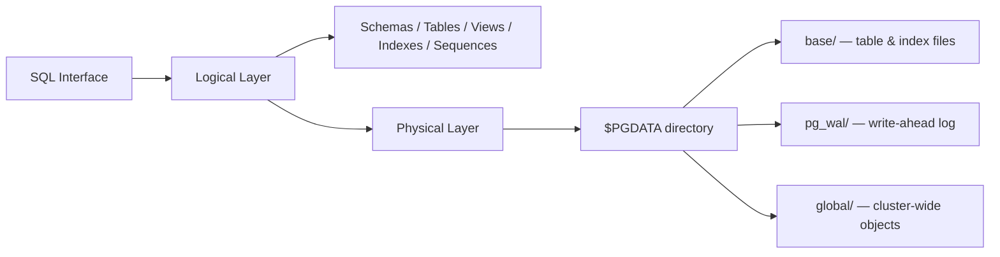
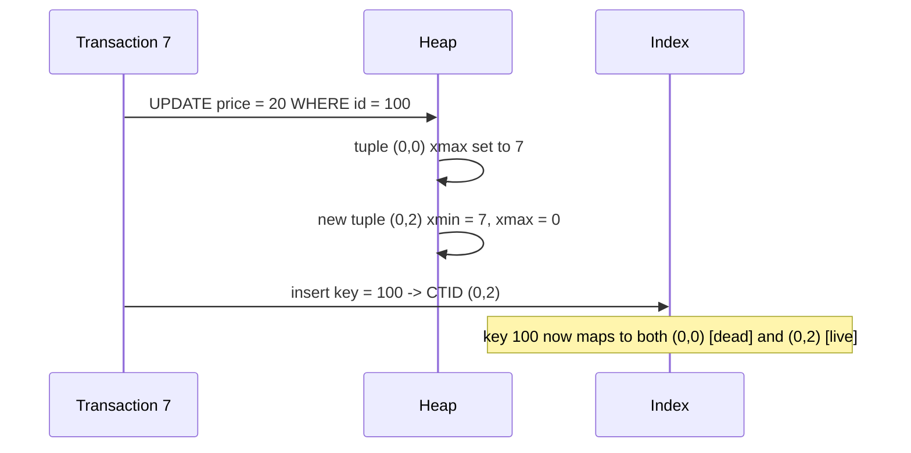

Map: [[Upskill/CS Topics/Computer Science|Computer Science]]
Connections: [[Upskill/CS Topics/Databases/SQL|SQL]], [[Upskill/DSA/Data Structures/B-Trees & B+ Trees|B-Trees & B+ Trees]]

> [!summary]
> How PostgreSQL organizes data logically and physically, how MVCC and indexing work under the hood, and how Postgres compares with MySQL/InnoDB.

---

## Table of Contents

1. [Logical vs. Physical Structure](#1-logical-vs-physical-structure)
2. [Logical Structure Deep Dive](#2-logical-structure-deep-dive)
3. [Physical Storage — Inside `$PGDATA`](#3-physical-storage--inside-pgdata)
4. [Pages, Tuples & the Shared Buffer](#4-pages-tuples--the-shared-buffer)
5. [CTID & How Indexes Point to Data](#5-ctid--how-indexes-point-to-data)
6. [MVCC: Why Postgres Never Updates In-Place](#6-mvcc-why-postgres-never-updates-in-place)
7. [The Heap Fetch Bottleneck](#7-the-heap-fetch-bottleneck)
8. [Vacuum, Snapshot Pinning & Table Bloat](#8-vacuum-snapshot-pinning--table-bloat)
9. [B-Tree Indexes in Postgres](#9-b-tree-indexes-in-postgres)
10. [Postgres vs. MySQL/InnoDB: Secondary Index Storage](#10-postgres-vs-mysqlinnodb-secondary-index-storage)
11. [Full SQL Walkthrough](#11-full-sql-walkthrough)
12. [Quick-Reference Summary](#12-quick-reference-summary)

---

## 1. Logical vs. Physical Structure

PostgreSQL separates two concerns:

- **Logical structure** — what you interact with via SQL: databases, schemas, tables, views, indexes, sequences, functions, triggers, tablespaces.
- **Physical structure** — how that logical structure is actually laid out as files, pages, and logs on disk.



Logical structures live inside schemas and can be mapped onto tablespaces — but ordinary users are shielded from *how* the data is physically stored. That's the layer this guide unpacks.

---

## 2. Logical Structure Deep Dive

### 2.1 Schemas — the foundation layer

Schemas are namespaces inside a database. They group related objects (tables, views, indexes, functions) so the same object name can exist in different schemas without colliding.

**Why schemas matter:**
- Isolate objects logically
- Prevent naming conflicts
- Simplify permission management (grant/revoke at the schema level)
- Support multi-tenancy

Every database ships with a default `public` schema — anything you create without specifying a schema lands there.

```sql
CREATE SCHEMA finance;
CREATE TABLE finance.transactions (...);
```

### 2.2 Heap Tables (base tables)

Postgres's default table storage is a **heap table**: rows go wherever there's free space, in insertion order, with **no guaranteed physical ordering**.

Because of MVCC, several versions ("tuples") of the same logical row can exist simultaneously. Old versions become **dead tuples** until `autovacuum` reclaims them.

**MVCC in heap tables, in short:**
- Readers and writers operate concurrently without blocking each other
- Every transaction sees a consistent snapshot from the moment it started
- System columns `xmin` (created-by) and `xmax` (ended-by) control which version is visible to which transaction

```sql
CREATE TABLE employees (
    emp_id     SERIAL PRIMARY KEY,
    name       TEXT NOT NULL,
    department TEXT,
    hire_date  DATE
);
```

### 2.3 Views (virtual tables) & the "no synonyms" gap

A view is a **stored query, not stored data**. Every read re-executes the underlying SQL.

**What views are good for:**
- Hiding complex joins behind a simple interface
- Row/column-level security layers
- Centralizing business logic so it behaves consistently across apps

```sql
CREATE VIEW active_employees AS
SELECT emp_id, name, department
FROM employees
WHERE status = 'ACTIVE';

-- Then simply:
SELECT * FROM active_employees;
```

**Synonyms:** Unlike Oracle, Postgres has **no native synonym object**. The same effect is achieved two ways:

| Technique | Example |
|---|---|
| A view acting as an alias | `CREATE VIEW my_synonym AS SELECT * FROM actual_schema.actual_table;` |
| Adjusting `search_path` | `SET search_path TO desired_schema, public;` |

### 2.4 Indexes — the key to performance

Without an index, Postgres must scan the entire table for every lookup. Indexes let it jump directly to matching rows.

| Type | Best for |
|---|---|
| **B-tree** (default) | Equality & range queries (`=`, `<`, `>`, `BETWEEN`), sorting, primary/unique keys |
| **Hash** | Equality-only lookups (rarely chosen over B-tree in practice) |
| **GIN** | Full-text search, arrays, JSONB |
| **GiST** | Spatial/geometric data, range types |
| **SP-GiST** | Hierarchical or non-balanced data — IP ranges, subnets |
| **BRIN** | Very large, naturally-ordered, append-only tables; tiny footprint, less precise |

**Tradeoffs of indexes:**
- Extra disk space for the index structure itself
- Slower writes — every `INSERT`/`UPDATE`/`DELETE` must also update all relevant indexes
- Poorly designed indexes can hurt performance instead of helping it

```sql
CREATE INDEX idx_department ON employees(department);
```

### 2.5 Sequences — concurrency-safe counters

Sequences generate unique numeric values (typically for primary keys) without locking, even under heavy concurrency.

**Key behavior:** if a transaction that pulled a sequence value rolls back, that value is **never reused** — gaps are normal and expected, because reuse would require locking.

```sql
-- Explicit sequence
CREATE SEQUENCE emp_id_seq START 1 INCREMENT 1;

CREATE TABLE employees (
    emp_id INTEGER DEFAULT nextval('emp_id_seq'),
    name   TEXT
);

-- SERIAL shorthand does the same thing implicitly:
CREATE TABLE employees (
    emp_id SERIAL PRIMARY KEY,
    name   TEXT
);
```

Sequences can also be customized with `START`, `INCREMENT`, min/max bounds, `CYCLE`, and caching behavior.

### 2.6 Functions, Procedures & Triggers

**Functions** push reusable business logic into the database itself:
- Centralizes rules/calculations instead of duplicating them across apps
- Callable by any client connecting to the database
- Supports procedural logic — `IF`, `LOOP`, error handling
- Procedures additionally support transaction control

Supported languages: **PL/pgSQL** (native), plain **SQL**, and extensions like **PL/Python**, PL/Perl, PL/Tcl.

```sql
CREATE FUNCTION calculate_bonus(salary NUMERIC) RETURNS NUMERIC AS $$
BEGIN
    RETURN salary * 0.10;
END;
$$ LANGUAGE plpgsql;

SELECT calculate_bonus(50000);  -- returns 5000
```

**Triggers** fire a function automatically on `INSERT`/`UPDATE`/`DELETE`. Common uses: audit logging, enforcing business rules, cascading updates.

```sql
CREATE TRIGGER log_update AFTER UPDATE ON employees
FOR EACH ROW EXECUTE FUNCTION audit_changes();
```
- `AFTER UPDATE` — fires once the update has completed
- `FOR EACH ROW` — runs per row affected, not once per statement

### 2.7 Tablespaces — mapping logical objects to physical disks

Tablespaces let DBAs choose *where on disk* an object physically lives — e.g., hot tables/indexes on SSD, cold data on cheap storage.

**Built-in tablespaces:**

| Tablespace | Contains | Physical location |
|---|---|---|
| `pg_default` | Most user-created objects by default | `$PGDATA/base/` |
| `pg_global` | Cluster-wide objects: roles, permissions, system catalogs | `$PGDATA/global/` |

```sql
CREATE TABLESPACE fast_ssd LOCATION '/mnt/fast_ssd';

CREATE TABLE large_table (
    id   SERIAL PRIMARY KEY,
    data TEXT
) TABLESPACE fast_ssd;
```

---

## 3. Physical Storage — Inside `$PGDATA`

Everything PostgreSQL needs to run lives under one root directory, `$PGDATA`: data files, transaction logs, system metadata, cluster configuration, and replication/recovery state.

| Directory | Purpose |
|---|---|
| **`base/`** | Actual table/index data. One subfolder per database OID; each object (table/index) stored as its own file, named by OID; files over ~1 GB auto-split into segments |
| **`global/`** | Cluster-wide objects — roles, permissions, system catalogs, cluster settings shared across *all* databases |
| **`pg_wal/`** (was `pg_xlog`) | **Write-Ahead Log** — every change is logged here *before* it touches data files, enabling crash recovery, PITR, and streaming replication |
| **`pg_xact/`** (was `pg_clog`) | Commit/abort status of every transaction — the backbone MVCC uses to know which tuple versions are valid |
| **`pg_commit_ts/`** | Optional per-transaction commit timestamps (`track_commit_timestamp = on`) — useful for logical-replication conflict resolution |
| **`pg_logical/`** | State for logical replication — replication slots and how far each subscriber has consumed the WAL stream |
| **`pg_stats/`** | Planner statistics (row counts, histograms, correlation) used to pick query plans; refreshed via `ANALYZE` / `VACUUM ANALYZE` |
| **`pg_tblspc/`** | Symlinks to custom tablespace locations that live outside `$PGDATA` |

**Example file path:** `$PGDATA/base/16384/24576`
→ database OID `16384`, object (table/index) OID `24576`.

### 3.1 The three special databases in `base/`

| Database | Nature | Purpose |
|---|---|---|
| **`template0`** | Pristine, **read-only** | The untouched original — used when you want a database with zero inherited customizations |
| **`template1`** | Customizable | The default source for `CREATE DATABASE`; add extensions/schemas/tables here to make them the default for all new databases |
| **`postgres`** | Default admin workspace | Safe space for config checks, quick queries, user/role management, testing commands — contains no application data by default |

### 3.2 Directory details worth knowing

- **`pg_commit_ts/`** is *optional* — many systems won't have meaningful data here unless `track_commit_timestamp` is explicitly turned on.
- **`pg_xact/`** is what makes MVCC possible: without knowing whether a transaction committed, aborted, or is still in progress, Postgres cannot decide which tuple versions are visible.
- **`pg_wal/`** files must be actively managed — **archived** for backups/PITR, or **recycled** once no longer needed — or disk space runs out.
- **`pg_stats/`** — in newer Postgres versions, much of the statistics system has moved into shared memory and system catalogs, though this directory still plays a backward-compatible role.

### 3.3 Why the physical layer matters in practice

| Concern | How physical-layer knowledge helps |
|---|---|
| 🔄 Backup & Restore | Know exactly which files to copy for a consistent backup |
| ⚙ High Availability | WAL understanding is required to set up streaming replication |
| 🚑 Disaster Recovery | Locate and isolate affected files during corruption/hardware failure |
| 📈 Performance | Use tablespaces to spread I/O across disks intentionally |
| 🕵 Troubleshooting | Map a slow query or missing data straight to the files involved |

---

## 4. Pages, Tuples & the Shared Buffer

A PostgreSQL table maps directly to a **physical file** on disk, broken into fixed-size **pages** (blocks), **8 KB by default**, numbered sequentially from `0`.

**Why fixed-size pages matter:** since every page is exactly 8 KB, Postgres can compute the exact byte offset of any page from its page number alone — it can **seek directly** to the right chunk instead of scanning the whole file.

```
Table File on Disk (array of 8 KB pages)
+----------+----------+----------+
|  Page 0  |  Page 1  |  Page 2  |  ...
+----------+----------+----------+
```

When a row is read or written, Postgres pulls the relevant 8 KB page from disk into RAM — into a cache called the **Shared Buffer**.

Inside each cached page, rows are stored as **tuples** (row versions). Two structures grow toward each other from opposite ends to make full use of space:

| Structure | Location | Grows | Purpose |
|---|---|---|---|
| **Line Pointers** | Top of page | Downward ↓ | Slot index (0, 1, 2…) → byte offset of a tuple |
| **Tuples** | Bottom of page | Upward ↑ | Actual row data |
| **The Heap** | — | — | The overall file/memory structure holding raw row data |

```
Cached Page in Shared Buffer (RAM)
+----------------------------------------------------+
| Page Header (metadata + line pointers)               |
|  Line Pointer 0 ───► offset to Tuple A                |
|  Line Pointer 1 ───► offset to Tuple B                |
|  Line Pointer 2 ───► offset to Tuple C                |
|                                                        |
|            [ free space, shrinking ]                  |
|                                                        |
|  Tuple C  (id: 100, price: $20)  xmin=7  xmax=0        |
|  Tuple B  (id: 200, price: $5)   xmin=2  xmax=0        |
|  Tuple A  (id: 100, price: $10)  xmin=1  xmax=7        |
+----------------------------------------------------+
```

---

## 5. CTID & How Indexes Point to Data

Every tuple has a unique physical address — the **CTID** (Current Tuple ID):

```
CTID = (page_number, line_pointer_index)
```

- `(0, 0)` → Page 0, Line Pointer 0
- `(1, 5)` → Page 1, Line Pointer 5

Postgres's default index type (**B+Tree**) does **not** store row data — only a sorted map of `key → CTID`.

| Indexed Key | Heap CTID |
|---|---|
| ID: 100 | (0, 0) |
| ID: 100 | (0, 2) |
| ID: 200 | (0, 1) |
| ID: 700 | (1, 5) |

**Lookup flow:** traverse the B+Tree → find the key → read its CTID → seek that exact heap page → fetch the tuple (this last hop is the "heap fetch" — see §7).

---

## 6. MVCC: Why Postgres Never Updates In-Place

PostgreSQL's core design decision: **it never overwrites a row in place.** Instead it uses **MVCC (Multi-Version Concurrency Control)**, so readers and writers never block each other.

### System headers on every tuple

| Header | Meaning |
|---|---|
| `xmin` | Transaction ID that **created** this tuple version |
| `xmax` | Transaction ID that **ended** (deleted/updated) this version — `0` if still alive |

### Update lifecycle — example: item `100`, price `$10 → $20`, run in Transaction 7

1. The old tuple at `(0, 0)` is **not overwritten**.
2. Its `xmax` is set to `7` — marking it as logically ended.
3. A **new tuple** is written to free space on the page (ideally the same page): `xmin = 7, xmax = 0`.
4. A **new index entry** is added pointing to the new CTID `(0, 2)`.

Result: both `(0, 0)` and `(0, 2)` now exist for key `100` in the index — one dead, one live.



### Visibility resolution ("the horizon")

Each transaction sees data as of its own **snapshot**, taken the moment it started. Two transactions can legitimately see different values for the same row at the same time.

**Transaction 10 (started after Tx 7 committed):**
- Sees CTIDs `(0,0)` and `(0,2)`.
- `(0,0)`: created by Tx 1, ended by Tx 7 → in the past → **ignored**.
- `(0,2)`: created by Tx 7, still alive → **valid** → returns **$20**.

**Transaction 5 (started *before* Tx 7 began):**
- Sees the same two CTIDs.
- `(0,0)`: `xmin=1, xmax=7` — but Tx 7 happened *after* Tx 5's snapshot was taken, so it's "the future" from Tx 5's point of view.
- Tx 5 **ignores** the update entirely → returns **$10**.

> This mechanism is exactly what guarantees: **readers never block writers, writers never block readers.**

---

## 7. The Heap Fetch Bottleneck

An index lookup alone is usually **not enough** to answer a query. Postgres must also visit the heap ("heap fetch") for two reasons:

1. **Visibility check** — `xmin`/`xmax` live on the tuple in the heap, not in the index, so Postgres must check the heap to know if a version is visible to your snapshot.
2. **Column retrieval** — if you select columns that aren't part of the index (e.g. `price` when only `id` is indexed), Postgres must go to the heap to read them.

*(This is the underlying reason "index-only scans" and covering indexes exist — they try to avoid this extra heap trip.)*

---

## 8. Vacuum, Snapshot Pinning & Table Bloat

Because updates leave old tuple versions behind, tables accumulate garbage over time.

- A tuple no longer visible to **any** active transaction is a **dead tuple**.
- **Vacuum** (usually running as `autovacuum`) is the background process that cleans up dead tuples and reclaims space inside pages.
- **Snapshot pinning:** a long-running transaction (like Tx 5 above) keeps needing an old tuple — so that tuple **cannot** be vacuumed while the transaction is open.
- **Table bloat:** while that old transaction stays open, Vacuum can't clean up *anything* modified after it started. New writes keep allocating fresh 8 KB pages while old dead tuples pile up unreclaimed — the table grows larger than the "live" data would require.

> **Practical takeaway:** long-running transactions (e.g. an app holding open a transaction, or a forgotten `BEGIN` that never commits) are one of the most common real-world causes of table bloat.

---

## 9. B-Tree Indexes in Postgres

Postgres's default index type is a **B+Tree**. A few Postgres-specific details:

- **Index entries point directly at the heap tuple** via CTID `(page, line_pointer)` — not at a separate primary-key lookup. This is the key architectural difference from MySQL/InnoDB (see §10).
- Each B+Tree node is sized to fit one 8 KB page, same as a heap page — this keeps I/O predictable and lets much of the upper tree (root + internal nodes) live comfortably in memory.
- `CREATE INDEX` sorts the target column's values and builds the balanced tree bottom-up, keeping all leaves at the same depth.

```sql
CREATE INDEX idx_publication_year ON books (publication_year);
```

**Lookup flow:** traverse the B+Tree → find the key → read its CTID → seek that exact heap page → fetch the tuple (the "heap fetch" from §7).

### 9.1 Demonstration: `EXPLAIN ANALYZE` before/after an index

**Without an index**, a range filter forces a full **Seq Scan**:
```text
Seq Scan on books  (cost=0.00..2357.12 rows=50851 width=36) (actual time=0.010..21.469 rows=50451 loops=1)
  Filter: ((publication_year >= 2008) AND (publication_year <= 2018))
  Rows Removed by Filter: 50557
Execution Time: 24.513 ms
```

**After** `CREATE INDEX idx_publication_year ON books (publication_year);`, the planner switches to a **Bitmap Index Scan** feeding a **Bitmap Heap Scan**:
```text
Bitmap Heap Scan on books  (cost=701.52..2306.28 rows=50851 width=36) (actual time=2.957..11.328 rows=50451 loops=1)
  Recheck Cond: ((publication_year >= 2008) AND (publication_year <= 2018))
  Heap Blocks: exact=842
  ->  Bitmap Index Scan on idx_publication_year  (actual time=2.843..2.843 rows=50451 loops=1)
Execution Time: 13.730 ms
```

Roughly a **44% reduction** in execution time on 100k rows — from an unavoidable full-table Seq Scan to targeted index traversal + heap fetch.

### 9.2 Why the optimizer sometimes *skips* the index

Postgres's planner will choose a Seq Scan over an index when it estimates most rows will be touched anyway:
- No `WHERE` clause
- A low-selectivity filter (e.g. `status = 'active'` when 90% of rows match)
- A function wrapped around the indexed column (`WHERE LOWER(name) = 'paul'`)
- An `OR` spanning unindexed columns

> Always confirm with `EXPLAIN ANALYZE` rather than assuming an index is being used.

### 9.3 Index types at a glance

| Type | Best for |
|---|---|
| **B-tree** (default) | Equality & range queries, sorting, primary/unique keys |
| **Hash** | Equality-only lookups (rarely chosen over B-tree in practice) |
| **GIN** | Full-text search, arrays, JSONB |
| **GiST** | Spatial/geometric data, range types |
| **SP-GiST** | Hierarchical or non-balanced data — IP ranges, subnets |
| **BRIN** | Very large, naturally-ordered, append-only tables; tiny storage footprint, less precise |

---

## 10. Postgres vs. MySQL/InnoDB: Secondary Index Storage

This is the single biggest architectural fork between the two systems, and it comes down to what a secondary index's leaf value actually *is*.

| | **PostgreSQL** | **MySQL (InnoDB)** |
|---|---|---|
| Secondary index leaf stores | CTID `(page, line#)` — a fixed-size physical pointer straight to the heap tuple | The table's **primary key value** |
| Table organization | Heap table (tuples in insertion order, not physically sorted by PK) | **Clustered index** — the PK's B+Tree leaves *are* the full row (Index-Organized Table) |
| Cost of large/UUID primary keys | Cheap — CTIDs are always small and fixed-size regardless of PK type | Expensive — every secondary index duplicates the full PK; a 36-byte UUID PK × 5 indexes × 100M rows balloons index storage fast |
| Primary-key point lookups | One extra heap fetch after the index hit | Fast — the row is already sitting in the PK's leaf node |
| Write pattern with random PKs (e.g. UUID) | Handles it reasonably well | Causes page splits/fragmentation in the clustered index, hurting write throughput |

> This is a well-known reason some large-scale systems (Uber being the famous example) have moved from Postgres to MySQL when their workload leans on cheap, fast PK-based clustered lookups — while write-heavy systems with large/random PKs and many secondary indexes tend to favor Postgres's model instead.

---

## 11. Full SQL Walkthrough

Postgres exposes these internals as hidden system columns: `ctid`, `xmin`, `xmax`.

```sql
-- 1. Create a simple table with a primary key (and therefore an index)
CREATE TABLE items (
    id    INT PRIMARY KEY,
    price NUMERIC
);

-- 2. Insert initial rows
INSERT INTO items (id, price) VALUES (100, 10.00);
INSERT INTO items (id, price) VALUES (200, 5.00);

-- 3. Inspect the hidden physical metadata
SELECT ctid, xmin, xmax, id, price FROM items;
```

```text
  ctid  | xmin | xmax | id  | price
--------+------+------+-----+-------
 (0,1)  |  101 |    0 | 100 | 10.00   -- created by Tx 101, still active (xmax=0)
 (0,2)  |  101 |    0 | 200 |  5.00   -- created by Tx 101, still active (xmax=0)
```

```sql
-- 4. Update item 100 (runs as a new transaction, e.g. Tx 105)
UPDATE items SET price = 20.00 WHERE id = 100;

-- 5. Inspect again
SELECT ctid, xmin, xmax, id, price FROM items;
```

```text
  ctid  | xmin | xmax | id  | price
--------+------+------+-----+-------
 (0,2)  |  101 |    0 | 200 |  5.00   -- unchanged
 (0,3)  |  105 |    0 | 100 | 20.00   -- brand-new tuple, xmin=105, ctid moved (0,1) -> (0,3)
```

> If you open a long-running transaction in a second session *before* step 4, and query from there, you'd still see the old tuple with `xmin = 101`, `xmax = 0` (or `xmax = 105` once the update commits and is visible to a later reader) — a direct demonstration of MVCC snapshot isolation.

---

## 12. Quick-Reference Summary

| Concept                 | One-line summary                                                                  |
| ----------------------- | --------------------------------------------------------------------------------- |
| **Page**                | 8 KB fixed-size disk block; a table is an array of pages                          |
| **Tuple**               | A physical row version stored inside a page                                       |
| **Line Pointer**        | Slot at the top of a page pointing to a tuple's offset                            |
| **CTID**                | `(page, line_pointer)` — a tuple's physical address; what Postgres's index stores |
| **B+Tree Index**        | Sorted map of `key → CTID`, no row data stored                                    |
| **`xmin` / `xmax`**     | Transaction IDs marking a tuple's birth / death                                   |
| **MVCC**                | No in-place updates; old + new versions coexist until vacuumed                    |
| **Heap Fetch**          | Extra trip to the heap for visibility checks / non-indexed columns                |
| **Vacuum**              | Background cleanup of dead tuples                                                 |
| **Table Bloat**         | Dead tuples pile up when long transactions pin the snapshot horizon               |
| **WAL (`pg_wal/`)**     | Log-before-write mechanism enabling crash recovery & replication                  |
| **Schema**              | Namespace grouping related objects within a database                              |
| **Heap Table**          | Postgres's default table storage — no guaranteed physical row order               |
| **View**                | Stored query; re-executed on every read, stores no data itself                    |
| **Sequence**            | Concurrency-safe counter, typically backing auto-increment PKs                    |
| **Tablespace**          | Maps a logical object to a physical disk location                                 |
| **Postgres index leaf** | Points to CTID (heap tuple) directly                                              |
| **InnoDB index leaf**   | Points to primary key value (clustered index)                                     |
