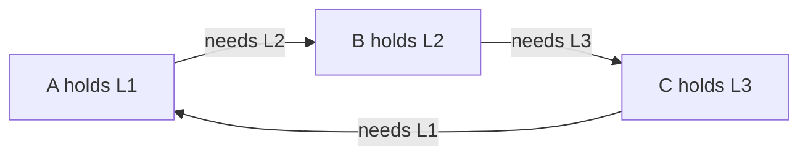

> [!summary]
> A deadlock is a cycle of work that cannot proceed because every participant waits for a resource held by another participant in the cycle.

> [!tip] Plain-English version
> The classic example: two people are eating with one fork and one knife between them. Person A grabs the fork and waits for the knife. Person B grabs the knife and waits for the fork. Neither will let go of what they're holding. Both wait forever. That's a deadlock — a closed loop of "I'm holding X, waiting for Y" where Y is held by someone waiting for X.

Map: [[Upskill/CS Topics/Operating Systems/Operating Systems|Operating Systems]]

## The Four Necessary Conditions

All four Coffman conditions must hold simultaneously for a deadlock to happen:

1. **Mutual exclusion:** at least one resource has exclusive ownership (can't be shared — like the fork, only one person can hold it).
2. **Hold and wait:** a participant holds one resource while waiting for another (A keeps the fork *while* waiting for the knife, instead of giving the fork back first).
3. **No preemption:** resources cannot be forcibly taken away safely (nobody can just grab the fork out of A's hand).
4. **Circular wait:** a cycle exists in the wait-for relationship (A waits on B, who waits on A — a closed loop).

Break any one condition and that class of deadlock cannot occur. This is the key practical insight: you don't need to fix all four, just reliably break one.



## Best Default: Prevent Circular Wait

Define one lock order and acquire multiple locks only in that order. This directly attacks condition #4 (circular wait) — if everyone must always ask for locks in the same fixed order (say, always lowest ID first), a cycle becomes mathematically impossible.

```java
void transfer(Account from, Account to, long amount) {
    Account first = from.id() < to.id() ? from : to;
    Account second = from.id() < to.id() ? to : from;

    synchronized (first) {
        synchronized (second) {
            from.debit(amount);
            to.credit(amount);
        }
    }
}
```

**Reading this line by line:** instead of always locking `from` then `to` (which could deadlock if another thread is transferring in the opposite direction at the same moment), this code compares account IDs and always locks the *lower-ID account first*, regardless of transfer direction. Two threads transferring money in opposite directions between the same two accounts will now both try to lock the same account first — so one simply waits its turn instead of the two threads deadlocking on each other.

The IDs create a stable global order regardless of transfer direction. Production code must also validate amounts and preserve transaction semantics; the snippet isolates the lock-ordering idea.

## Other Strategies

- **Prevent:** remove a necessary condition using lock ordering, one-at-a-time acquisition, or preemptible resources.
- **Avoid:** admit a request only if the resulting resource state remains safe. Banker's algorithm demonstrates this idea (it simulates whether granting a request could still let every process finish) but needs known maximum demands in advance, which most real services don't have.
- **Detect and recover:** build a wait-for graph (who's waiting on whom) or use runtime diagnostics, then cancel, restart, roll back, or terminate a participant to break the cycle.
- **Timeout and retry:** converts an indefinite wait into a visible failure, but can create livelock (see below) or duplicate effects without idempotency (an operation is idempotent if doing it twice has the same effect as doing it once) and jitter (randomized delay to avoid retries syncing up).
- **Ignore at the OS level:** general-purpose systems often let applications manage many lock deadlocks because forced recovery could violate application invariants (the OS can't safely guess which lock to yank away without possibly corrupting your data).

## Detecting a Java Deadlock

```java
ThreadMXBean threads = ManagementFactory.getThreadMXBean();
long[] ids = threads.findDeadlockedThreads();

if (ids != null) {
    for (ThreadInfo info : threads.getThreadInfo(ids, true, true)) {
        System.err.println(info);
    }
}
```

**Reading this line by line:** `ThreadMXBean` is a built-in JVM management interface. `findDeadlockedThreads()` asks the JVM to scan all live threads for a genuine lock-wait cycle and returns the IDs of any threads stuck in one (or `null` if none are found). The loop then prints full details (stack traces, held locks) for each deadlocked thread — this is exactly the kind of check an on-call engineer runs during an incident.

In an incident, also capture a full thread dump. A thread waiting for a lock is not proof of deadlock; look for a cycle and verify that no participant can make progress.

## Distributed Deadlocks

The same shape appears outside one process:

- database transactions lock rows in inconsistent order;
- services synchronously call each other in a cycle (service A calls B, which calls C, which calls back into A, and all are waiting on responses);
- a thread holds a connection-pool slot while waiting for work that needs another slot;
- bounded executors submit child work to the same saturated executor and wait synchronously (a classic "thread pool deadlock": a task on a pool of size N submits a sub-task to the *same* pool and blocks waiting for it, but all N threads are already busy waiting the same way).

There may be no single OS lock graph, so use request traces, pool metrics, database lock views, and dependency graphs.

## Not Every Stall Is a Deadlock

- **Starvation:** a participant is repeatedly denied a resource while others progress — everyone else is fine, just not you.
- **Livelock:** participants keep reacting but no useful work completes — like two people repeatedly stepping aside for each other in a hallway and never actually passing.
- **Priority inversion:** high-priority work waits for a resource held by lower-priority work (a scheduling quirk, not a lock cycle).
- **Slow dependency:** progress exists, just below an acceptable rate — this isn't stuck, it's just slow.

Correct diagnosis changes the fix. Adding retries to a true capacity deadlock can make it worse — it just adds more contenders stuck in the same cycle, potentially amplifying load and delaying detection.

## Incident Checklist

1. Capture thread, goroutine, database, and pool state before restarting.
2. Identify the resource each blocked participant owns and awaits.
3. Find the cycle or prove that progress is merely slow.
4. Restore service with the least damaging cancellation or restart.
5. Fix ownership, lock ordering, bounded capacity, or call topology.
6. Add a test and telemetry for wait duration and resource saturation.

## Key Vocabulary

| Term | Plain-English meaning |
|---|---|
| **Coffman conditions** | The four conditions (mutual exclusion, hold-and-wait, no preemption, circular wait) that must ALL be true for a deadlock. |
| **Wait-for graph** | A diagram of "who is waiting on whom" used to spot cycles. |
| **Starvation** | Repeatedly denied a resource, even though the system as a whole is making progress. |
| **Livelock** | Threads stay busy reacting to each other but no real work gets done — "active" but stuck. |
| **Priority inversion** | An important task stuck waiting behind a less important one that happens to hold a needed lock. |
| **Idempotent** | An operation that produces the same result whether it's run once or many times — safe to retry. |
| **Thread dump** | A snapshot of every thread's current stack trace and lock state, taken for debugging. |

---

## References

- [Java `ThreadMXBean`](https://docs.oracle.com/en/java/javase/25/docs/api/java.management/java/lang/management/ThreadMXBean.html) - Runtime deadlock detection and thread inspection.
