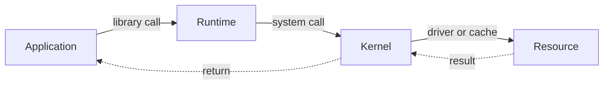

> [!summary]
> The kernel protects hardware and shared resources; a system call is a controlled request from application code to that kernel.

> [!tip] Plain-English version
> Imagine the CPU/RAM/disk as a bank vault. Your program is a customer. It can't walk into the vault itself — it has to ask a bank teller (the kernel) to do it on their behalf, and the teller checks you're allowed before acting. A **system call** is literally that request-and-response over the counter: "read this file for me," "give me 4KB of memory," "send this data over the network." The kernel is the only code trusted to actually touch the vault.

Map: [[Upskill/CS Topics/Operating Systems/Operating Systems|Operating Systems]]

## Kernel Responsibilities

The kernel provides mechanisms that applications cannot safely implement for themselves:

- schedule runnable threads on CPUs;
- isolate and map virtual memory;
- expose files, sockets, pipes, and devices through handles;
- enforce permissions and resource limits;
- deliver interrupts, timers, and signals;
- coordinate device drivers and hardware.

Libraries and runtimes build friendlier APIs on top. Java's `Files.readString`, Go's `os.ReadFile`, and Python's `open` eventually request kernel work, but they may buffer, cache, retry, or combine operations before making a system call.

## User Mode to Kernel Mode



> [!important]
> A mode switch is not automatically a context switch. A system call can enter the kernel and return to the same thread. A context switch occurs only if the scheduler changes the running thread or process context.

Think of **user mode** as "the sidewalk" (limited privileges, can't touch traffic lights) and **kernel mode** as "inside the traffic control room" (full access). A system call is like walking up to a control-room window, handing over a request slip, and getting a result back — you never actually step inside the room yourself.

Common syscall families include process control (`clone`, `execve`, `wait`), files (`openat`, `read`, `write`), memory (`mmap`, `mprotect`), communication (`socket`, `sendmsg`), and information (`clock_gettime`, `stat`). Exact calls differ by OS and runtime.

## Process Creation: `fork`, `exec`, `wait`

On Unix-like systems, a shell commonly creates a child with `fork`, replaces the child's program with `exec`, and collects its exit status with `wait`.

**In plain English:** `fork()` clones the currently running process into two identical copies (parent + child) that then run independently. `exec()` throws away the current program in a process and loads a brand-new one in its place — same process, different code. `wait()` lets the parent pause until its child finishes, and pick up its exit status (like a manager checking whether a delegated task succeeded or failed).

```c
#include <stdio.h>
#include <stdlib.h>
#include <sys/wait.h>
#include <unistd.h>

int main(void) {
    pid_t pid = fork();

    if (pid == -1) {
        perror("fork");
        return EXIT_FAILURE;
    }

    if (pid == 0) {
        char *args[] = {"ls", "-la", NULL};
        execvp(args[0], args);
        perror("execvp");          // Reached only when exec fails.
        _exit(127);
    }

    int status;
    if (waitpid(pid, &status, 0) == -1) {
        perror("waitpid");
        return EXIT_FAILURE;
    }

    return WIFEXITED(status) ? WEXITSTATUS(status) : EXIT_FAILURE;
}
```

`fork` gives parent and child separate virtual address spaces with identical initial contents. Linux normally implements this with copy-on-write pages, so memory is copied only when either side writes. Copied file descriptors still refer to the same open file descriptions, including shared file offsets.

After `fork` in a multithreaded process, only the calling thread exists in the child. Calling `exec` promptly avoids inheriting locks that were held by vanished threads.

## Fork Counting Exercise

This example from the old note is useful for learning `fork` return values and short-circuit evaluation:

```c
#include <stdio.h>
#include <unistd.h>

int main(void) {
    if (fork() && fork()) {
        fork();
    }

    puts("Hello");
    return 0;
}
```

Assuming every `fork` succeeds, `Hello` is printed **four times**:

1. The first `fork` creates child **C1**. C1 receives `0`, so `&&` short-circuits and C1 prints.
2. The parent receives a positive PID and evaluates the second `fork`, creating **C2**.
3. C2 receives `0`, skips the body, and prints.
4. The parent sees both conditions as true and executes the third `fork`, creating **C3**.
5. The original parent and C3 both print, giving **P + C1 + C2 + C3 = 4 processes**.

> [!example] Walking through it visually
> ```text
> Start:            P
> 1st fork():        P ──┬── C1 (returns 0 → prints "Hello", stops here)
>                         └── P continues (returns PID → truthy)
> 2nd fork():         P ──┬── C2 (returns 0 → prints "Hello", stops here)
>                          └── P continues (returns PID → truthy, both sides of && true)
> 3rd fork():         P ──┬── C3 (falls through → prints "Hello")
>                          └── P falls through → prints "Hello"
> ```
> Four leaves in this little tree = four `printf`s.

The print order is nondeterministic because the processes run independently. In real code, always handle `fork() == -1`; this puzzle deliberately omits failure handling to keep the counting visible.

## File Descriptors Are Capabilities

A file descriptor is a process-local integer referring to a kernel-managed open object. It may represent a regular file, directory, socket, pipe, event source, or device.

**Plain English:** think of a file descriptor like a coat-check ticket number. The kernel is holding the actual coat (the open file); your program just holds a small ticket number (an integer, e.g. `3`) that it hands back to the kernel whenever it wants to read/write/close that resource.

Important consequences:

- descriptors must be closed on every path or they leak;
- short reads and writes are valid, so callers may need loops;
- descriptor inheritance can accidentally keep pipes or sockets alive;
- buffered language I/O can delay the underlying `write` syscall;
- `lseek(fd, 0, SEEK_END)` changes the shared file offset and is not a universal file-size API.

### File Size With `lseek`

The original note asked how to find a file's size with `lseek`. Save and restore the current offset so the check does not surprise later reads:

```c
off_t file_size_with_lseek(int fd) {
    off_t current = lseek(fd, 0, SEEK_CUR);
    if (current == -1) return -1;

    off_t end = lseek(fd, 0, SEEK_END);
    if (end == -1) return -1;

    if (lseek(fd, current, SEEK_SET) == -1) return -1;
    return end;
}
```

This works only for seekable descriptors and can race with concurrent file changes. For a regular file, `fstat(fd, &statbuf)` and `statbuf.st_size` usually express the intent more directly.

## Permissions as Kernel Policy

Unix permission bits apply read (`4`), write (`2`), and execute (`1`) rights to the owner, group, and others. For example, `chmod 640 report.txt` gives the owner read/write, the group read-only, and others no permission.

> [!example] Reading the number
> `640` breaks into three digits: `6` (owner), `4` (group), `0` (others).
> - `6` = 4(read) + 2(write) = owner can read and write.
> - `4` = 4(read) = group can only read.
> - `0` = nothing = others get no access at all.

Directory permissions have different effects from file permissions: read lists names, write changes directory entries, and execute allows traversal. Effective access can also depend on ownership, ACLs, capabilities, mount options, and the process's credentials. `umask` removes default permissions when new objects are created.

Treat permissions as least-privilege policy, not merely a command to memorize. A service should run with only the files, ports, and kernel capabilities it needs.

## Networking Boundary

The OSI model is a reasoning vocabulary, not a literal map of seven separately implemented OS components.

- Applications and user-space libraries normally implement HTTP, serialization, compression, and TLS policy.
- The kernel exposes sockets and usually implements TCP/UDP, IP routing, packet queues, and congestion-related mechanisms.
- Device drivers and network hardware handle link and physical transmission details.

Calls such as `socket`, `connect`, `accept`, `send`, and `recv` cross the kernel boundary. Readiness APIs such as `epoll` or `kqueue` let one thread monitor many descriptors, but the application still owns timeouts, protocol correctness, backpressure, and cancellation.

### Example: Sending an HTTPS Request

1. Application code builds an HTTP request.
2. A TLS library encrypts it in user space.
3. A socket write enters the kernel.
4. The kernel's TCP/IP stack segments and routes the bytes.
5. A device driver passes packets to the network interface.
6. Response packets travel back through the stack, are decrypted, and become an HTTP response.

This is why the OSI model helps describe responsibilities but does not identify one exact software component for every layer.

## Engineering Questions

- Can this library call block an OS thread?
- Does cancellation reach the kernel operation or only stop waiting for its result?
- What happens after a partial read, interrupted call, timeout, or resource-limit error?
- Is data only in a language buffer, in the kernel page cache, or durable on storage?

## Key Vocabulary

| Term | Plain-English meaning |
|---|---|
| **`fork()`** | Clones the current process into an identical parent + child pair. |
| **`exec()`** | Replaces the code currently running in a process with a different program. |
| **Copy-on-write** | A trick where the OS delays actually copying memory until one side tries to change it — saves work when the copy is never modified. |
| **Zombie process** *(see also Processes note)* | A finished child process whose exit status hasn't been collected yet by its parent. |
| **Short-circuit evaluation** | In `a && b`, if `a` is false, `b` is never even evaluated — the language "short-circuits" past it. |
| **Least privilege** | Give a program only the exact permissions it needs to do its job, nothing extra. |
| **OSI model** | A 7-layer conceptual map (Physical → Application) used to describe networking responsibilities — a teaching tool, not a literal 1:1 map of real software components. |

---

## References

- [Linux `fork(2)`](https://man7.org/linux/man-pages/man2/fork.2.html) - Return values, copy-on-write, descriptor inheritance, and multithreaded caveats.
- [Linux system calls](https://man7.org/linux/man-pages/man2/syscalls.2.html) - System-call inventory and related interfaces.
- [Linux sockets](https://man7.org/linux/man-pages/man7/socket.7.html) - The user/kernel interface for network endpoints and I/O.
