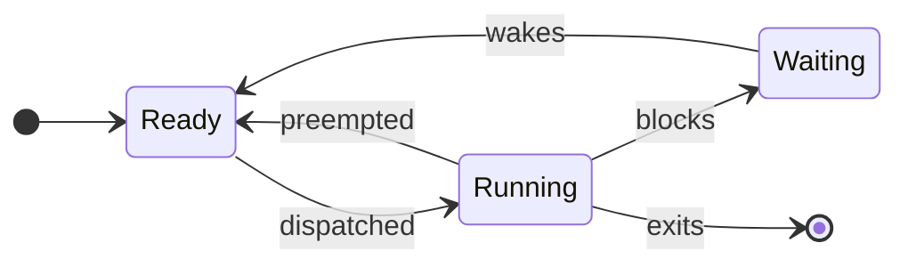

> [!summary]
> A process is a protected resource container; runnable threads inside it are the units the scheduler actually executes.

> [!tip] Plain-English version
> A **process** is like a sealed apartment: it has its own furniture (memory), its own mailbox (file descriptors), its own lease (permissions), and neighbors can't just walk in and rearrange your stuff. A **thread** is a person living inside that apartment — multiple threads (people) can share the same apartment (memory), but each has their own todo list and current task (registers/stack). A **context switch** is the building manager pausing one apartment's activity and letting another one proceed, carefully remembering exactly where the first one left off so it can resume later without losing its place.

Map: [[Upskill/CS Topics/Operating Systems/Operating Systems|Operating Systems]]

## Process Model

A process combines:

- a virtual address space;
- one or more threads with registers and stacks;
- open file descriptors and sockets;
- credentials, limits, signals, and accounting;
- kernel bookkeeping such as PID, parent, state, and scheduling data.

The textbook Process Control Block (PCB) is a useful abstraction for that bookkeeping — think of it as the process's "ID card + file" that the kernel keeps on hand: who owns it, what state it's in, and enough saved detail to pause and resume it perfectly. Real kernels distribute the data across several structures rather than one universal PCB object.

## Lifecycle

- **Ready/runnable:** able to run, waiting for a CPU. *(Like a customer who has their order ready and is just waiting for a free cashier.)*
- **Running:** currently executing on a CPU. *(Being served right now.)*
- **Blocked/sleeping:** cannot progress until an event occurs. *(Stepped away because they're waiting on something else — like waiting for a delivery — and can't move forward even if a cashier were free.)*
- **Terminated:** finished; on Unix, a small zombie entry remains until its parent reads the status.

An I/O-blocked process normally stays resident in memory. Swapping is a separate memory-pressure mechanism, not the normal destination of every blocked task — don't assume "blocked" automatically means "kicked out to disk."

## Creating and Ending Processes

Unix exposes `fork` plus `exec`; other systems and high-level runtimes often expose a single spawn API. Creation must account for:

- inherited descriptors and environment;
- credentials and working directory;
- parent-child lifetime and exit-status collection;
- output pipes that can fill and deadlock the parent;
- process and memory limits.

If a parent never waits for an exited child, the child remains a **zombie** — like a completed task sitting in a manager's inbox that nobody has formally signed off on, so the record can't be cleared yet.

If a parent exits first, the child becomes an **orphan** and is adopted by a system process (on Linux, usually PID 1 or a subreaper) that can reap it — analogous to a foster-parent process taking responsibility for cleanup.

## What a Context Switch Saves

To stop one runnable thread and resume another, the OS must preserve and restore execution state such as registers, stack pointer, program counter, scheduling state, and sometimes memory-translation context.

> [!example] A concrete analogy
> Imagine you're reading a 900-page novel, and someone interrupts you mid-sentence to have you read a different book instead. To resume your original book later without losing your place, you need to remember: the exact page and sentence, any sticky notes/bookmarks you had, and your mental context (who's who in the story). A context switch is the OS doing exactly that bookkeeping for a CPU core switching between threads — except it also has to worry about CPU caches "forgetting" your book's content while you were away (see below).

The cost is more than saving registers:

- warm CPU caches and branch predictors may become less useful — the new thread's data isn't in the fast cache yet, so early memory accesses are slower ("cold cache");
- translation lookaside buffer (TLB) entries may be disturbed — the CPU's shortcut table for memory addresses gets partly invalidated;
- the new task can contend for shared caches and memory bandwidth;
- excessive runnable work increases queueing delay — more threads waiting means everyone waits longer for their turn.

Switching between threads in one address space is often cheaper than switching between unrelated processes (since memory-translation context often doesn't need to change), but it is never free. Measure the workload instead of assuming that more workers improve throughput.

## Mode Switch, Context Switch, and Function Call

- **Function call:** changes control within the same privilege level and thread. Cheapest — no OS involvement.
- **Mode switch:** crosses between user and kernel privilege, often for a syscall or interrupt. Medium cost — still the same thread.
- **Context switch:** changes which thread is executing. Most expensive — involves the scheduler and full state swap.

A blocking syscall may cause all three: it's a function call into the runtime, which triggers a mode switch into the kernel, and if the resource isn't ready, the kernel may context-switch to a different thread while this one waits. A quick `getpid`-like call can enter and leave the kernel without scheduling another thread — mode switch, but no context switch.

## Production Clues

- Many runnable threads plus high CPU suggests CPU saturation or too much parallelism.
- Many sleeping threads may be healthy I/O concurrency or an unhealthy dependency wait.
- Many zombies usually means broken child-process lifecycle management (the parent isn't calling `wait`).
- High voluntary switches (thread gives up CPU willingly, e.g. waiting on I/O) often accompany waits; high involuntary switches (thread got kicked off mid-run) can indicate preemption or CPU pressure.
- A large process count can exhaust PID, file-descriptor, memory, or cgroup limits before CPU is full.

## Key Vocabulary

| Term | Plain-English meaning |
|---|---|
| **PCB (Process Control Block)** | The kernel's "ID card" for a process — state, registers, memory maps, etc. |
| **PID** | Process ID — a unique number the kernel assigns to each process. |
| **Zombie process** | A finished child process whose exit status the parent hasn't collected yet. |
| **Orphan process** | A running child process whose original parent has already exited. |
| **Register** | A tiny, very fast storage slot inside the CPU core itself — where the CPU keeps the values it's actively working with. |
| **Program counter** | A register that tracks which instruction the CPU should execute next. |
| **TLB (Translation Lookaside Buffer)** | A small, fast cache inside the CPU that remembers recent virtual-to-physical memory address translations, so the CPU doesn't have to look them up the slow way every time. |
| **Preempted** | Interrupted/paused by the OS against its will, usually so another thread can run. |

---

## References

- [Linux `proc(5)`](https://man7.org/linux/man-pages/man5/proc.5.html) - Process state and runtime information exposed through `/proc`.
- [Linux `fork(2)`](https://man7.org/linux/man-pages/man2/fork.2.html) - Actual parent/child memory and descriptor semantics.
