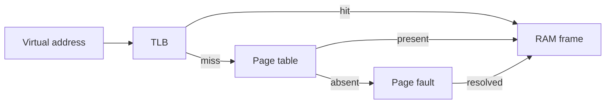

> [!summary]
> Virtual memory gives each process an address space while the OS maps pages to RAM, files, shared mappings, or no physical memory yet.

> [!tip] Plain-English version
> Every process thinks it owns a huge, private, continuous chunk of memory — addresses starting at 0 and going up. That's a fiction. Behind the scenes, the OS keeps a translation table (the "page table") that maps each little chunk of that fake address space to wherever the real data actually lives — a spot in physical RAM, a spot on disk, or nowhere yet (because it's never been touched). It's like a hotel where every guest is told "this is room 101," but the hotel secretly reassigns which physical room "101" maps to per guest, and can even move your stuff to storage if you haven't used your room in a while.

Map: [[Upskill/CS Topics/Operating Systems/Operating Systems|Operating Systems]]

## Address Translation

A virtual address is split into a virtual page number and an offset. Page tables map it to a physical frame and permissions. The TLB (Translation Lookaside Buffer) caches recent translations so every memory access does not require a full page-table walk — think of it as a "recently used addresses" cheat sheet the CPU checks first before doing the slower full lookup.

## Page Faults Are Not All Errors

A **page fault** happens whenever the CPU touches a virtual address that isn't currently mapped to physical RAM. Despite the scary name, most page faults are completely normal and expected:

- A **minor fault** can be resolved without storage I/O, such as allocating a zero-filled page or completing copy-on-write. Fast — just some bookkeeping.
- A **major fault** needs data from storage and can be much slower — the OS actually has to go fetch the page from disk.
- An **invalid access** cannot be resolved and normally causes a signal or exception (this is the "actual error" case — e.g. a null pointer dereference or accessing memory you don't own).

Demand paging delays physical allocation or loading until a page is touched. This makes startup and sparse address spaces efficient (a program can "claim" gigabytes of address space instantly without the OS actually reserving real RAM until it's used), but the first access may have a latency cost.

## Copy-on-Write and Mapped Files

After `fork`, parent and child initially share physical pages marked copy-on-write. A write triggers a private copy, preserving process isolation while avoiding eager duplication.

> [!example] Why this matters
> If a process with 2GB of memory calls `fork()`, the OS doesn't actually copy 2GB immediately — that would be slow and often wasteful (many `fork`+`exec` patterns throw the copy away almost immediately). Instead, both processes initially point at the *same* physical pages, marked "copy-on-write." Only when either process actually *writes* to a page does the OS quietly duplicate just that one page. Most pages, in many real workloads, are never written after fork — so this saves enormous amounts of copying.

`mmap` maps files or anonymous memory into an address space. Shared mappings can communicate changes; private mappings use copy-on-write semantics. Mapping a file does not make every access free or durable: pages can still fault in, become dirty, and require explicit synchronization depending on the contract.

## Allocation and Fragmentation

Classical contiguous allocation explains **external fragmentation** (free memory exists, but it's scattered in pieces too small to satisfy a request) and fit strategies:

- **First fit:** choose the first sufficient hole; fast and simple.
- **Best fit:** choose the smallest sufficient hole; can leave many tiny fragments (leftover slivers too small to be useful).
- **Worst fit:** choose the largest hole; tries to leave a reusable remainder.

Paging removes the need for one contiguous physical block (since pages can scatter anywhere in physical RAM and still be stitched together logically via the page table) but introduces page tables and **internal fragmentation** within allocated pages (wasted space *inside* a page when the data doesn't perfectly fill it). Application allocators add arenas, size classes, and caches, so freed heap objects may remain in process RSS (Resident Set Size — see below) for reuse rather than returning immediately to the OS.

## Page Replacement

When memory is scarce, the OS chooses reclaimable pages to evict:

- **FIFO:** simple — evict whichever page has been resident the longest, regardless of usage. Can show **Belady's anomaly**, a genuinely surprising result where *adding more memory frames actually increases* the number of faults for certain access patterns (a counterintuitive edge case worth knowing for interviews).
- **Optimal:** evicts the page used farthest in the future; impossible to implement online (you'd need to see the future), useful only as a theoretical comparison baseline.
- **LRU (Least Recently Used):** evicts the page that hasn't been touched in the longest time; exact LRU is costly to track precisely, so systems use approximations and recency/frequency signals (e.g. the "clock" algorithm).
- **MRU (Most Recently Used):** evicts the *most* recently used page; useful only for particular access patterns (e.g. sequential scans where you know you won't revisit recent pages) and not a general default.

Replacement policy interacts with anonymous memory, file-backed cache, dirty pages, swap, cgroups, and workload locality. Do not infer a current kernel's exact policy from the classroom algorithm names alone — real kernels use much more nuanced heuristics.

## Thrashing

**Thrashing** occurs when the active working sets (the memory a process actually needs to make progress) do not fit in available memory and the system spends much of its time faulting and reclaiming instead of doing useful work — like a chef who has to keep running out to the store for one ingredient at a time because the kitchen is too small to hold everything needed for the recipe at once.

Signals include:

- sustained major faults or swap activity;
- high I/O with low useful throughput;
- reclaim and allocation stalls;
- rapidly worsening latency as concurrency rises;
- cgroup memory pressure or OOM (Out-Of-Memory) kills.

Reduce the working set, bound concurrency and caches, fix leaks, add memory, or isolate workloads. Adding workers to a memory-thrashing service usually increases pressure — this is a common mistake: throwing more parallelism at a memory-bound problem just makes contention for the scarce resource worse.

## Metrics That People Confuse

- **Virtual size:** address space reserved or mapped; not equal to RAM consumed. A process can "claim" far more virtual memory than the machine even has physical RAM.
- **RSS (Resident Set Size):** resident pages currently in RAM; may include shared pages and allocator-retained memory — this can overstate a single process's "true" footprint if pages are shared with other processes.
- **Heap used:** language-runtime view of live or allocated heap; excludes many native mappings and kernel resources.
- **Page cache:** RAM used to cache files; reclaimable under pressure and often beneficial (this is why "available RAM" often looks lower than it really is — the OS is happily using spare RAM to cache files, and will give it back instantly if a process needs it).
- **Swap used:** not by itself proof of current trouble; active swap-in/out and pressure matter more than a static "some swap is used" number.

For Java, compare heap, metaspace, direct buffers, thread stacks, and RSS. For Go, compare runtime heap metrics with RSS and goroutine stacks. For Python, include native-extension allocations and child processes.

## Key Vocabulary

| Term | Plain-English meaning |
|---|---|
| **Page** | A fixed-size chunk of memory (commonly 4KB) — the unit the OS manages memory in. |
| **Page table** | The OS's lookup table mapping virtual addresses to physical RAM locations. |
| **Page fault** | The CPU trying to access a virtual address that isn't currently mapped to RAM. |
| **TLB** | A small, fast cache of recent address translations, inside the CPU. |
| **Demand paging** | Only actually allocating/loading a page when it's first touched, not upfront. |
| **Copy-on-write** | Sharing memory between processes until one of them writes to it, at which point it's duplicated. |
| **Thrashing** | Spending most of your time swapping/faulting instead of doing real work, because memory is too tight. |
| **RSS** | How much physical RAM a process is actually currently using. |
| **OOM kill** | The OS (or a container's cgroup) forcibly killing a process because the system ran out of memory. |

---

## References

- [Linux memory-management documentation](https://docs.kernel.org/admin-guide/mm/index.html) - Kernel memory behavior and operator-facing controls.
- [Linux `mmap(2)`](https://man7.org/linux/man-pages/man2/mmap.2.html) - File and anonymous mapping semantics.
