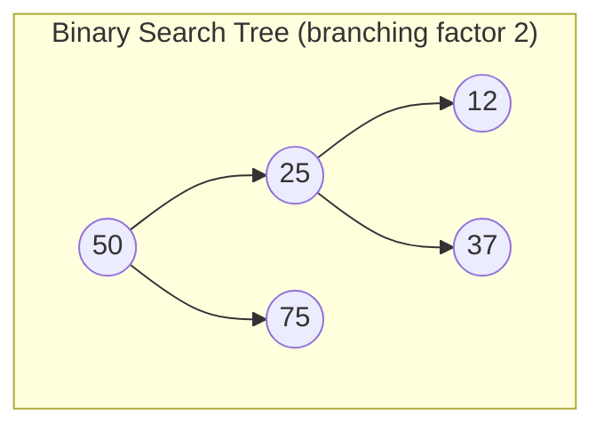
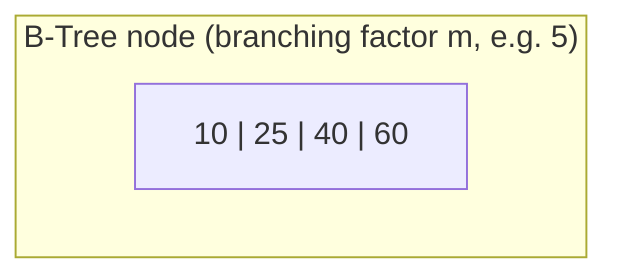
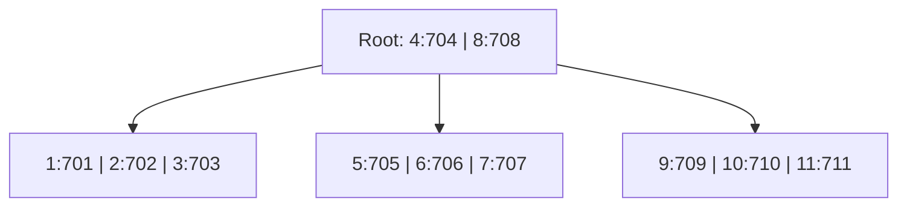
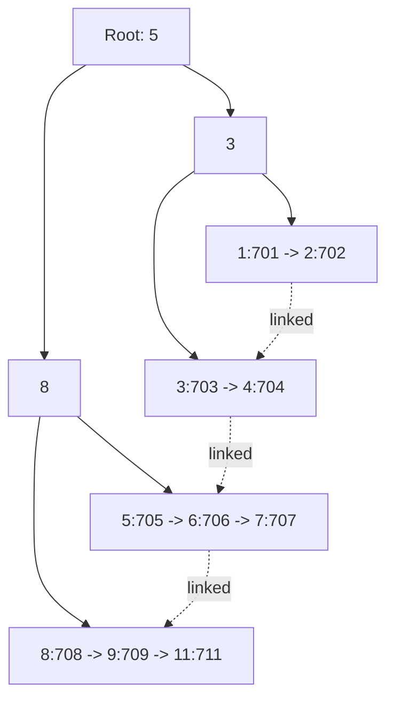

> Pure data-structure notes: what these trees are, why they exist, how their operations work, and code examples. For the database-specific view, see [[Upskill/CS Topics/Databases/PostgreSQL Internals|PostgreSQL Internals]].

---

## 1. Why This Structure Exists

Binary search trees give O(log₂ n) search, but each node only branches two ways — on disk-backed data that means one disk seek per level, and disk seeks are slow (milliseconds vs. nanoseconds for RAM). A B-Tree fixes this by letting each node branch **m ways** instead of 2, which flattens the tree dramatically and turns a search into just a handful of disk reads no matter how large the dataset gets.



One B-Tree node can replace an entire subtree's worth of binary-tree comparisons, because a single disk-page read gives you many keys to binary-search *in memory* before deciding which child to follow.

---

## 2. B-Tree: Structure & Rules

A B-Tree of **order/degree m** obeys:

- Every node has at most `m` children and `m - 1` keys.
- Every node (except the root) has at least `⌈m/2⌉` children.
- Keys within a node are kept sorted.
- **All leaf nodes sit at the same depth** — the tree is always height-balanced.
- Every node — root, internal, *and* leaf — stores both a key **and** its associated data pointer.


*(`key:pointer` — here the pointer is a stand-in for "tuple ID" / disk address / memory address, depending on context.)*

### Search
Start at the root; binary-search the keys in the current node. If found, return the data pointer. Otherwise, follow the child pointer for the range the target key falls into, and repeat. Height is `O(logₘ n)`, so total disk reads are `O(logₘ n)` too.

### Insert
Descend to the correct leaf and insert the key in sorted position. If the node overflows past `m - 1` keys, **split** it: the median key moves up into the parent, and the node divides into two. This can cascade up to the root (in the worst case creating a new root and increasing tree height by one). Sequential/monotonic keys (timestamps, auto-increment IDs) cause far fewer splits than random keys (UUIDs).

### Delete
Remove the key; if the node underflows below `⌈m/2⌉ - 1` keys, **borrow** a key from a sibling or **merge** with one, potentially propagating the fix upward. This is the most complex of the three operations to implement correctly.

### Limitations of a Plain B-Tree
1. **Wasted space in internal nodes** — internal-node data pointers are never actually read during a normal lookup (only the leaf's pointer matters), yet they still consume page space. With large pointers/values, fewer keys fit per node → more levels → more disk reads.
2. **Poor range scans** — a query like "all keys between 4 and 9" may require repeated root-to-leaf traversals even though the matching rows might be adjacent in the tree, because there's no direct link between neighboring leaves.
3. **Scattered data** — random inserts and splits can leave logically sequential data physically scattered, increasing I/O for anything resembling a scan.

These three problems are exactly what the B+ Tree was designed to fix.

---

## 3. B+ Tree: The Refinement

The B+ Tree keeps the same balancing rules as a B-Tree but changes *where data lives*:

- **Internal nodes store keys only** — no data pointers. This lets far more keys fit per page, which means fewer levels and fewer disk reads to get through the "routing" part of the tree.
- **Only leaf nodes store the actual key → data-pointer pairs.**
- **Leaf nodes are linked together** (like a singly/doubly linked list), so once you reach the right leaf, you can walk sideways to neighboring leaves instead of climbing back to the root.
- Because a key that routes to a subtree also needs to exist in a leaf, **some keys are duplicated** between internal and leaf levels — a small storage tradeoff for a large read-performance win.



### Range Query Example: "keys between 4 and 9"
1. Traverse root → internal → leaf to locate key `4` (a normal B+Tree search, `O(logₘ n)`).
2. From there, **walk the linked leaves** rightward: `4 → 5 → 6 → 7 → 8 → 9`.
3. No backtracking to the root, no repeated traversals — this is effectively a linked-list scan once you've found the start.

This is precisely the range-scan weakness a plain B-Tree has and a B+Tree doesn't.

### B-Tree vs B+ Tree — Comparison Table

| Aspect | B-Tree | B+ Tree |
|---|---|---|
| Data pointers | On every node (internal + leaf) | Only on leaf nodes |
| Internal node content | Keys + pointers to data | Keys only (routing) |
| Search | Can terminate early at an internal node | Always descends all the way to a leaf |
| Duplicate keys | None — each key stored once | Some duplication (routing keys reappear in leaves) |
| Range scans | Slow — repeated root-to-leaf traversals | Fast — sequential leaf traversal via links |
| Leaf linkage | Not linked | Linked list across leaves |
| Keys per internal page | Fewer (space shared with pointers) | More (pointer-free, so denser) |
| Typical use | General balanced search trees, some filesystems | Default index structure in most relational databases (MySQL InnoDB, PostgreSQL, SQL Server) |

---

## 4. Where Each Is Actually Used

- **B-Trees**: classic balanced-tree use cases outside of range-heavy workloads — some in-memory symbol tables, certain filesystem metadata structures.
- **B+ Trees**: the default index structure in essentially every mainstream relational database (MySQL/InnoDB, PostgreSQL, SQL Server, Oracle), because real workloads constantly do range queries (`BETWEEN`, `ORDER BY`, pagination) on top of equality lookups. Even MongoDB's WiredTiger storage engine uses a B+Tree internally, though it deliberately omits leaf-to-leaf links since Mongo isn't optimized around traditional SQL-style range scans.

Design choices that matter in real implementations:
- **Node size = page size** (commonly 4 KB or 8 KB) so one tree node = one disk I/O.
- **Leaf-linking is optional** — systems built around heavy range scans (SQL databases) keep it; systems that don't need it can drop it to save a little space.
- **Upper levels tend to fit in memory** since internal nodes are pointer-free and dense, meaning most of the "expensive" part of a search is cheap, and only the final leaf fetch costs a real disk read.

---

## 5. Code Examples (Java)

Below are simplified, illustrative implementations — enough to see the core mechanics (search, insert with splitting) without the full production edge cases (deletion, concurrency, disk paging) that a real database engine handles.

### 5.1 A Minimal B-Tree Node & Search

```java
import java.util.ArrayList;
import java.util.List;

class BTreeNode {
    List<Integer> keys = new ArrayList<>();
    List<Object> values = new ArrayList<>();      // data pointers, aligned with keys
    List<BTreeNode> children = new ArrayList<>();
    boolean isLeaf = true;

    // Classic B-Tree: every node (leaf or internal) can answer a lookup directly.
    Object search(int key) {
        int i = 0;
        while (i < keys.size() && key > keys.get(i)) i++;

        if (i < keys.size() && keys.get(i) == key) {
            return values.get(i);                  // found here, even if internal node
        }
        if (isLeaf) return null;                    // not found anywhere
        return children.get(i).search(key);          // descend into the right subtree
    }
}
```

### 5.2 B-Tree Insert with Node Splitting

```java
class BTree {
    private static final int MAX_KEYS = 4;          // order m = 5 → up to 4 keys per node
    BTreeNode root = new BTreeNode();

    void insert(int key, Object value) {
        BTreeNode r = root;
        if (r.keys.size() == MAX_KEYS) {
            BTreeNode newRoot = new BTreeNode();
            newRoot.isLeaf = false;
            newRoot.children.add(r);
            splitChild(newRoot, 0);
            root = newRoot;
            insertNonFull(root, key, value);
        } else {
            insertNonFull(r, key, value);
        }
    }

    private void insertNonFull(BTreeNode node, int key, Object value) {
        int i = node.keys.size() - 1;
        if (node.isLeaf) {
            node.keys.add(0);
            node.values.add(null);
            while (i >= 0 && key < node.keys.get(i)) {
                node.keys.set(i + 1, node.keys.get(i));
                node.values.set(i + 1, node.values.get(i));
                i--;
            }
            node.keys.set(i + 1, key);
            node.values.set(i + 1, value);
        } else {
            while (i >= 0 && key < node.keys.get(i)) i--;
            i++;
            if (node.children.get(i).keys.size() == MAX_KEYS) {
                splitChild(node, i);
                if (key > node.keys.get(i)) i++;
            }
            insertNonFull(node.children.get(i), key, value);
        }
    }

    // Splits a full child into two, pushing its median key up into the parent.
    private void splitChild(BTreeNode parent, int index) {
        BTreeNode fullChild = parent.children.get(index);
        int mid = fullChild.keys.size() / 2;

        BTreeNode right = new BTreeNode();
        right.isLeaf = fullChild.isLeaf;
        right.keys.addAll(fullChild.keys.subList(mid + 1, fullChild.keys.size()));
        right.values.addAll(fullChild.values.subList(mid + 1, fullChild.values.size()));
        if (!fullChild.isLeaf) {
            right.children.addAll(fullChild.children.subList(mid + 1, fullChild.children.size()));
        }

        int medianKey = fullChild.keys.get(mid);
        Object medianValue = fullChild.values.get(mid);

        fullChild.keys.subList(mid, fullChild.keys.size()).clear();
        fullChild.values.subList(mid, fullChild.values.size()).clear();
        if (!fullChild.isLeaf) {
            fullChild.children.subList(mid + 1, fullChild.children.size()).clear();
        }

        parent.keys.add(index, medianKey);
        parent.values.add(index, medianValue);
        parent.children.add(index + 1, right);
    }
}
```

### 5.3 A Minimal B+ Tree Leaf Chain (the key structural difference)

```java
class BPlusLeafNode {
    List<Integer> keys = new ArrayList<>();
    List<Object> values = new ArrayList<>();        // data pointers ONLY live here
    BPlusLeafNode next;                              // <-- the defining feature: linked leaves

    // Range scan: find the start key, then just walk `next` pointers.
    List<Object> rangeScan(int fromKey, int toKey) {
        List<Object> results = new ArrayList<>();
        BPlusLeafNode node = this;
        while (node != null) {
            for (int i = 0; i < node.keys.size(); i++) {
                int k = node.keys.get(i);
                if (k >= fromKey && k <= toKey) results.add(node.values.get(i));
                if (k > toKey) return results;       // past the range, stop early
            }
            node = node.next;                        // no root re-traversal needed
        }
        return results;
    }
}

class BPlusInternalNode {
    List<Integer> keys = new ArrayList<>();          // routing only, NO values
    List<Object> children = new ArrayList<>();        // BPlusInternalNode or BPlusLeafNode

    Object findChildFor(int key) {
        int i = 0;
        while (i < keys.size() && key >= keys.get(i)) i++;
        return children.get(i);
    }
}
```

The contrast between §5.1/§5.2 and §5.3 is the whole point: in a B-Tree, `values` lives on every node; in a B+ Tree, `BPlusInternalNode` never stores a value at all, and the `next` pointer on the leaf is what turns a range query into a linked-list walk instead of repeated tree descents.

---

## Quick-Reference Summary

| Term                    | One-line definition                                                         |
| ----------------------- | --------------------------------------------------------------------------- |
| Order / degree (`m`)    | Max children per node; controls branching factor and tree height            |
| Node split              | On overflow, median key promotes to the parent; can cascade to the root     |
| Node merge/borrow       | On underflow during delete, fix by borrowing from or merging with a sibling |
| B-Tree                  | Balanced m-way tree; every node stores keys + data pointers                 |
| B+ Tree                 | Balanced m-way tree; only leaves store data pointers, leaves are linked     |
| Why B+Tree wins for DBs | Denser internal nodes (fewer levels) + linked leaves (fast range scans)     |
