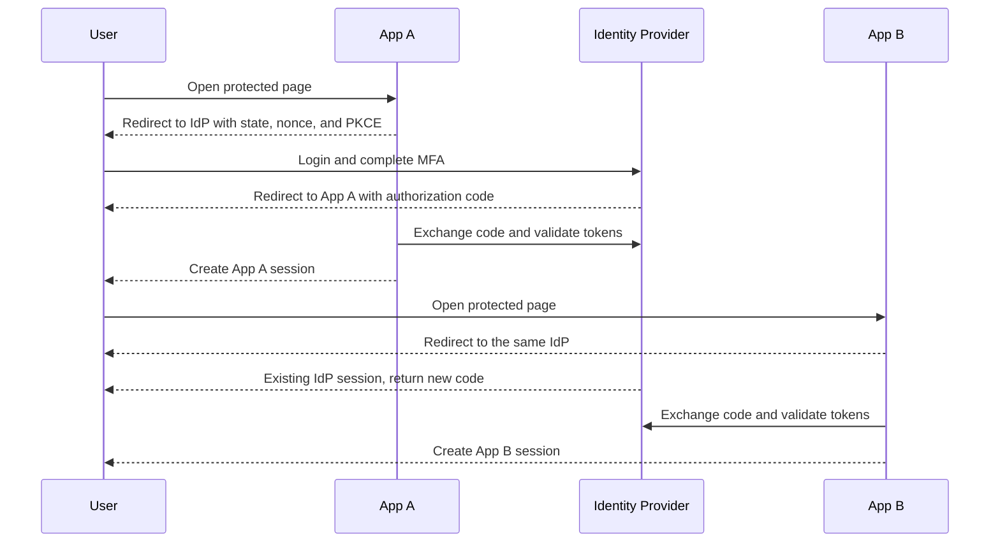

# Single Sign-On

> [!summary]
> Single Sign-On lets a user authenticate once with a trusted Identity Provider and enter multiple applications without repeating the login ceremony.

> [!important]
> SSO is a trust relationship and user experience. JWT is a token format; Redis is a state store; OIDC and SAML are protocols that can implement SSO.

## The Core Idea

An application does not accept a user merely because another application did. Instead, every application trusts the same Identity Provider (IdP).

1. The IdP authenticates the user and keeps its own login session.
2. App A redirects to the IdP and receives a verifiable identity result.
3. App A validates it, creates a local session, and applies its own authorization.
4. App B later redirects to the same IdP.
5. The IdP already has a login session, so it returns an identity result without another login prompt.

The second application still runs the protocol. The skipped step is repeated user authentication, not validation or authorization.

## The Parties

- **User:** wants access to several applications.
- **Identity Provider (IdP):** authenticates the user, enforces MFA, and issues identity results.
- **Relying Party:** an OIDC application that trusts the IdP.
- **Service Provider:** the equivalent application role in SAML.
- **Resource Server:** an API that accepts access tokens for its own audience.

## Standards-Based OIDC Flow



Each app receives a result intended for that app. App A should not pass its local session cookie to App B.

## Two Architectures in the Article

The article presents two genuinely different implementations. They should not be mentally merged.

| Question | Custom JWT + Redis | External IdP + Spring Security |
| --- | --- | --- |
| Who authenticates users? | Your custom auth service | Keycloak, Okta, Auth0, Entra ID, or another IdP |
| Who issues tokens? | Your code | The IdP or authorization server |
| Who validates API calls? | Your custom filter | Spring Security resource server support |
| Request-time state | Redis lookup on every request | Usually local signature and claim validation |
| Immediate revocation | Delete or disable the Redis record | Harder for stateless JWTs; use short expiry or added revocation state |
| What you maintain | Login, MFA, keys, tokens, filters, sessions, recovery, auditing | Application trust configuration and authorization |

The first architecture makes your service the identity system. The second delegates identity to a standards-based provider.

## Method 1: Custom JWT + Redis

This approach is stateful when Redis is the allowlist for every active token.

1. A custom login service verifies credentials and MFA.
2. It issues a signed token containing `jti`, `sub`, roles, and `exp`.
3. It stores the active token ID or a secure verifier in Redis with a TTL.
4. The client sends the token in `Authorization: Bearer ...`.
5. A filter verifies the token and checks Redis before the controller runs.
6. Logout removes the Redis entry, making revocation immediate.

```text
Bearer token -> cryptographic validation -> Redis check
             -> Authentication -> SecurityContext -> controller
```

The filter's job is to turn a validated token into a Spring Security `Authentication` before the controller runs. Immediate revocation is straightforward, but every request depends on Redis and the team owns the entire identity security surface.

See [[Custom JWT and Redis Authentication]] for the corrected filter walkthrough, revocation model, and implementation risks.

## Method 2: External IdP + Spring Security

Here the application trusts tokens issued by an existing provider. It does not write its own JWT generator, Redis token service, or validation filter.

### Browser Application

`oauth2Login` starts the OIDC login flow and normally creates a local application session after successful login.

```java
@Configuration
@EnableWebSecurity
class OidcClientSecurity {

    @Bean
    SecurityFilterChain webSecurity(HttpSecurity http) throws Exception {
        http
            .authorizeHttpRequests(auth -> auth
                .requestMatchers("/", "/health").permitAll()
                .anyRequest().authenticated()
            )
            .oauth2Login(Customizer.withDefaults())
            .logout(logout -> logout.logoutSuccessUrl("/"));

        return http.build();
    }
}
```

This `.logout(...)` block ends only the application's local session. Logging out at the IdP requires the provider's OIDC logout flow.

The registration tells Spring which IdP to redirect to and which client credentials identify this application.

```yaml
spring:
  security:
    oauth2:
      client:
        registration:
          company:
            provider: company-idp
            client-id: ${SSO_CLIENT_ID}
            client-secret: ${SSO_CLIENT_SECRET}
            authorization-grant-type: authorization_code
            scope: openid,profile,email
        provider:
          company-idp:
            issuer-uri: https://idp.example.com
```

Spring exposes `/oauth2/authorization/company` to start login and `/login/oauth2/code/company` as the callback.

After login, controllers can read the validated OIDC user:

```java
record CurrentUser(String issuer, String subject, String email) {}

@RestController
class ProfileController {

    @GetMapping("/me")
    CurrentUser me(@AuthenticationPrincipal OidcUser user) {
        return new CurrentUser(
            user.getIdToken().getIssuer().toString(),
            user.getSubject(),
            user.getEmail()
        );
    }
}
```

Use `(issuer, subject)` as the stable external identity. Email is a profile attribute and may change.

### Protected API

In a downstream API, `oauth2ResourceServer` accepts bearer access tokens. Spring's built-in filter verifies them and creates the `Authentication` in the security context.

```java
@Configuration
@EnableWebSecurity
class ApiSecurity {

    @Bean
    SecurityFilterChain apiSecurity(HttpSecurity http) throws Exception {
        http
            .authorizeHttpRequests(auth -> auth
                .requestMatchers("/health").permitAll()
                .requestMatchers("/orders/**").hasAuthority("SCOPE_orders.read")
                .anyRequest().authenticated()
            )
            .oauth2ResourceServer(oauth2 ->
                oauth2.jwt(Customizer.withDefaults())
            );

        return http.build();
    }
}
```

```yaml
spring:
  security:
    oauth2:
      resourceserver:
        jwt:
          issuer-uri: https://idp.example.com
          audiences: orders-api
```

```http
GET /orders/42 HTTP/1.1
Host: api.example.com
Authorization: Bearer ACCESS_TOKEN
```

Spring discovers the provider's public keys, validates the token, and maps the `orders.read` scope to `SCOPE_orders.read`.

App A and App B use the same pattern with separate client registrations. Each application gets tokens intended for its own client ID and creates its own local session.

> [!note]
> `oauth2Login` and `oauth2ResourceServer` are not interchangeable. The first logs a browser user into an application; the second protects an API that receives access tokens.

APIs can validate signed JWTs locally without Redis. The tradeoff is that a stateless token usually remains usable until expiry, and the IdP becomes critical shared infrastructure.

## Revocation Choices

- **Short-lived access tokens:** limit how long stolen or revoked access survives.
- **Refresh-token rotation:** controls renewal and detects reuse.
- **Opaque tokens with introspection:** ask the authorization server whether each token is active.
- **JWT denylist:** check revoked `jti` values in Redis, adding request-time state.
- **Back-channel logout or revocation events:** notify applications without relying only on browser redirects.

A Redis check is not automatically wrong. It simply changes the architecture from stateless verification to stateful validation.

## OIDC and SAML

| Protocol | Representation | Common fit |
| --- | --- | --- |
| OIDC | JSON, JWT, OAuth endpoints | Modern browser, mobile, and API-oriented systems |
| SAML 2.0 | Signed XML assertions | Established enterprise and SaaS integrations |

For a new application, OIDC is usually the simpler starting point. SAML remains common when an enterprise provider or vendor requires it.

## Sessions and Logout

SSO involves several independent lifetimes:

- The IdP login session.
- Each application's local session.
- ID and access token expiry.
- Refresh-token or reauthentication policy.

Local logout destroys one app's session. IdP logout ends the central login session. Single Logout attempts to notify every participating app, which is more difficult because each app owns local state.

## Security Checklist

- Validate signature, issuer, audience, expiry, token type, `state`, and `nonce` where applicable.
- Use `(issuer, subject)` as the stable external identity, not email.
- Keep client secrets in a secret manager.
- Map external groups and roles deliberately to local permissions.
- Plan IdP outages, key rotation, offboarding delay, and tenant boundaries.
- Never send an ID token to an API as an access token.

## Interview Explanation

> [!example]
> SSO means multiple applications trust one Identity Provider. Each app redirects an unauthenticated user to that IdP, validates the returned identity, creates its own session, and applies local authorization. When another app redirects to the same IdP, the existing IdP session avoids another login prompt. In implementation, I would distinguish a custom stateful JWT service that checks Redis on every request from standards-based OIDC or SAML, where Spring Security validates tokens issued by an external provider.

## Common Confusions

- **JWT creates SSO:** no; it is only a token format.
- **Redis creates SSO:** no; it stores session or revocation state.
- **OAuth 2.0 is user login:** OAuth handles authorization; OIDC adds standardized authentication.
- **Resource Server starts login:** no; it validates API access tokens.
- **SSO removes authorization:** every application must still enforce its own permissions.
- **One logout automatically ends everything:** only if coordinated logout or revocation is designed.

Related: [[Authentication Overview]], [[Custom JWT and Redis Authentication]], [[OpenID Connect]], [[OAuth 2.0]], [[Bearer Tokens]], and [[Session Authentication]]

#authentication #sso

---

## References

- [If an Interviewer Asked You About Single Sign-On, Could You Explain It Clearly?](https://freedium-mirror.cfd/https://medium.com/stackademic/if-an-interviewer-asked-you-about-single-sign-on-sso-could-you-explain-it-clearly-42bd4f7a1040) - Source article for the custom JWT, Redis, Spring Security, and logout discussion.
- [OpenID Connect Core 1.0](https://openid.net/specs/openid-connect-core-1_0.html) - Standards-based authentication, ID tokens, and validation.
- [SAML 2.0 Technical Overview](https://docs.oasis-open.org/security/saml/Post2.0/sstc-saml-tech-overview-2.0.html) - Identity Provider and Service Provider federation.
- [Spring Security OAuth 2.0 Login](https://docs.spring.io/spring-security/reference/servlet/oauth2/login/index.html) - Browser login through OAuth 2.0 and OIDC.
- [Spring Security JWT Resource Server](https://docs.spring.io/spring-security/reference/servlet/oauth2/resource-server/jwt.html) - API-side JWT discovery, verification, and authentication.
