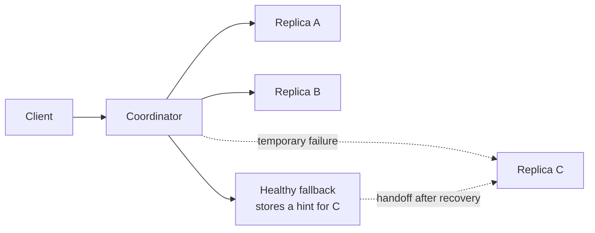

> [!summary]
> Dynamo keeps a key-value store writable during failures by combining partitioning, replication, version tracking, and background repair. Its central choice is **availability with application-visible conflict resolution**, rather than a single globally ordered history.

Map: [[Upskill/SysDes/HLD/Distributed Systems|Distributed Systems]]

- **Authors:** Giuseppe DeCandia, Deniz Hastorun, Madan Jampani, Gunavardhan Kakulapati, Avinash Lakshman, Alex Pilchin, Swaminathan Sivasubramanian, Peter Vosshall, Werner Vogels
- **Published:** SOSP 2007 (ACM Symposium on Operating Systems Principles)

> [!important]
> Dynamo is a design paper about Amazon's *internal* store. It influenced DynamoDB and Cassandra, but it is **not** a description of the modern, managed Amazon DynamoDB product.

## Why Dynamo Exists

Amazon needed storage for services like the shopping cart that could not simply stop accepting writes when a replica or network link failed. The workload shaped the design:

- Values are opaque blobs addressed by a primary key.
- Most operations touch one key; cross-key transactions are outside the model.
- Writes must remain available during partial failures.
- Temporary inconsistency is acceptable if replicas eventually converge.
- The application often understands a conflict better than the storage layer does (e.g., merging two shopping carts is safe; merging two account balances is not).

The result is an **always-writable**, eventually consistent key-value architecture.

## Core Architecture



Any node can coordinate a request. It finds the key's **preference list**, sends the operation to replicas, and waits only for the configured number of responses — not for every replica.

## Partitioning and Replication

1. Hash the key onto a circular key space (the "ring").
2. Walk clockwise to find the key's owner.
3. Replicate the key to the first `N` distinct physical nodes in its preference list.
4. Give each physical node several **virtual nodes** so ownership stays balanced and capacity can be weighted (a bigger machine gets more virtual nodes).

Virtual nodes also make recovery incremental: a replacement node receives many small ranges from several peers rather than one huge range from a single server. (This is the same idea covered in the separate Consistent Hashing paper — Dynamo is one of its most famous real-world applications.)

## Quorum Parameters — N, W, R

Dynamo exposes three tunable values:

- `N`: number of replicas that should own a key.
- `W`: successful write responses required before the write returns success.
- `R`: successful read responses required before a read returns a value.

With `N = 3`, `W = 2`, `R = 2`, normal read and write quorums overlap (`R + W = 4 > N = 3`), which improves — but does not *guarantee* — the odds of seeing the latest version. Increasing `R` or `W` spends more latency and availability for a better chance of freshness.

> [!warning]
> `R + W > N` creates quorum *overlap* under the model's assumptions. It does **not**, by itself, turn a Dynamo-style store with sloppy quorums and concurrent versions into a linearizable database. Real consistency guarantees are weaker than they look on paper.

## Sloppy Quorums and Hinted Handoff

A *strict* quorum would only ever contact a key's normal `N` replicas — and would block if one of them was down. Dynamo instead contacts the first `N` **healthy** nodes in the preference list. This is a **sloppy quorum**: availability wins even when the "correct" owner is temporarily unavailable.

If a fallback node `D` accepts a write intended for failed node `C`, it stores both the value and a **hint** naming `C`. When `C` comes back, `D` forwards ("hands off") the write and can delete its temporary copy.

Hints close short outages quickly, but they are not a complete repair strategy — a node can be down longer than hints are retained, or a failure can interrupt the handoff itself. That's why Dynamo layers *multiple* repair mechanisms (below) instead of relying on hints alone.

## Vector Clocks and Conflicts

Because writes are always accepted (even during a partition), two clients can concurrently write different values for the same key. Dynamo doesn't pick a winner at write time — it tracks causality with a **vector clock**, like `{A: 2, B: 1}`, and lets the *application* resolve genuine conflicts on read.

- Version `x` **happened-before** `y` if every counter in `x` is ≤ the corresponding counter in `y`, with at least one strictly smaller — in that case, `y` simply supersedes `x`.
- If neither happened-before the other, they are **concurrent siblings** — a real conflict.
- A read can return multiple sibling versions; the application reconciles them and writes back a new descendant version.

```python
from enum import Enum


class Relation(Enum):
    BEFORE = "before"
    AFTER = "after"
    EQUAL = "equal"
    CONCURRENT = "concurrent"


def compare(left: dict[str, int], right: dict[str, int]) -> Relation:
    nodes = left.keys() | right.keys()
    left_le_right = all(left.get(n, 0) <= right.get(n, 0) for n in nodes)
    right_le_left = all(right.get(n, 0) <= left.get(n, 0) for n in nodes)

    if left_le_right and right_le_left:
        return Relation.EQUAL
    if left_le_right:
        return Relation.BEFORE
    if right_le_left:
        return Relation.AFTER
    return Relation.CONCURRENT


mobile_cart = {"A": 3, "B": 1}
web_cart = {"A": 2, "B": 2}
assert compare(mobile_cart, web_cart) is Relation.CONCURRENT  # real conflict


def reconcile_cart(*carts: set[str]) -> set[str]:
    # A shopping cart can preserve concurrent additions by taking their union.
    # Real removal semantics need tombstones or an operation-aware data type.
    return set().union(*carts)


merged = reconcile_cart({"book", "mouse"}, {"book", "keyboard"})
assert merged == {"book", "mouse", "keyboard"}
```

The union rule works for concurrent *additions*, not every domain — two concurrent shipping-address updates need a business rule or a user choice; silently picking either one can be wrong.

### The Same Idea in Java

```java
import java.util.HashSet;
import java.util.Map;
import java.util.Set;

public final class VectorClock {
    private final Map<String, Integer> counters;

    public VectorClock(Map<String, Integer> counters) {
        this.counters = Map.copyOf(counters);
    }

    public enum Relation { BEFORE, AFTER, EQUAL, CONCURRENT }

    public Relation compareTo(VectorClock other) {
        Set<String> nodes = new HashSet<>(counters.keySet());
        nodes.addAll(other.counters.keySet());

        boolean leftLessOrEqual = true, rightLessOrEqual = true;
        for (String node : nodes) {
            int a = counters.getOrDefault(node, 0);
            int b = other.counters.getOrDefault(node, 0);
            if (a > b) leftLessOrEqual = false;
            if (b > a) rightLessOrEqual = false;
        }
        if (leftLessOrEqual && rightLessOrEqual) return Relation.EQUAL;
        if (leftLessOrEqual) return Relation.BEFORE;
        if (rightLessOrEqual) return Relation.AFTER;
        return Relation.CONCURRENT; // real conflict -- app must reconcile
    }
}
```

## Request Walkthrough — Putting It All Together

For `PUT(cart-42, value)` with `N = 3`, `W = 2`:

1. The coordinator hashes `cart-42` and builds its preference list of replicas.
2. It sends the versioned value to the responsible replicas.
3. Two replicas persist and acknowledge it, so the client receives success (quorum `W = 2` met).
4. If the third replica was down, a fallback node holds a hinted copy for it.
5. A later read with `R = 2` may see one or more versions returned from the contacted replicas.
6. Causally older versions are discarded automatically; concurrent siblings are handed to the application to reconcile.
7. Hinted handoff and background anti-entropy eventually bring every intended replica up to date.

## Repair and Membership

No single mechanism covers every failure, so Dynamo layers several:

- **Read reconciliation** — compare versions returned by replicas during a normal read and repair stale copies opportunistically.
- **Merkle trees** — compare hashes for key ranges between replicas, then transfer only the specific sub-ranges whose hashes differ (instead of re-syncing everything).
- **Gossip** — spread node membership and ownership information without any central registry; see [[Upskill/SysDes/HLD/Distributed Systems Papers/Gossip and Failure Detection|Gossip and Failure Detection]].
- **Hinted handoff** — quickly replay writes missed during a short outage.

This same layered-repair model reappears almost unchanged in Cassandra, which explicitly combines Dynamo's distribution layer with Bigtable's data model.

## Trade-offs — When to Reach for This Model

**Good fit when:**
- writes must continue through node and network failures;
- data is naturally addressed by a single key;
- temporary stale reads are acceptable;
- conflicts can be merged safely by the application.

**Poor fit when:**
- correctness requires a single global order;
- several keys must change atomically together;
- the application cannot safely reconcile concurrent values;
- stale authorization, inventory, or financial state would violate an invariant.

## What to Remember

1. Availability is a **deliberate semantic choice**, not a free performance feature.
2. Consistent hashing places data; `N`, `R`, and `W` decide replica participation.
3. Sloppy quorums and hints keep writes moving during temporary failures.
4. Vector clocks distinguish real causality from genuine concurrency.
5. Read repair and Merkle-tree anti-entropy make replicas converge later, not instantly.

## Related

- [[Upskill/SysDes/HLD/Distributed Systems Papers/Consistent Hashing Paper|Consistent Hashing Paper]] - the partitioning technique Dynamo builds on.
- [[Upskill/SysDes/HLD/Distributed Systems Papers/Gossip and Failure Detection|Gossip and Failure Detection]] - how nodes learn about cluster membership.
- [[Upskill/SysDes/HLD/Distributed Systems Papers/Apache Cassandra|Apache Cassandra]] - Dynamo's distribution model combined with Bigtable's data model.
- [[Upskill/SysDes/HLD/Consistency Models|Consistency Models]]

---

## References

- [Dynamo: Amazon's Highly Available Key-value Store](https://cdn.amazon.science/ac/1d/eb50c4064c538c8ac440ce6a1d91/dynamo-amazons-highly-available-key-value-store.pdf) - original SOSP 2007 paper.
- [Amazon Science publication page](https://www.amazon.science/publications/dynamo-amazons-highly-available-key-value-store) - abstract and metadata.
- [The 10 Engineering Papers Behind Netflix, Uber, Amazon and Google](https://freedium-mirror.cfd/https://medium.com/@kanishks772/the-10-engineering-papers-behind-netflix-uber-amazon-google-f9955004155a) - source article for this collection.
