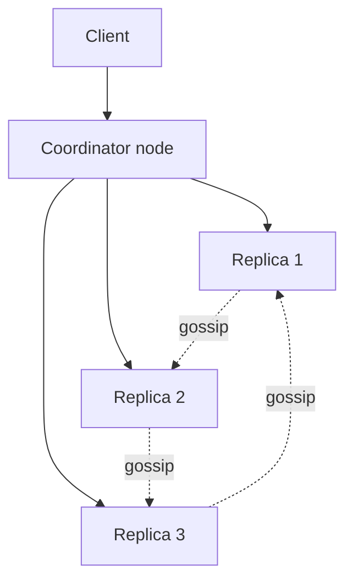
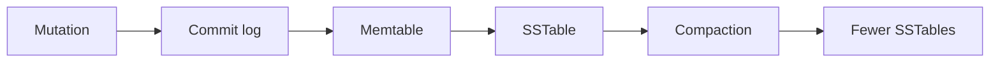

> [!summary]
> Cassandra combines Dynamo-style decentralized partitioning and replication with a Bigtable-style wide-column, log-structured storage model. It's designed for high write availability, horizontal scale, and query-first schema design.

Map: [[Upskill/SysDes/HLD/Distributed Systems|Distributed Systems]]

- **Authors:** Avinash Lakshman, Prashant Malik (Facebook)
- **Published:** LADIS 2009 / ACM SIGOPS Operating Systems Review, 2010

## Why Cassandra Exists

Facebook built Cassandra for **Inbox Search** — a workload demanding high write throughput, geographic distribution, and no single database master. The paper explicitly combines ideas from two predecessors on this list:

- [[Upskill/SysDes/HLD/Distributed Systems Papers/Amazon Dynamo|Amazon Dynamo]] contributes consistent hashing, replication, eventual convergence, hinted handoff, and decentralized gossip-based membership.
- [[Upskill/SysDes/HLD/Distributed Systems Papers/Google Bigtable|Google Bigtable]] contributes the wide-column data model and log-structured local storage engine.

(Notably, Avinash Lakshman also co-authored the original Dynamo paper — this is quite literally the same engineer bringing Dynamo's ideas into an open system.)

Modern Cassandra exposes these ideas through **CQL**, a SQL-*like* query language — but it is not a relational database with joins and arbitrary filtering. Every good Cassandra schema starts from the queries, not from the entities.

## Cluster Model



**Any** node can coordinate a request — there's no elected master. It hashes the partition key to find token ownership, identifies replicas from the keyspace's replication strategy, forwards the request, and waits for however many responses the requested consistency level requires.

**Virtual nodes** give each physical machine several token ranges (same idea as the Consistent Hashing paper). `NetworkTopologyStrategy` places replicas with datacenter and rack topology in mind, rather than just picking the next few adjacent physical nodes on the ring.

## Query-First Data Modeling

Cassandra tables are designed around known queries, *not* around normalized entities. The primary key has two parts:

- **Partition key** — hashes to a replica set and groups rows that get stored together physically.
- **Clustering columns** — sort rows *within* that partition, enabling efficient bounded range scans.

Suppose the query is: "read one user's events for one day, newest first."

```sql
CREATE KEYSPACE learning
WITH replication = {
  'class': 'NetworkTopologyStrategy',
  'dc1': 3
};

USE learning;

CREATE TABLE user_events (
    user_id uuid,
    event_day date,
    event_time timestamp,
    event_id timeuuid,
    event_type text,
    payload text,
    PRIMARY KEY ((user_id, event_day), event_time, event_id)
) WITH CLUSTERING ORDER BY (event_time DESC, event_id DESC);
```

`(user_id, event_day)` is the compound partition key. The **day bucket** prevents one busy user's entire lifetime history from becoming one unbounded, ever-growing partition. `event_time` and `event_id` give newest-first ordering plus uniqueness inside that day.

## Write and Read Example

```sql
CONSISTENCY LOCAL_QUORUM;

INSERT INTO user_events (
    user_id, event_day, event_time, event_id, event_type, payload
) VALUES (
    11111111-1111-1111-1111-111111111111,
    '2026-07-16',
    '2026-07-16T18:30:00Z',
    now(),
    'invoice.paid',
    '{"invoiceId":"inv-42","amount":4999}'
);

SELECT event_time, event_type, payload
FROM user_events
WHERE user_id = 11111111-1111-1111-1111-111111111111
  AND event_day = '2026-07-16'
  AND event_time >= '2026-07-16T12:00:00Z'
LIMIT 100;
```

This query names the full partition key and then restricts the clustering order — so Cassandra can route it to exactly one replica set and read a contiguous slice off disk. Avoid solving ordinary schema problems with `ALLOW FILTERING`: it permits a query that may scan far more data than it returns. If you need a different access path, design another table for it (denormalization is expected and normal in Cassandra).

## Code Example — Tunable Consistency (DataStax Java Driver)

```java
CqlSession session = CqlSession.builder().build();

// High-volume, low-stakes write -- accept some risk of a missed replica
// in exchange for lower latency and higher throughput
session.execute(
    SimpleStatement.builder(
        "INSERT INTO activity_log (user_id, event_time, event_type) VALUES (?, ?, ?)")
        .addPositionalValues(userId, Instant.now(), "page_view")
        .setConsistencyLevel(DefaultConsistencyLevel.ONE)
        .build());

// A read that should overlap a quorum write -- pay for a majority round trip
ResultSet rs = session.execute(
    SimpleStatement.builder("SELECT display_name FROM user_profile WHERE user_id = ?")
        .addPositionalValue(userId)
        .setConsistencyLevel(DefaultConsistencyLevel.QUORUM)
        .build());

Row row = rs.one();
String displayName = row != null ? row.getString("display_name") : null;
```

Quorum overlap improves freshness under the replica model; it does not make this an arbitrary transaction or protect a cross-partition invariant.

## Write Path



At each replica:

1. Append the mutation to a durable commit log.
2. Apply it to an in-memory memtable.
3. Acknowledge according to the configured durability level.
4. Flush a full memtable as a new immutable SSTable.
5. Compact SSTables in the background — merging versions and reclaiming obsolete data once tombstone-grace rules permit it.

Because SSTables are immutable, an update creates a **newer cell version** rather than editing an old file in place. Cassandra normally resolves competing cell values with timestamp-based **last-write-wins** semantics — unlike Dynamo's application-visible vector-clock siblings, Cassandra picks a winner automatically instead of pushing conflict resolution up to the application.

## Read Path

A replica may need to merge data from the current memtable *and* several SSTables. Bloom filters, partition indexes, row caches, and SSTable metadata all help skip files that can't possibly contain the requested partition. Compaction reduces the number of files (and stale versions) a read has to reconcile at query time.

This creates a real operational trade-off:

- write-heavy workloads benefit hugely from the append-oriented storage design;
- reads pay a cost for reconciling multiple structures and tombstones;
- compaction itself consumes disk bandwidth and temporary space;
- poor partition-key sizing can create hotspots or unexpectedly expensive reads.

## Tunable Consistency — Per Query, Not Per Cluster

With replication factor `N = 3`:

| Level | Waits for | Trade-off |
|---|---|---|
| `ONE` | 1 replica | Fastest, most available, least consistent |
| `QUORUM` | 2 replicas (majority) | Balanced |
| `ALL` | All 3 replicas | Strongest, fails if any replica is down |
| `LOCAL_QUORUM` | Majority in the coordinator's local datacenter | Balanced, avoids cross-DC latency |

Writes are actually sent to *all* intended replicas regardless of level — the consistency level only controls how many acknowledgements the coordinator waits for before responding to the client. Choosing read and write levels whose replica sets mathematically overlap (`R + W > N`) improves — but does not *guarantee* — that you'll observe the latest acknowledged write. It does not provide arbitrary multi-row transactions or a global linearizable history.

## Convergence Mechanisms

- **Hinted handoff** — a coordinator temporarily stores a missed mutation for a currently-unavailable replica.
- **Read repair** — reads can opportunistically repair inconsistent replicas encountered along the way.
- **Anti-entropy repair** — replicas compare Merkle trees for token ranges and stream just the differences.
- **Gossip** — nodes spread membership and state information peer-to-peer.
- **Phi-accrual failure detection** — suspicion adapts to observed heartbeat timing, instead of relying on one fixed timeout (see the Gossip paper for the underlying idea).

Hints and read repair are best-effort accelerators, not a guarantee. Operators still need **scheduled repair** so missed updates are found *before* tombstones expire — otherwise old, supposedly-deleted data can silently reappear.

## Deletes and Tombstones

A delete writes a timestamped **tombstone**, not an immediate physical erasure. Replicas must retain that tombstone long enough for repair to inform every peer that missed the delete. Removing it too early can let the old value resurface on an isolated, unrepaired replica.

This means deletion correctness genuinely depends on repair cadence, outage duration, and tombstone-grace configuration. Tombstone-heavy scans can also get expensive, so TTL-based and delete-heavy schemas deserve deliberate load testing.

## Failure Scenario Walkthrough

For replication factor 3 and `LOCAL_QUORUM`:

1. The coordinator sends the write to all three local replicas.
2. Two persist it and respond; the client receives success.
3. The third replica is down, so the coordinator stores a hint for it.
4. When that replica returns, hint replay sends it the original mutation.
5. If the hint is lost or expires before replay, scheduled anti-entropy repair later compares token-range Merkle trees and streams the mismatched data.

Availability comes from several **overlapping** repair paths working together — not from assuming every request magically reaches every replica on the first try.

## Paper vs. Modern Cassandra

The 2009 paper describes Facebook's early system and its pre-CQL data model. Modern Cassandra adds CQL tables, virtual nodes, topology-aware replication, multiple compaction strategies, and many operational improvements — but the Dynamo-plus-Bigtable synthesis remains the best mental model for understanding *why* it's architected the way it is.

## When Cassandra Fits

**Good fit:** high sustained writes, known key-based query patterns, large horizontally-partitioned datasets, multi-datacenter availability, teams prepared to actively operate compaction and repair.

**Poor fit:** ad hoc analytics, joins, broad secondary access patterns, strict cross-partition transactions, small datasets, or workloads whose partition key can't be distributed evenly.

## What to Remember

1. Cassandra fuses Dynamo's decentralized cluster model with Bigtable's local data model.
2. The **partition key** decides physical placement; **clustering columns** decide order within a partition.
3. Commit log → memtable → SSTables → compaction form the storage engine, same shape as Bigtable's.
4. Consistency is tunable **per query**, but your application's invariants still need careful design regardless.
5. Hints, read repair, and *scheduled* anti-entropy repair are what actually make replicas converge over time.

## Related

- [[Upskill/SysDes/HLD/Distributed Systems Papers/Amazon Dynamo|Amazon Dynamo]] - the distribution and replication half of Cassandra's design.
- [[Upskill/SysDes/HLD/Distributed Systems Papers/Google Bigtable|Google Bigtable]] - the data-model and storage-engine half.
- [[Upskill/SysDes/HLD/Distributed Systems Papers/Gossip and Failure Detection|Gossip and Failure Detection]] - cluster membership and failure suspicion.
- [[Upskill/SysDes/HLD/SQL vs NoSQL|SQL vs NoSQL]]

---

## References

- [Cassandra: A Decentralized Structured Storage System](https://www.cs.cornell.edu/projects/ladis2009/papers/lakshman-ladis2009.pdf) - original LADIS 2009 paper.
- [Apache Cassandra architecture overview](https://cassandra.apache.org/doc/latest/cassandra/architecture/overview.html) - current official cluster and storage overview.
- [Apache Cassandra's Dynamo architecture](https://cassandra.apache.org/doc/latest/cassandra/architecture/dynamo.html) - partitioning, replication, consistency levels, gossip, and repair.
- [Apache Cassandra storage engine](https://cassandra.apache.org/doc/stable/cassandra/architecture/storage-engine.html) - commit log, memtables, SSTables, reads, and compaction.
- [Apache Cassandra repair](https://cassandra.apache.org/doc/latest/cassandra/managing/operating/repair.html) - operational anti-entropy repair and Merkle trees.
- [The 10 Engineering Papers Behind Netflix, Uber, Amazon and Google](https://freedium-mirror.cfd/https://medium.com/@kanishks772/the-10-engineering-papers-behind-netflix-uber-amazon-google-f9955004155a) - source article for this collection.
