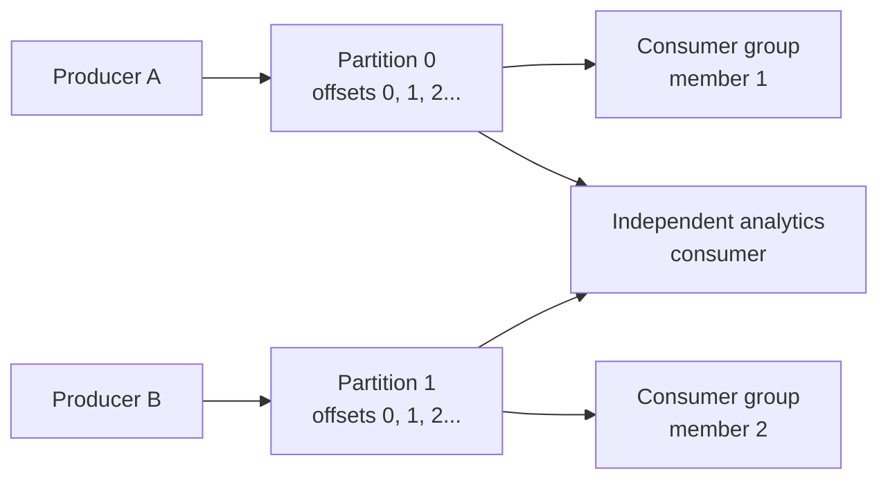

> [!summary]
> Kafka models messaging as an append-only, partitioned log. Producers append records, consumers track their own offsets, and retention lets the same history be replayed independently by different readers.

Map: [[Upskill/SysDes/HLD/Distributed Systems|Distributed Systems]]

- **Authors:** Jay Kreps, Neha Narkhede, Jun Rao (LinkedIn)
- **Published:** NetDB Workshop 2011, Athens, Greece

## Why Kafka Exists

LinkedIn needed one pipeline that could collect high-volume activity events and operational metrics for both real-time consumers and offline analytics. Traditional message queues made this hard: each consumer needed a different pace, and rereading history wasn't a first-class idea.

Kafka's decisive move was to make the **log** the durable source of truth:

- producers *append* instead of updating records in place;
- records are ordered within a partition;
- consumers pull records and remember their own position (offset);
- data expires by retention policy, not because one consumer acknowledged it.

## Core Model



A record is identified by `(topic, partition, offset)`. An offset is a position **within one partition**, not a timestamp and not a topic-wide sequence number.

## How a Record Moves

1. The producer serializes the key and value.
2. A partitioner chooses a partition — records with the same key normally land on the same partition.
3. The producer batches records and appends them to the partition leader.
4. The broker persists the append and replicates it per the topic's replication factor.
5. A consumer fetches a range of records starting at its current offset.
6. After successfully processing, the consumer commits the next offset it should read.

Ordering is only guaranteed **inside one partition**. A multi-partition topic deliberately trades global ordering for parallelism — this is the single most important thing to internalize about Kafka.

## Why Sequential I/O Matters

Kafka's original design deliberately avoids the database-style random update for every message:

- records are appended in large batches;
- brokers lean heavily on the OS page cache instead of managing their own memory buffer;
- consumers fetch contiguous ranges;
- zero-copy transfer moves bytes straight from page cache to network socket, skipping unnecessary application-level copies.

The broader lesson: disk isn't simply "slow." Predictable sequential access and batching sustain very high throughput even on spinning disk.

## Consumer-Owned Progress

Because consumers control their own offsets, they can:

- pause without deleting data for other consumers;
- rewind to rebuild state after a bug;
- start a brand-new consumer from old history;
- process the same partition at a different pace than another consumer group.

Within one consumer group, each partition is assigned to **at most one** active member at a time — adding more consumers than partitions doesn't add parallelism for that topic.

## Code Example — Process, Then Commit (At-Least-Once)

This uses a manual offset commit, giving **at-least-once processing**: a crash after the downstream write but before `commitSync()` can cause the same record to be redelivered.

```java
Properties config = new Properties();
config.put(ConsumerConfig.BOOTSTRAP_SERVERS_CONFIG, "localhost:9092");
config.put(ConsumerConfig.GROUP_ID_CONFIG, "billing-projection");
config.put(ConsumerConfig.KEY_DESERIALIZER_CLASS_CONFIG, StringDeserializer.class.getName());
config.put(ConsumerConfig.VALUE_DESERIALIZER_CLASS_CONFIG, StringDeserializer.class.getName());
config.put(ConsumerConfig.ENABLE_AUTO_COMMIT_CONFIG, "false");
config.put(ConsumerConfig.AUTO_OFFSET_RESET_CONFIG, "earliest");

try (KafkaConsumer<String, String> consumer = new KafkaConsumer<>(config)) {
    consumer.subscribe(List.of("invoice-events"));

    while (!Thread.currentThread().isInterrupted()) {
        ConsumerRecords<String, String> records = consumer.poll(Duration.ofSeconds(1));

        for (ConsumerRecord<String, String> record : records) {
            InvoiceEvent event = parse(record.value());
            // Make this idempotent using event.id() as a dedupe key --
            // a redelivered record should be a no-op, not a double charge.
            invoiceProjection.applyOnce(event.id(), event);
        }

        consumer.commitSync(); // commit only after every record in the batch is applied
    }
}
```

> Committing the offset **before** processing would instead risk **at-most-once** behavior — a crash could lose work whose offset was already advanced. Always process first, commit second.

## Code Example — Durable, Idempotent Producer

```java
Properties config = new Properties();
config.put(ProducerConfig.BOOTSTRAP_SERVERS_CONFIG, "localhost:9092");
config.put(ProducerConfig.ACKS_CONFIG, "all");                    // wait for all in-sync replicas
config.put(ProducerConfig.ENABLE_IDEMPOTENCE_CONFIG, "true");     // dedupes retried sends
config.put(ProducerConfig.KEY_SERIALIZER_CLASS_CONFIG, StringSerializer.class.getName());
config.put(ProducerConfig.VALUE_SERIALIZER_CLASS_CONFIG, StringSerializer.class.getName());

try (KafkaProducer<String, String> producer = new KafkaProducer<>(config)) {
    ProducerRecord<String, String> record = new ProducerRecord<>(
        "invoice-events",
        invoice.customerId(), // stable key -> preserves per-customer ordering
        toJson(invoice)
    );
    producer.send(record).get();
}
```

Idempotent production prevents duplicates caused by producer-level retries. It does **not** make an arbitrary database write and a Kafka publish one atomic operation — for that, you need an outbox pattern or a Kafka transaction spanning the whole workflow.

## Failure and Recovery

| Scenario | What happens |
|---|---|
| Broker fails | A replicated follower with up-to-date data becomes the new partition leader |
| Consumer fails | Its partitions are reassigned to other group members; processing resumes from the last committed offset |
| Consumer is slow | Records stay put until retention expires, but consumer lag grows |
| Handler retries | Duplicate delivery is possible — downstream logic needs idempotency |
| Hot partition | One key or uneven partitioning can overload a single partition even with spare cluster capacity |

## Paper vs. Modern Kafka

The original 2011 paper focused on the partitioned log, consumer-controlled offsets, batching, and efficient disk use — replication was still "future work" at that point. Modern Kafka adds replicated partitions, idempotent producers, transactions, tiered storage, and **KRaft** metadata management.

> Older tutorials often present ZooKeeper as a permanent Kafka dependency. Current Kafka uses KRaft for metadata instead — treat ZooKeeper as historical context unless you're maintaining an older cluster.

## When Kafka Fits

**Use it** for durable event streams, independent consumer groups, replay, high write throughput, or ordered processing per key.

**Look elsewhere** for arbitrary record lookup, low-volume command delivery with complex per-message routing, a global order across all work, or a simple database transaction without asynchronous event semantics.

## What to Remember

1. A partition is an ordered append-only log; a topic is a group of partitions.
2. The record's key decides ordering scope and often the load distribution.
3. Consumers pull records and own their offsets — the broker doesn't push or track "read" state per consumer.
4. Retention enables replay; acknowledgement doesn't delete a record.
5. Delivery guarantees (at-least-once vs. at-most-once) depend entirely on the order of processing vs. committing.

## Related

- [[Upskill/SysDes/HLD/Distributed Systems Papers/Apache ZooKeeper|Apache ZooKeeper]] - Kafka's historical coordination dependency before KRaft.
- [[Upskill/SysDes/HLD/Message Queues|Message Queues]]
- [[Upskill/SysDes/HLD/Event-Driven Architecture|Event-Driven Architecture]]
- [[Upskill/SysDes/HLD/Publish-Subscribe|Publish-Subscribe]]

---

## References

- [Kafka: A Distributed Messaging System for Log Processing](https://www.microsoft.com/en-us/research/wp-content/uploads/2017/09/Kafka.pdf) - original NetDB 2011 paper.
- [Apache Kafka documentation](https://kafka.apache.org/documentation/) - current concepts, client configuration, operations, and KRaft architecture.
- [The 10 Engineering Papers Behind Netflix, Uber, Amazon and Google](https://freedium-mirror.cfd/https://medium.com/@kanishks772/the-10-engineering-papers-behind-netflix-uber-amazon-google-f9955004155a) - source article for this collection.
