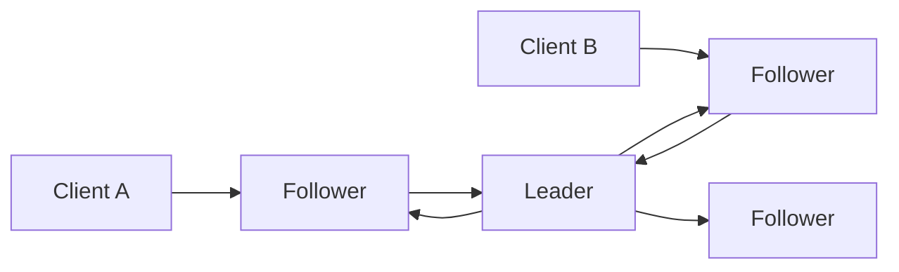
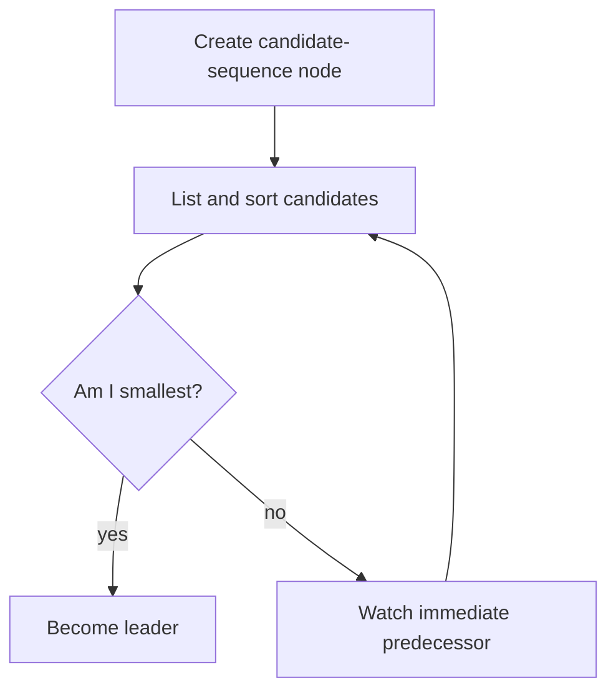

> [!summary]
> ZooKeeper is a replicated coordination kernel built from a small hierarchical namespace, ordered updates, ephemeral and sequential nodes, and one-shot watches. Applications compose those primitives into elections, locks, membership, barriers, and configuration — using **recipes**, not a giant built-in API.

Map: [[Upskill/SysDes/HLD/Distributed Systems|Distributed Systems]]
Connections: [[Upskill/SysDes/HLD/Distributed Systems Papers/Google Chubby|Google Chubby]], [[Upskill/SysDes/HLD/Distributed Systems Papers/Apache Kafka Architecture|Apache Kafka Architecture]], [[Upskill/SysDes/HLD/Consistency Models|Consistency Models]]

- **Authors:** Patrick Hunt, Mahadev Konar, Flavio P. Junqueira, Benjamin Reed (Yahoo! Research)
- **Published:** USENIX ATC 2010 (USENIX Annual Technical Conference)

## Why ZooKeeper Exists

Distributed applications kept reimplementing coordination logic from scratch, and kept getting the recovery races subtly wrong. ZooKeeper avoids a large, specialized API for every use case; instead it offers a small set of ordered metadata operations and publishes **recipes** that compose them safely.

Its design targets read-heavy workloads:

- writes pass through leader-based atomic broadcast (ZAB);
- reads can be served locally by any ensemble member, without going through the write pipeline;
- a client always observes FIFO order for **its own** operations;
- write operations across the ensemble are linearizable;
- ordinary local reads can be *stale* — recipes use versions, ordering, and an explicit `sync` call where true freshness matters.

The paper calls the kernel "wait-free" because one client's slow or failed execution doesn't have to block another client's reads and asynchronous operations. Higher-level recipes can still choose to wait for a specific event — that's a recipe decision, not a kernel limitation.

## Data Model

ZooKeeper stores a tree of **znodes**:

```text
/payments
  /config
  /members
    /worker-a       <- ephemeral
    /worker-b       <- ephemeral
  /election
    /candidate-0000000041  <- ephemeral + sequential
    /candidate-0000000042
```

Each znode has a path, a small byte-array value, metadata, and a version number. ZooKeeper is coordination storage — not a document database and not a blob store.

**Important node modes:**

- **Persistent** — remains until explicitly deleted.
- **Ephemeral** — automatically removed when its creating session expires; cannot have children.
- **Sequential** — receives a monotonically increasing numeric suffix on creation.
- **Ephemeral + sequential** — ideal for elections and locks, because it combines an ownership lifetime *and* a global order in one primitive.

## Ensemble and Ordering



The leader orders all updates through **ZAB** (ZooKeeper Atomic Broadcast). An update succeeds once the required ensemble quorum has accepted it. Reads normally don't enter that write pipeline at all — which is exactly why read throughput scales well, and also why a connected follower can briefly return a slightly older value.

## Watches — Notifications, Not an Event Log

A client can register a watch while reading data, listing children, or checking existence. A relevant change produces one asynchronous notification.

Classic watches are strictly **one-shot**:

1. Read the state and register a watch, in the *same* ZooKeeper operation.
2. Receive a notification that something changed.
3. Read the state again and register the *next* watch.
4. Always compute from the current state you just re-read — never assume you observed every single intermediate change.

A watch is a prompt to re-read, not a durable event log. If your application needs every business event, use a real log like Kafka instead.

## Leader Election Recipe

Each candidate creates an ephemeral-sequential znode. The candidate with the smallest sequence number owns leadership. Every *other* candidate only watches its immediate predecessor — never the whole list — which avoids a "thundering herd" of clients all waking up simultaneously when the leader exits.



## Code Example — Real ZooKeeper Java API

```java
import static org.apache.zookeeper.ZooDefs.Ids.OPEN_ACL_UNSAFE;

import java.nio.charset.StandardCharsets;
import java.util.Collections;
import java.util.List;
import java.util.concurrent.CountDownLatch;
import org.apache.zookeeper.CreateMode;
import org.apache.zookeeper.Event.EventType;
import org.apache.zookeeper.ZooKeeper;

final class LeaderElection {
    private static final String ELECTION = "/payments/election";
    private final ZooKeeper zooKeeper;
    private final String candidatePath;

    LeaderElection(ZooKeeper zooKeeper, String instanceId) throws Exception {
        this.zooKeeper = zooKeeper;
        this.candidatePath = zooKeeper.create(
            ELECTION + "/candidate-",
            instanceId.getBytes(StandardCharsets.UTF_8),
            OPEN_ACL_UNSAFE,
            CreateMode.EPHEMERAL_SEQUENTIAL
        );
    }

    void awaitLeadership() throws Exception {
        String ownNode = candidatePath.substring(candidatePath.lastIndexOf('/') + 1);

        while (true) {
            List<String> candidates = zooKeeper.getChildren(ELECTION, false);
            Collections.sort(candidates); // fixed-width sequence suffixes sort correctly

            int ownIndex = candidates.indexOf(ownNode);
            if (ownIndex < 0) {
                throw new IllegalStateException("candidate disappeared; session may be lost");
            }
            if (ownIndex == 0) {
                return; // we are the leader
            }

            String predecessor = candidates.get(ownIndex - 1);
            String predecessorPath = ELECTION + "/" + predecessor;
            CountDownLatch deleted = new CountDownLatch(1);

            var stat = zooKeeper.exists(predecessorPath, event -> {
                if (event.getType() == EventType.NodeDeleted) {
                    deleted.countDown();
                }
            });

            // The predecessor may disappear between getChildren() and exists() --
            // if so, loop immediately instead of waiting on a latch that will never fire.
            if (stat != null) {
                deleted.await();
            }
        }
    }
}
```

The race between listing candidates and installing the watch is handled by immediately looping if `exists()` reports the predecessor is already gone.

**Also needed for production code:** session-expiration handling, authentication and ACLs, connection-state tracking, cancellation, and the ambiguous case where `create()` succeeded server-side but the response was lost. A mature recipe library like **Apache Curator** is almost always safer than maintaining this loop by hand.

## Code Example — Service Discovery via Ephemeral Nodes (Curator)

```java
CuratorFramework client = CuratorFrameworkFactory.newClient(
    "zk1:2181,zk2:2181,zk3:2181",
    new ExponentialBackoffRetry(1000, 3));
client.start();

String path = "/services/inventory-service/" + instanceId;
client.create()
      .creatingParentsIfNeeded()
      .withMode(CreateMode.EPHEMERAL) // disappears automatically if this process dies
      .forPath(path, instanceAddress.getBytes(StandardCharsets.UTF_8));

// Other services discover live instances by listing children -- no separate heartbeat needed
List<String> liveInstances = client.getChildren().forPath("/services/inventory-service");
```

## Configuration Pattern

For mutable configuration stored in ZooKeeper:

1. Read `/service/config` along with its version, and register a watch in the same call.
2. Validate and atomically replace the application's in-memory config.
3. On notification, re-read and install the next watch.
4. Write updates with an expected version, so two administrators can't silently overwrite each other.
5. Keep values small — store large configuration artifacts elsewhere and keep only a versioned pointer in ZooKeeper.

## Failure Semantics

| Scenario | What happens |
|---|---|
| Client process dies | Its ephemeral nodes disappear after session expiry — not necessarily at the exact crash instant |
| Network pauses | The client must stop acting as owner after session loss; protected resources need fencing |
| Leader server fails | The ensemble elects a new leader and continues, as long as a quorum remains |
| Watch fires | Only the *fact* of a relevant change is guaranteed — always re-read current state |
| Connection moves to a lagging server | Session ordering is preserved, but local read freshness should be considered explicitly |

## Paper vs. Modern ZooKeeper

The paper explains the service's core contract and its ZAB-backed design. Current ZooKeeper adds more APIs and operational features, but the classic ephemeral-sequential recipes and watch discipline described here remain foundational.

> Kafka historically used ZooKeeper for broker and metadata coordination. Modern Kafka uses **KRaft** instead — don't assume a current ZooKeeper dependency just because older Kafka material mentions one.

## What to Remember

1. ZooKeeper stores small coordination metadata in a replicated znode tree.
2. Linearizable writes and per-client FIFO ordering are stronger guarantees than ordinary local-read freshness.
3. Ephemeral nodes bind cluster membership to a client's session lifetime — no separate heartbeat protocol needed.
4. Sequential nodes provide the ordering that elections and locks are built from.
5. Watches are one-shot change notifications — always re-read and re-register after each one fires.

---

## References

- [ZooKeeper: Wait-free Coordination for Internet-scale Systems](https://www.usenix.org/events/usenix10/tech/full_papers/Hunt.pdf) - original USENIX ATC 2010 paper.
- [USENIX publication page](https://www.usenix.org/conference/usenix-atc-10/zookeeper-wait-free-coordination-internet-scale-systems) - metadata, slides, and presentation material.
- [Apache ZooKeeper Programmer's Guide](https://zookeeper.apache.org/doc/current/zookeeperProgrammers.html) - current official data model, sessions, watches, and consistency guarantees.
- [ZooKeeper Recipes and Solutions](https://zookeeper.apache.org/doc/current/recipes.html) - official election, lock, queue, and barrier recipes.
- [The 10 Engineering Papers Behind Netflix, Uber, Amazon and Google](https://freedium-mirror.cfd/https://medium.com/@kanishks772/the-10-engineering-papers-behind-netflix-uber-amazon-google-f9955004155a) - source article for this collection.
