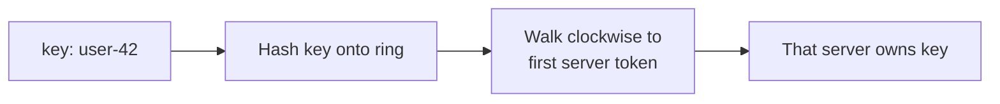

> [!summary]
> Consistent hashing maps both resources and keys into one shared hash space, so a membership change moves only a limited share of keys. The original paper also introduced **random trees** to spread demand for unexpectedly hot objects — a half of the paper most modern summaries skip.

Map: [[Upskill/SysDes/HLD/Distributed Systems|Distributed Systems]]
Connections: [[Upskill/SysDes/HLD/Distributed Systems Papers/Amazon Dynamo|Amazon Dynamo]], [[Upskill/SysDes/HLD/Distributed Systems Papers/Apache Cassandra|Apache Cassandra]], [[Upskill/SysDes/HLD/Consistent Hashing|Consistent Hashing]], [[Upskill/SysDes/HLD/Database Sharding|Database Sharding]]

- **Authors:** David Karger, Eric Lehman, Tom Leighton, Rina Panigrahy, Matthew Levine, Daniel Lewin
- **Published:** STOC 1997 (ACM Symposium on Theory of Computing)

## The Scaling Problem

A common naive partition rule is:

```text
server = hash(key) mod numberOfServers
```

This distributes keys fine while the server count `N` is fixed. But changing `N` to `N + 1` changes the divisor for *every* key's modulo result — so almost all keys pick a different server, and a cache goes cold all at once, right when the system is already under stress from a topology change.

Consistent hashing reframes the question from "which bucket *number*?" to "which *active server* owns this point in a stable hash space?"

## The Ring Model



Conceptually, the highest hash value wraps back to zero, forming a ring:

1. Hash every server identity to one or more points on the ring.
2. Hash each key into the same space.
3. Assign the key to the first server point found walking clockwise.
4. If a server **joins**, it takes only the interval immediately before its point.
5. If a server **leaves**, only its interval moves to its clockwise successor.

For a balanced ring of `N` servers, a single membership change moves roughly `1/N` of the keys — not nearly all of them, like naive modulo hashing.

## Virtual Nodes

One token per physical server can leave lopsided gaps — one server might end up owning a much bigger arc than another purely by chance. So in practice a server owns many **virtual nodes**, like `cache-a#0`, `cache-a#1`, `cache-a#2`, ... (often 100–200 per server).

Virtual nodes improve:

- **balance** — each machine gets many small intervals instead of one big one;
- **weighting** — a bigger machine can be given more tokens, so it naturally absorbs more traffic;
- **recovery** — when a node's ranges move, they're spread across many peers instead of dumped on one.

They aren't magic, though — token count, key distribution, replication placement, and per-key traffic still determine the *real* load a server sees.

## Java Implementation

This uses SHA-256 for stable hashes and `TreeMap.ceilingEntry()` for the clockwise lookup.

```java
import java.nio.ByteBuffer;
import java.nio.charset.StandardCharsets;
import java.security.MessageDigest;
import java.security.NoSuchAlgorithmException;
import java.util.ArrayList;
import java.util.List;
import java.util.NavigableMap;
import java.util.TreeMap;

final class HashRing {
    private final NavigableMap<Long, String> ring = new TreeMap<>();
    private final int virtualNodes;

    HashRing(int virtualNodes) {
        if (virtualNodes < 1) {
            throw new IllegalArgumentException("virtualNodes must be positive");
        }
        this.virtualNodes = virtualNodes;
    }

    void addServer(String serverId) {
        for (int replica = 0; replica < virtualNodes; replica++) {
            ring.put(hash(serverId + "#" + replica), serverId);
        }
    }

    void removeServer(String serverId) {
        ring.entrySet().removeIf(entry -> entry.getValue().equals(serverId));
    }

    String ownerOf(String key) {
        if (ring.isEmpty()) {
            throw new IllegalStateException("ring has no servers");
        }
        var owner = ring.ceilingEntry(hash(key)); // first point clockwise
        return owner != null ? owner.getValue() : ring.firstEntry().getValue(); // wrap around
    }

    List<String> replicasFor(String key, int count) {
        if (count < 1 || count > distinctServerCount()) {
            throw new IllegalArgumentException("invalid replica count");
        }
        List<String> replicas = new ArrayList<>();
        long position = hash(key);

        for (String server : clockwiseValuesFrom(position)) {
            if (!replicas.contains(server)) {
                replicas.add(server);
            }
            if (replicas.size() == count) {
                return replicas;
            }
        }
        throw new IllegalStateException("not enough distinct servers");
    }

    private List<String> clockwiseValuesFrom(long position) {
        List<String> values = new ArrayList<>(ring.tailMap(position, true).values());
        values.addAll(ring.headMap(position, false).values());
        return values;
    }

    private long distinctServerCount() {
        return ring.values().stream().distinct().count();
    }

    private static long hash(String value) {
        try {
            byte[] digest = MessageDigest.getInstance("SHA-256")
                .digest(value.getBytes(StandardCharsets.UTF_8));
            return ByteBuffer.wrap(digest).getLong() & Long.MAX_VALUE;
        } catch (NoSuchAlgorithmException impossible) {
            throw new IllegalStateException("SHA-256 is unavailable", impossible);
        }
    }
}
```

Example usage — showing minimal disruption on scale-out:

```java
HashRing ring = new HashRing(128);
ring.addServer("cache-a");
ring.addServer("cache-b");
ring.addServer("cache-c");

String owner = ring.ownerOf("customer:42");
List<String> replicas = ring.replicasFor("customer:42", 2);

ring.addServer("cache-d");
// Only keys that fall in cache-d's newly claimed intervals should move --
// "customer:42" most likely still resolves to the same owner as before.
```

Production implementations also need collision handling, persistent token assignment, membership consensus, bounded-load strategies, and safe data transfer. The ring only answers **where data should live** — it doesn't perform the movement or prove a node is healthy; that is a separate concern covered in [[Upskill/SysDes/HLD/Distributed Systems Papers/Gossip and Failure Detection|Gossip and Failure Detection]].

## The Often-Missed Half: Random Trees

The paper's original motivation was **web caching hot spots**, not database sharding. Consistent hashing decides the *normal* cache responsible for an object. A **random tree** adds extra paths through which demand for a suddenly popular object can be served and replicated, without changing the ring itself.

The idea, adaptively:

1. A request follows a randomly chosen leaf-to-root path through a tree of caches.
2. Caches along the path count demand for that object.
3. Once demand crosses a threshold, another cache along the path starts storing the object too.
4. Later requests get intercepted closer to the leaves, spreading load away from the one original owner.

Modern system-design discussions usually keep the ring and drop the random-tree half — but the original paper treats "stable placement" and "hot-object relief" as two halves of the same problem.

## Operational Questions Before You Adopt This

- Who owns membership changes, and how do you prevent two nodes from disagreeing about the current ring?
- How many virtual nodes does each capacity class get?
- How are replicas placed across racks/zones, not just adjacent ring tokens?
- What happens to reads/writes *while* a range is streaming to a joining node?
- Can one single hot key overwhelm its owner even when key *counts* look even?
- Are you measuring skew by bytes and CPU, or only by raw key count? (Key count alone can be very misleading.)

## What to Remember

1. Modulo hashing ties placement to the *current* server count — every resize reshuffles nearly everything.
2. Consistent hashing ties placement to stable points in a shared hash space.
3. Joining or leaving only changes *nearby* intervals, not the whole dataset.
4. Virtual nodes improve balance and let you weight machines by capacity.
5. The original paper's random trees address hot demand; the ring alone does not.

---

## References

- [Consistent Hashing and Random Trees: Distributed Caching Protocols for Relieving Hot Spots on the World Wide Web](https://doi.org/10.1145/258533.258660) - original STOC 1997 paper and publication record.
- [The 10 Engineering Papers Behind Netflix, Uber, Amazon and Google](https://freedium-mirror.cfd/https://medium.com/@kanishks772/the-10-engineering-papers-behind-netflix-uber-amazon-google-f9955004155a) - source article for this collection.
