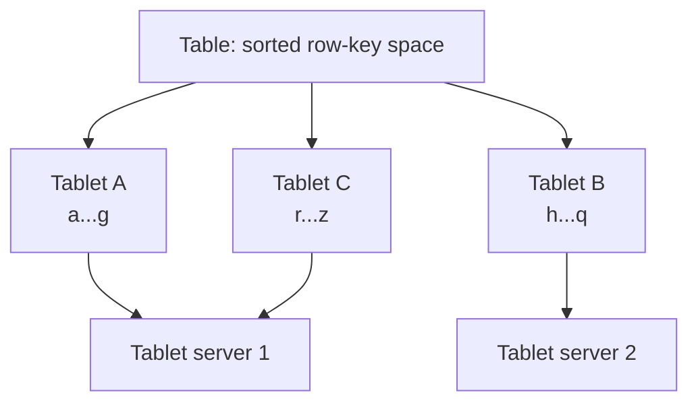
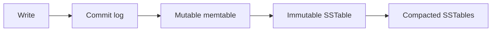

> [!summary]
> Bigtable is a sparse, distributed, versioned, sorted map. Its row-key order drives locality, tablets provide horizontal partitioning, and an LSM-style storage path turns random writes into sequential files plus background compaction.

Map: [[Upskill/SysDes/HLD/Distributed Systems|Distributed Systems]]
Connections: [[Upskill/SysDes/HLD/Distributed Systems Papers/Google Chubby|Google Chubby]], [[Upskill/SysDes/HLD/Distributed Systems Papers/Apache Cassandra|Apache Cassandra]], [[Upskill/SysDes/HLD/Big Data Systems|Big Data Systems]], [[Upskill/SysDes/HLD/Database Sharding|Database Sharding]]

- **Authors:** Fay Chang, Jeffrey Dean, Sanjay Ghemawat, Wilson C. Hsieh, Deborah A. Wallach, Mike Burrows, Tushar Chandra, Andrew Fikes, Robert E. Gruber
- **Published:** OSDI 2006 (USENIX Symposium on Operating Systems Design and Implementation)

## Why Bigtable Exists

Google needed one storage system for very different workloads: web indexing, Maps, crawling, personalization, analytics. A fixed relational schema and cross-row transactions mattered less than raw scale, predictable range access, and control over physical data locality.

Bigtable exposes a deliberately small model:

```text
(row key, column family:qualifier, timestamp) -> bytes
```

Think of it as a multidimensional **sorted map**, not a conventional SQL table.

## Data Model

- **Row key** — arbitrary bytes; rows are stored in lexicographic order. This is the single most important design decision in any Bigtable schema.
- **Column family** — a declared group that controls storage, compression, and access policy.
- **Qualifier** — a dynamic name inside a family; different rows can have completely different qualifiers (this is what makes it "sparse").
- **Timestamp** — identifies a cell version; a cell can retain several historical versions.
- **Value** — uninterpreted bytes; the application owns encoding and meaning.

Rows are the atomic consistency boundary in the original model — an operation touching several rows is **not** automatically one transaction just because the keys happen to be adjacent.

Example logical cells:

```text
row = tenant-a#user-42#09223370222309244757
profile:name@1710000000  -> "Maya"
event:type@1710000000    -> "invoice.paid"
event:amount@1710000000  -> "4999"
```

## Tablets and Serving



A **tablet** is a contiguous row-key range and the unit of distribution. As a table grows, tablets split; a master assigns tablets to tablet servers. Clients locate the responsible tablet server and talk to it directly, caching the location for later requests instead of asking the master every time.

Contiguous keys are powerful but dangerous: they make range scans efficient, but a poorly chosen key prefix (e.g., always starting with an incrementing timestamp) can send *all* new write traffic to one tablet — a "hot tablet."

## Write Path (LSM-style)



1. Append the mutation to a durable commit log (crash safety first).
2. Apply it to an in-memory sorted memtable.
3. When the memtable fills up, freeze it and flush it as an immutable SSTable file.
4. Reads merge a view of the current memtable plus the relevant SSTables.
5. Background compaction merges files to reduce read amplification and discards obsolete versions/deletion markers once it's safe to.

This design makes foreground writes mostly *sequential*, which is fast — but it shifts cost onto reads and compaction, so disk space, compaction backlog, and read amplification become the operational concerns to watch.

**Compaction levels used in the paper:**
- **Minor compaction** — turns one memtable into one SSTable, freeing memory.
- **Merging compaction** — combines a few SSTables to limit file count.
- **Major compaction** — rewrites *all* SSTables for a tablet, and is the only point where deleted data can finally be physically removed.

## Row-Key Design — the Real Schema Design Skill

The schema follows the access pattern. Suppose the query is "show one user's newest events for one day":

```java
import java.time.Instant;
import java.time.LocalDate;
import java.time.ZoneOffset;

final class EventRowKeys {
    private EventRowKeys() {}

    static String forEvent(String tenantId, String userId, Instant occurredAt) {
        LocalDate day = occurredAt.atZone(ZoneOffset.UTC).toLocalDate();
        long reverseTime = Long.MAX_VALUE - occurredAt.toEpochMilli(); // newest sorts first

        return String.format("%s#%s#%s#%019d", tenantId, userId, day, reverseTime);
    }

    static String dayPrefix(String tenantId, String userId, LocalDate day) {
        return "%s#%s#%s#".formatted(tenantId, userId, day);
    }
}
```

Why this shape works:

- tenant + user keep one user's events physically adjacent;
- the **day** bounds each range so it doesn't grow forever;
- **reversed time** places the newest events first inside that range;
- a simple prefix scan answers the intended query — no filtering the entire table.

If one user can produce extreme traffic, add a deterministic shard suffix and query several shard prefixes in parallel. Never start every key with a plain increasing timestamp — every new write would target the same end of the key space, creating a permanent hot tablet.

## Reading Data — Client Code

```java
// Using the HBase client, Bigtable's open-source cousin -- same conceptual API
Configuration conf = HBaseConfiguration.create();
try (Connection connection = ConnectionFactory.createConnection(conf);
     Table table = connection.getTable(TableName.valueOf("events"))) {

    // Point lookup
    Get get = new Get(Bytes.toBytes("tenant-a#user-42#2026-07-16#..."));
    get.addFamily(Bytes.toBytes("event"));
    Result result = table.get(get);
    byte[] type = result.getValue(Bytes.toBytes("event"), Bytes.toBytes("type"));

    // Range scan -- cheap because rows are stored sorted by key
    String prefix = EventRowKeys.dayPrefix("tenant-a", "user-42", LocalDate.parse("2026-07-16"));
    Scan scan = new Scan()
        .withStartRow(Bytes.toBytes(prefix))
        .withStopRow(Bytes.toBytes(prefix + "\uffff")); // exclusive upper bound
    try (ResultScanner scanner = table.getScanner(scan)) {
        for (Result row : scanner) {
            process(row);
        }
    }
}
```

In real code, use the client's binary prefix-range helper rather than a string sentinel like `\uffff` — the point above is conceptual: the row key turns the query into one bounded, ordered scan.

## Failure and Recovery

- The **commit log** protects acknowledged mutations before they reach durable SSTables.
- Immutable SSTables simplify recovery and safe sharing between processes.
- Tablet assignment can move away from an unavailable tablet server.
- A **master** coordinates metadata and tablet assignment, but sits outside the hot path for ordinary data requests.
- [[Upskill/SysDes/HLD/Distributed Systems Papers/Google Chubby|Google Chubby]] provides master election and failure coordination in the paper's architecture, which is why the two papers are best read together.

## Paper vs. Modern Bigtable

The 2006 paper describes Google's internal architecture. Cloud Bigtable (the managed product) keeps the same sorted wide-column model, but its APIs, replication options, and operational controls have evolved since. Use current product docs for exact limits; use the paper to understand *why* the data model and storage engine are shaped the way they are.

## When the Model Fits

**Good fit:** massive keyed datasets, predictable prefix/range queries, high write throughput, sparse columns, workloads that can design around row-level atomicity.

**Poor fit:** ad hoc joins, arbitrary secondary queries, relational constraints, multi-row transactions, or a schema whose access patterns you don't know yet.

## What to Remember

1. The map is sorted by row key — key design **is** your physical architecture.
2. Column families are coarse storage groups; qualifiers can be sparse and dynamic per row.
3. Tablets split the ordered row space into independently assignable ranges.
4. Commit log → memtable → SSTables → compaction is the storage engine, end to end.
5. Design keys from your queries first, and actively guard against hot prefixes.

---

## References

- [Bigtable: A Distributed Storage System for Structured Data](https://storage.googleapis.com/gweb-research2023-media/pubtools/4443.pdf) - original OSDI 2006 paper.
- [Google Research publication page](https://research.google/pubs/bigtable-a-distributed-storage-system-for-structured-data/) - abstract and metadata.
- [Cloud Bigtable schema design](https://docs.cloud.google.com/bigtable/docs/schema-design) - current official guidance on row keys, hot spots, and query-led design.
- [The 10 Engineering Papers Behind Netflix, Uber, Amazon and Google](https://freedium-mirror.cfd/https://medium.com/@kanishks772/the-10-engineering-papers-behind-netflix-uber-amazon-google-f9955004155a) - source article for this collection.
