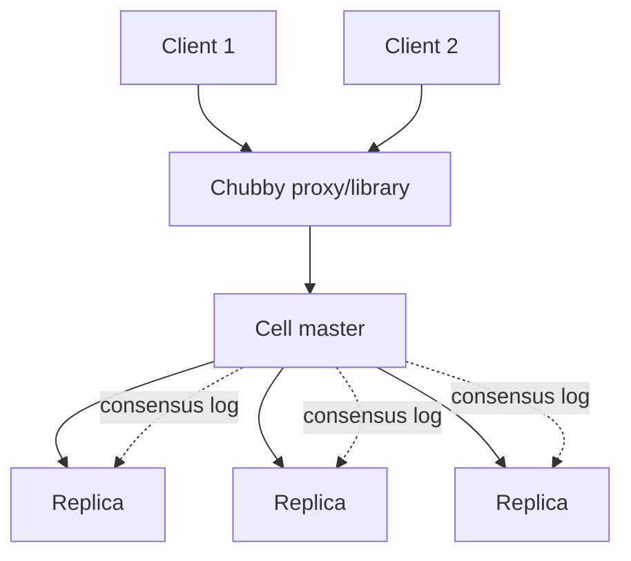

> [!summary]
> Chubby is a highly available service for coarse-grained locks and small, reliable metadata. Its important ideas are consensus-backed leadership, lease-based sessions, cache invalidation, and **sequencers** that fence stale lock holders.

Map: [[Upskill/SysDes/HLD/Distributed Systems|Distributed Systems]]

- **Author:** Mike Burrows (Google)
- **Published:** OSDI 2006 (USENIX Symposium on Operating Systems Design and Implementation)

## Why Chubby Exists

Large distributed applications repeatedly need a small amount of shared truth:

- Which process is the leader right now?
- What is the current configuration?
- Where is a particular service located?
- Who is currently allowed to modify a protected resource?

Implementing consensus (Paxos) correctly, inside every single application that needs an answer to these questions, is genuinely difficult and easy to get subtly wrong. Chubby's insight was to build consensus **once**, package it behind a simple file-system-like namespace, and let every other Google system use that instead of reimplementing Paxos themselves.

It deliberately favors availability and reliable semantics over raw throughput. Locks are expected to be held for seconds-to-minutes, and stored values are meant to be small — Chubby is coordination storage, not a general-purpose database.

## Cell Architecture



A Chubby **cell** is a small group of replicas (typically 5). Paxos-style consensus elects one master among them and replicates updates. Clients discover the current master and direct all operations to it; reads can be served straight from the master's cache-backed state.

The namespace looks like files and directories, but Chubby isn't a general file system — names hold small metadata and can *also* act as advisory locks at the same time.

## Sessions, Leases, and Keepalives

Clients maintain a session with the master via periodic keepalive requests. A **lease** gives the client a bounded window during which the master promises not to consider the session expired.

Keepalive replies can carry:

- lease extensions;
- handle invalidations;
- file-content invalidations;
- lock and session events.

If the client's connectivity to the master becomes uncertain, the client enters a state called **jeopardy** before finally declaring the session expired. This matters because the application must stop trusting any cached lock ownership the moment it can no longer renew its lease — not just after the lease has definitively expired.

## Advisory Locks — and Why They're Dangerous Alone

Chubby locks are **advisory**: the protected resource must actively cooperate. A rogue process that simply ignores the lock service can still call the protected database directly, unless the database itself validates an ownership token.

This creates a classic distributed-systems failure:

1. Worker A acquires a lease, then pauses for a long garbage-collection cycle.
2. The lease expires while A is paused; worker B acquires the lock.
3. Worker A resumes with stale in-memory state — believing it still owns the lock — and writes to the protected resource anyway.

A lease alone cannot stop step 3. The resource itself needs **fencing**.

## Sequencers and Fencing Tokens

Chubby can issue a **sequencer** containing the lock's identity, its mode, and a **generation** number. The generation increases every time lock ownership changes hands. A properly built protected service simply rejects any operation carrying an older generation than the one it has already seen.

```java
record LockGrant(String lockName, long generation) {}

final class ProtectedLedger {
    private long highestAcceptedGeneration = -1;

    synchronized void append(LockGrant grant, String expectedLockName, String entry) {
        if (!grant.lockName().equals(expectedLockName)) {
            throw new SecurityException("grant belongs to another lock");
        }
        if (grant.generation() < highestAcceptedGeneration) {
            throw new IllegalStateException("stale lock holder"); // this is the fence
        }
        highestAcceptedGeneration = grant.generation();
        persist(entry);
    }

    private void persist(String entry) {
        // Durable write owned by this service.
    }
}
```

If worker B has already written with generation `42`, delayed worker A's generation `41` write is rejected outright. Crucially, that comparison must happen **at the protected resource itself** (or a trusted gateway in front of it) — not only inside the worker that might be stale, since the whole point is that the stale worker can't be trusted to police itself.

For concurrent requests from the same still-valid holder, the generation may legitimately stay equal — application-level operation IDs and transactions still need to handle duplicate or reordered business operations on top of this.

## Leader Election Pattern

```java
while (!Thread.currentThread().isInterrupted()) {
    LockGrant grant = chubby.tryAcquire("/service/payments/leader");

    if (grant != null) {
        try {
            runLeaderLoop(grant); // every protected write carries grant.generation()
        } finally {
            chubby.release(grant);
        }
    } else {
        waitForLockChange("/service/payments/leader");
    }
}
```

This is conceptual — a real client must also handle session expiry, master failover, jeopardy, cache invalidation, and the ambiguous case where `acquire()` succeeded on the server but the response was lost in transit.

## Caching Without Losing Correctness

Coordination reads are frequent, so Chubby clients cache file data and metadata locally. Before changing cached data, the master sends invalidations to holders and waits until caches are confirmed invalid (or their lease has simply expired). The lease bounds how long an *unreachable* client can delay an update — which is what makes read-heavy coordination practical without letting a cache stay trusted forever.

## When Chubby Fits

**Good uses:** coarse leader election; small configuration values; service discovery and primary-location pointers; low-frequency schema/generation metadata; locks held for meaningful periods of time.

**Poor uses:** one lock per database row; high-throughput queues or counters; bulk files and application records; correctness that relies on a lease without fencing the protected resource; extremely short critical sections where the round trip to Chubby dominates the cost.

## Chubby vs. ZooKeeper

Both provide replicated coordination metadata. Chubby exposes locks more directly and manages client-side cache invalidation via leases. ZooKeeper instead exposes an ordered znode kernel plus watches, from which client libraries *build* elections, locks, barriers, and queues as recipes.

The useful design question isn't "which API looks more like a lock?" — it's "what is the minimum amount of strongly coordinated state my application actually needs?"

## What to Remember

1. Chubby stores small, important coordination state — not bulk application data.
2. Consensus (Paxos) chooses and maintains one authoritative cell master.
3. Sessions and leases bound how long a cached lock ownership belief can be trusted.
4. Advisory locking is only safe when the protected resource itself validates ownership.
5. A monotonic sequencer/generation fences off paused or partitioned former leaders.

## Related

- [[Upskill/SysDes/HLD/Distributed Systems Papers/Apache ZooKeeper|Apache ZooKeeper]] - an open-source coordination service influenced by Chubby.
- [[Upskill/SysDes/HLD/Distributed Systems Papers/Google Bigtable|Google Bigtable]] - relies on Chubby for master election.
- [[Upskill/SysDes/HLD/Consistency Models|Consistency Models]]

---

## References

- [The Chubby Lock Service for Loosely-Coupled Distributed Systems](https://storage.googleapis.com/gweb-research2023-media/pubtools/4444.pdf) - original OSDI 2006 paper.
- [Google Research publication page](https://research.google/pubs/the-chubby-lock-service-for-loosely-coupled-distributed-systems/) - abstract and metadata.
- [The 10 Engineering Papers Behind Netflix, Uber, Amazon and Google](https://freedium-mirror.cfd/https://medium.com/@kanishks772/the-10-engineering-papers-behind-netflix-uber-amazon-google-f9955004155a) - source article for this collection.
