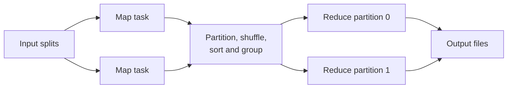

> [!summary]
> MapReduce turns a large batch job into deterministic map tasks, a key-based shuffle, and reduce tasks. The runtime — not the application — owns partitioning, placement, retries, data transfer, and straggler mitigation.

Map: [[Upskill/SysDes/HLD/Distributed Systems|Distributed Systems]]

- **Authors:** Jeffrey Dean, Sanjay Ghemawat (Google)
- **Published:** OSDI 2004 (USENIX Symposium on Operating Systems Design and Implementation)

## Why MapReduce Exists

Google engineers kept independently writing distributed programs to process crawled documents, logs, indexes, and graph data. The actual domain logic was usually simple; the hard part — scheduling thousands of tasks around inevitable machine failures — was rewritten, and often re-broken, every time.

MapReduce cleanly separates the two:

- **application code** says *how* to transform and aggregate records;
- the **runtime** splits the input, schedules work near the data, shuffles records between stages, retries failures, and commits output.

The abstraction is intentionally *narrower* than a general distributed-programming model — and that constraint is exactly what lets the runtime automate so much on the application's behalf.

## Execution Model



The abstract signatures:

```text
map(inputKey, inputValue) -> zero or more (intermediateKey, value)
reduce(intermediateKey, values) -> zero or more output records
```

The runtime groups every intermediate value sharing a key and routes that entire group to one reducer partition.

## Word Count — Making the Shuffle Visible

This small Python runner deliberately makes the usually-hidden shuffle phase explicit:

```python
from collections import Counter, defaultdict
from collections.abc import Iterable, Iterator

Pair = tuple[str, int]

def map_document(document: str) -> Iterator[Pair]:
    for raw_word in document.split():
        word = raw_word.strip(".,!?;:").lower()
        if word:
            yield word, 1

def combine_locally(pairs: Iterable[Pair]) -> list[Pair]:
    # A combiner reduces repeated keys before network transfer.
    counts = Counter()
    for word, count in pairs:
        counts[word] += count
    return list(counts.items())

def reduce_word(word: str, counts: Iterable[int]) -> Pair:
    return word, sum(counts)

def run_word_count(documents: list[str]) -> dict[str, int]:
    shuffled: dict[str, list[int]] = defaultdict(list)

    for document in documents:                   # independent map tasks
        local_pairs = combine_locally(map_document(document))
        for word, partial_count in local_pairs:   # shuffle by key
            shuffled[word].append(partial_count)

    return dict(reduce_word(word, counts) for word, counts in sorted(shuffled.items()))


result = run_word_count(["failures are normal", "retries make failures survivable"])
assert result["failures"] == 2
assert result["retries"] == 1
```

Real workers write partitioned intermediate files, and each reducer fetches its own partition from every map worker. This all-to-all transfer is the **shuffle** — often the most network- and disk-intensive phase of the whole job.

## The Same Job in Real Hadoop MapReduce (Java)

```java
public class WordCountMapper extends Mapper<LongWritable, Text, Text, IntWritable> {
    private static final IntWritable ONE = new IntWritable(1);
    private final Text word = new Text();

    @Override
    protected void map(LongWritable key, Text value, Context context)
            throws IOException, InterruptedException {
        for (String token : value.toString().split("\\s+")) {
            word.set(token);
            context.write(word, ONE);
        }
    }
}

public class WordCountReducer extends Reducer<Text, IntWritable, Text, IntWritable> {
    @Override
    protected void reduce(Text word, Iterable<IntWritable> counts, Context context)
            throws IOException, InterruptedException {
        int sum = 0;
        for (IntWritable count : counts) sum += count.get();
        context.write(word, new IntWritable(sum));
    }
}

// Optional combiner -- identical logic to the reducer, run locally before the shuffle
public class WordCountCombiner extends Reducer<Text, IntWritable, Text, IntWritable> {
    @Override
    protected void reduce(Text word, Iterable<IntWritable> counts, Context context)
            throws IOException, InterruptedException {
        int localSum = 0;
        for (IntWritable count : counts) localSum += count.get();
        context.write(word, new IntWritable(localSum));
    }
}
```

## Partitioning

The default reducer choice is conceptually:

```text
reducer = hash(intermediateKey) mod numberOfReducers
```

All equal keys must land on the same reducer. A custom partitioner can preserve a meaningful domain grouping — e.g., sending every URL from one host to the same output partition.

A poorly chosen key can create **skew**: one reducer receives most of the values and becomes the job's tail. Salting a hot key, doing a two-stage aggregation, or writing a smarter partition function can all spread that work back out.

## Combiners — Free Speedup, With a Catch

A combiner does local partial aggregation *before* the shuffle, cutting network transfer. It's only safe when arbitrary partial grouping still produces a valid input to the final reducer — operations like sum, min, max, and set union work because they're associative and commutative.

Naively averaging averages is a classic bug:

```text
average(average(1, 9), average(10)) = 7.5
average(1, 9, 10)                  = 6.67   <- different answer!
```

The fix: combine `(sum, count)` pairs through the pipeline, and only divide once, after the final reduce.

## Fault Tolerance Through Re-execution

If a worker fails, the master simply reschedules its incomplete tasks. Completed map output may also need regenerating, since intermediate files typically live on the failed worker's local disk.

This is why map and reduce functions should be:

- deterministic for the same input;
- free of uncoordinated external side effects;
- safe to execute more than once;
- explicit about any nondeterministic input, like the current time or random values.

Output is written to temporary files and atomically renamed (or otherwise committed), so a duplicate task attempt never publishes duplicate final output.

## Data Locality — "Move Computation to Data"

Moving terabytes over the network just to *begin* a computation is expensive. The scheduler prefers a worker on the machine that already holds an input replica, then a worker in the same rack, and only as a last resort a fully remote worker.

Modern disaggregated-storage systems sometimes rely on very fast networks and independent object storage instead — but locality remains an important cost lever whenever the network is the bottleneck.

## Stragglers and Backup Tasks

A single slow task near the end of a job can hold up an otherwise-complete run. Near completion, MapReduce launches a **backup copy** of unusually slow tasks — whichever attempt (original or backup) finishes first wins, and the other is simply discarded.

This is **speculative execution**, not ordinary failure retry — it spends a bit of extra compute specifically to cut tail latency caused by overloaded machines, slow disks, or transient interference.

## A Practical Job Checklist

Before writing a batch job, pin down:

- input record boundaries and split size;
- the intermediate key and its expected distribution;
- reducer count and partitioning function;
- whether a mathematically valid combiner actually exists;
- expected **shuffle** bytes, not just input bytes;
- what happens if a task executes twice;
- output commit semantics;
- counters/samples needed to debug malformed input and skew.

## Paper vs. Modern Processing

The paper describes Google's original internal batch runtime. Hadoop MapReduce popularized the same model outside Google. Spark, Flink, Beam, and modern SQL engines add richer execution graphs, in-memory data reuse across stages, streaming, and query optimization — but they still expose recognizable descendants of split, shuffle, partition, retry, and speculative execution.

MapReduce remains a useful mental model even when the production engine you're using is a full DAG rather than a single map-then-reduce stage.

## What to Remember

1. `map` transforms individual records; `reduce` receives every intermediate value sharing one key.
2. The shuffle is the distributed grouping step, and it often dominates job cost.
3. Partition-key distribution directly determines reducer balance.
4. Safe re-execution requires deterministic, side-effect-free task code.
5. Locality and backup tasks are the two mechanisms addressing network cost and long-tail workers respectively.

## Related

- [[Upskill/SysDes/HLD/Distributed Systems Papers/Hadoop Distributed File System|Hadoop Distributed File System]] - the open-source storage layer paired with Hadoop MapReduce.
- [[Upskill/SysDes/HLD/Distributed Systems Papers/Google Bigtable|Google Bigtable]] - structured, lower-latency access rather than batch scans.
- [[Upskill/SysDes/HLD/Big Data Systems|Big Data Systems]]
- [[Upskill/CS Topics/Concurrency-Parallelism-Async|Concurrency, Parallelism, and Async]]

---

## References

- [MapReduce: Simplified Data Processing on Large Clusters](https://storage.googleapis.com/gweb-research2023-media/pubtools/4449.pdf) - original OSDI 2004 paper.
- [Google Research publication page](https://research.google/pubs/mapreduce-simplified-data-processing-on-large-clusters/) - abstract and metadata.
- [The 10 Engineering Papers Behind Netflix, Uber, Amazon and Google](https://freedium-mirror.cfd/https://medium.com/@kanishks772/the-10-engineering-papers-behind-netflix-uber-amazon-google-f9955004155a) - source article for this collection.
