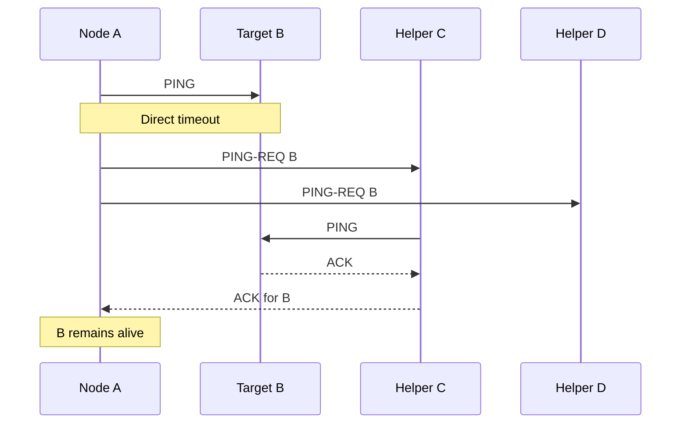

> [!summary]
> Gossip spreads bounded information through repeated random peer exchanges. For a *practical* membership and failure detector built on gossip, the SWIM protocol adds direct probes, indirect probes, suspicion states, and piggybacked membership updates.

Map: [[Upskill/SysDes/HLD/Distributed Systems|Distributed Systems]]
Connections: [[Upskill/SysDes/HLD/Distributed Systems Papers/Amazon Dynamo|Amazon Dynamo]], [[Upskill/SysDes/HLD/Distributed Systems Papers/Apache Cassandra|Apache Cassandra]], [[Upskill/SysDes/HLD/Consistency Models|Consistency Models]], [[Upskill/SysDes/HLD/Replication and Recovery|Replication and Recovery]]

- **Survey paper:** Ken Birman, *The Promise, and Limitations, of Gossip Protocols*
- **Failure detector:** Abhinandan Das, Indranil Gupta, Ashish Motivala, *SWIM: Scalable Weakly-consistent Infection-style Process Group Membership Protocol* (2002)

> [!important]
> The commonly linked Birman paper is a *survey* of the broader gossip family, not a concrete failure detector. This note pairs it with SWIM for a practical membership protocol. Cassandra uses gossip with a separate phi-accrual failure detector; SWIM-derived systems include Consul and Serf.

## Why Gossip Exists

If every node reports to one central monitor, that monitor becomes a scaling bottleneck and a single point of failure. If every node talks to every other node constantly, communication cost grows quadratically with cluster size. Gossip picks a middle path:

1. Each node periodically selects a **small** number of random peers.
2. Those peers exchange a bounded summary of what they know.
3. New information spreads over repeated rounds.
4. No single exchange needs to reach the whole cluster.

The result is decentralized and resilient, but **probabilistic** — information becomes eventually consistent across the cluster rather than instantly identical everywhere.

## Gossip Is a Family, Not One Algorithm

- **Dissemination / rumor spreading** — distribute an update or event, like "node X just joined."
- **Anti-entropy** — compare replica summaries (e.g., Merkle trees) and repair differences.
- **Aggregation** — estimate cluster-wide values like counts or averages without a central coordinator.

These techniques shine when *approximate* or *eventual* knowledge is acceptable. They are a poor substitute for consensus when every participant must agree on one ordered decision *right now* (for that, you want Paxos/Raft/ZAB — see the Chubby and ZooKeeper papers).

## Why Failure Detection Is Genuinely Hard

In an asynchronous network, "no response before timeout" could mean any of:

- the process actually crashed;
- a single packet was lost;
- the network is partitioned;
- the target (or the caller) is merely paused (GC, scheduling);
- the timeout itself was too aggressive.

A failure detector can only ever produce a **suspicion**, never proof. The system has to decide how much evidence and delay it needs before taking an irreversible action (like electing a new leader).

## SWIM Probe Flow



One SWIM-style round:

1. Pick a random target and send a direct `PING`.
2. If it replies, record it as alive.
3. If it times out, ask a few random **helper** nodes to send indirect `PING-REQ` probes on your behalf.
4. If every path fails, mark the target **suspect** — not immediately dead.
5. Piggyback the suspicion on ordinary probe traffic (no extra messages needed).
6. If the target refutes the suspicion with a higher-incarnation "I'm alive" message, believe it.
7. Only mark it dead once the suspicion window expires without a refutation.

Indirect probes matter because they test *different network paths* — this catches the case where the direct link between A and B is bad, even though B is perfectly healthy.

## Python Reference Model

```python
from dataclasses import dataclass
from enum import Enum
from random import Random
from time import monotonic
from typing import Callable


class Status(Enum):
    ALIVE = "alive"
    SUSPECT = "suspect"
    DEAD = "dead"


@dataclass
class Member:
    node_id: str
    incarnation: int = 0
    status: Status = Status.ALIVE
    suspect_until: float | None = None


class SwimDetector:
    def __init__(self, members: dict[str, Member], suspicion_seconds: float = 5.0):
        self.members = members
        self.suspicion_seconds = suspicion_seconds
        self.random = Random()

    def probe(
        self,
        target_id: str,
        direct_ping: Callable[[str], bool],
        indirect_ping: Callable[[str, str], bool],
    ) -> Status:
        target = self.members[target_id]

        if direct_ping(target_id):
            self.mark_alive(target_id, target.incarnation)
            return Status.ALIVE

        candidates = [node_id for node_id in self.members if node_id != target_id]
        helpers = self.random.sample(candidates, k=min(3, len(candidates)))

        if any(indirect_ping(helper, target_id) for helper in helpers):
            self.mark_alive(target_id, target.incarnation)
            return Status.ALIVE

        target.status = Status.SUSPECT
        target.suspect_until = monotonic() + self.suspicion_seconds
        return Status.SUSPECT

    def mark_alive(self, node_id: str, incarnation: int) -> None:
        member = self.members[node_id]
        if incarnation >= member.incarnation:
            member.incarnation = incarnation
            member.status = Status.ALIVE
            member.suspect_until = None

    def expire_suspicions(self) -> list[str]:
        now = monotonic()
        newly_dead = []
        for member in self.members.values():
            if member.status is Status.SUSPECT and member.suspect_until <= now:
                member.status = Status.DEAD
                newly_dead.append(member.node_id)
        return newly_dead
```

### The Same Shape in Java — Plain Dissemination Gossip

```java
import java.util.ArrayList;
import java.util.Collections;
import java.util.HashMap;
import java.util.List;
import java.util.Map;
import java.util.Random;
import java.util.concurrent.ConcurrentHashMap;
import java.util.concurrent.atomic.AtomicLong;

public class GossipNode {
    private final String nodeId;
    private final Map<String, MemberState> membership = new ConcurrentHashMap<>();
    private final Random random = new Random();
    private final AtomicLong heartbeat = new AtomicLong();

    public GossipNode(String nodeId) {
        this.nodeId = nodeId;
    }

    // Runs on a fixed-rate scheduler, e.g. every 1 second
    public void gossipRound(List<GossipNode> clusterPeers) {
        membership.merge(
            nodeId,
            new MemberState(heartbeat.incrementAndGet(), false),
            MemberState::preferNewer
        );

        List<GossipNode> targets = pickRandom(clusterPeers, 3);
        for (GossipNode peer : targets) {
            peer.receiveGossip(new HashMap<>(this.membership));
        }
    }

    public void receiveGossip(Map<String, MemberState> theirView) {
        theirView.forEach((otherId, theirState) ->
            membership.merge(otherId, theirState, MemberState::preferNewer));
    }

    private List<GossipNode> pickRandom(List<GossipNode> peers, int count) {
        List<GossipNode> shuffled = new ArrayList<>(peers);
        Collections.shuffle(shuffled, random);
        return shuffled.subList(0, Math.min(count, shuffled.size()));
    }
}

record MemberState(long heartbeatVersion, boolean suspected) {
    static MemberState preferNewer(MemberState a, MemberState b) {
        return a.heartbeatVersion() >= b.heartbeatVersion() ? a : b;
    }
}
```

A production implementation needs authenticated membership, message deduplication, bounded piggyback retransmission, adaptive suspicion timeouts, persisted incarnation numbers, graceful leave, cluster bootstrap, and careful clock handling — the above is a teaching model, not a drop-in library.

## Incarnation Numbers — Preventing a Zombie Rumor

Suppose peers spread "B is suspect, incarnation 7," but B was merely paused, not dead. B can increment its own incarnation and broadcast "B is alive, incarnation 8." The newer incarnation supersedes the older suspicion.

This stops an old rumor from repeatedly killing a healthy process after it rejoins. Crucially, a node should only ever refute suspicion **about itself** — otherwise different peers could invent competing histories for the same identity.

## Piggybacking Membership

SWIM cleanly separates two concerns:

- the **probe protocol** decides whether one target currently looks responsive;
- **membership updates** ride along on ordinary probe traffic and spread via gossip.

This keeps per-node probing work roughly stable as the cluster grows, while membership changes still disseminate in an expected `O(log N)` rounds under healthy network conditions.

## What Gossip Cannot Promise

- Instant agreement about cluster membership.
- Proof that a silent node has actually crashed.
- A globally ordered sequence of updates.
- Strong consistency for configuration or lock ownership.
- Predictable low tail-latency for every individual rumor.

Use consensus-backed coordination such as [[Upskill/SysDes/HLD/Distributed Systems Papers/Google Chubby|Chubby]] or [[Upskill/SysDes/HLD/Distributed Systems Papers/Apache ZooKeeper|ZooKeeper]] when you need one authoritative leader or configuration version. Use gossip when scalable, eventually convergent awareness is the actual requirement.

## Paper vs. Real Systems

- **Dynamo** uses gossip for membership and ownership information.
- **Cassandra** combines gossip with a **phi-accrual** failure detector (an adaptive-timeout refinement of the same idea).
- **Consul** and similar tools use SWIM-derived designs with heavy additional engineering around suspicion, encryption, and dissemination.

The transferable lesson, across all of them: **probe health, spread observations, delay irreversible judgment.**

## What to Remember

1. Gossip is repeated randomized exchange — a *family* of techniques, not one fixed algorithm.
2. Failure detectors report *suspicion*, because silence over a network is fundamentally ambiguous.
3. SWIM uses both direct and indirect probes to test multiple network paths before suspecting a node.
4. A suspect state plus incarnation numbers together prevent false eviction of a merely-slow node.
5. Gossip converges membership eventually; it does not replace consensus for decisions that need to be made *now*.

---

## References

- [The Promise, and Limitations, of Gossip Protocols](https://www.cs.cornell.edu/projects/Quicksilver/public_pdfs/2007PromiseAndLimitations.pdf) - Ken Birman's survey of gossip styles, strengths, and limitations.
- [SWIM: Scalable Weakly-consistent Infection-style Process Group Membership Protocol](https://research.cs.cornell.edu/projects/Quicksilver/public_pdfs/SWIM.pdf) - original scalable failure-detection and membership protocol.
- [Cassandra architecture: gossip and failure detection](https://cassandra.apache.org/doc/latest/cassandra/architecture/dynamo.html) - official example of gossip, phi accrual, and replica convergence.
- [The 10 Engineering Papers Behind Netflix, Uber, Amazon and Google](https://freedium-mirror.cfd/https://medium.com/@kanishks772/the-10-engineering-papers-behind-netflix-uber-amazon-google-f9955004155a) - source article for this collection.
