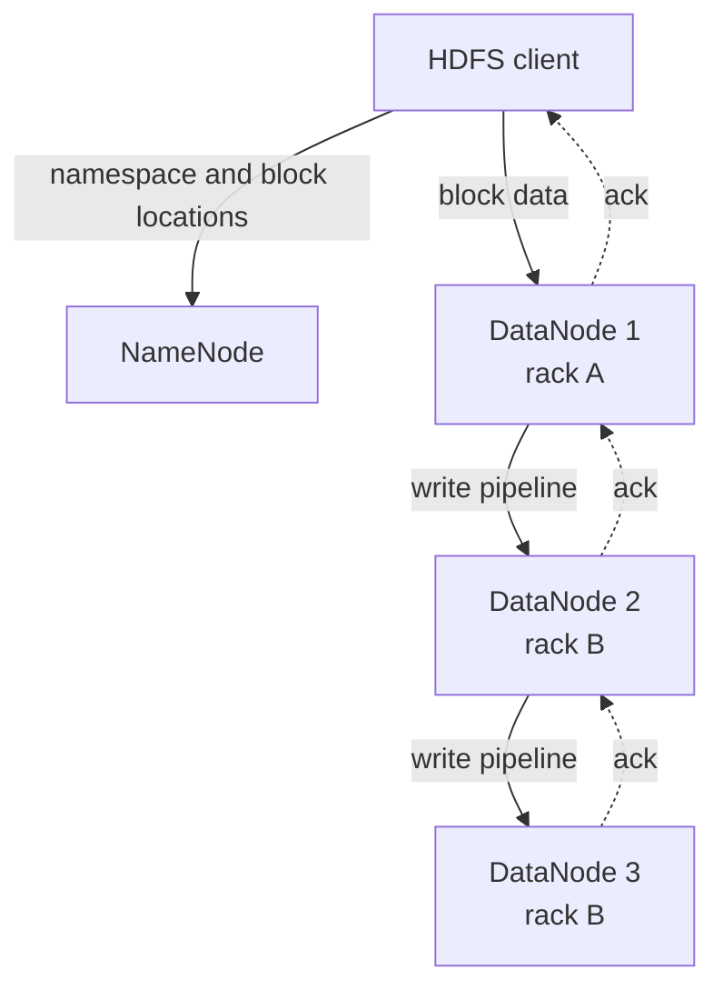

> [!summary]
> HDFS stores very large files as replicated blocks spread across DataNodes, while a single NameNode owns all filesystem metadata. Clients ask the NameNode *where* blocks live, then stream data directly to or from the DataNodes — the actual bytes never flow through the NameNode.

Map: [[Upskill/SysDes/HLD/Distributed Systems|Distributed Systems]]
Connections: [[Upskill/SysDes/HLD/Distributed Systems Papers/Google MapReduce|Google MapReduce]], [[Upskill/SysDes/HLD/Big Data Systems|Big Data Systems]], [[Upskill/SysDes/HLD/Blob Storage and CDN|Blob Storage and CDN]], [[Upskill/SysDes/HLD/Replication and Recovery|Replication and Recovery]]

- **Authors:** Konstantin Shvachko, Hairong Kuang, Sanjay Radia, Robert Chansler (Yahoo!)
- **Published:** MSST 2010 (IEEE 26th Symposium on Mass Storage Systems and Technologies)

## Why HDFS Exists

Hadoop needed a file system built for batch processing on clusters where disks, servers, and entire racks fail routinely — not as a rare edge case, but as the expected steady state. HDFS optimizes hard for one specific workload:

- files are large;
- access is primarily streaming, not random;
- writes are append-oriented, with one active writer at a time;
- throughput matters far more than millisecond latency;
- computation often runs *near* a data replica, not on a separate machine;
- commodity hardware failure is a given, not an exception.

These choices make HDFS excellent for huge datasets and genuinely awkward for millions of tiny files or low-latency random updates.

## Architecture



The two server roles are deliberately very different:

- **NameNode** — owns the namespace, permissions, file-to-block mapping, replica placement decisions, and recovery decisions. Metadata only, kept in memory for speed.
- **DataNode** — owns the local block bytes, checksums, block creation/deletion, and replication streaming.

File data **never** flows through the NameNode. This keeps the metadata service out of the high-volume data path — but NameNode metadata capacity and availability remain the central architectural concerns of the whole system.

## Blocks and Replicas

A file is split into large, configurable blocks. Large blocks reduce the number of metadata entries the NameNode has to track and let clients stream long, sequential ranges efficiently. The original paper describes a **64 MiB** default; later Hadoop deployments commonly use 128 MiB or larger. Block size is a *configuration choice*, not a hard-coded HDFS constant.

Each block has a replication factor, commonly **3**. Rack-aware placement balances three competing goals:

- surviving a whole-machine or whole-rack failure;
- limiting cross-rack write traffic (which is typically more expensive/slower);
- keeping a nearby replica available for local reads and co-located compute.

The NameNode uses DataNode **heartbeats** to detect liveness and periodic **block reports** to learn exactly which blocks each DataNode currently stores.

## Read Path

1. The client asks the NameNode for the file's block locations.
2. The NameNode returns replica locations ordered by network proximity to the client.
3. The client streams bytes **directly** from the closest suitable DataNode.
4. For the next block, it may connect to a different DataNode entirely.
5. If a replica fails or a checksum doesn't match, the client falls back to another replica and reports the bad copy for repair.

The NameNode stays responsible for metadata but is never consulted per-packet during the actual data transfer.

## Write Pipeline

1. The client asks the NameNode to create the file.
2. The NameNode validates the path, records metadata, and selects a replica pipeline for the first block.
3. The client sends packetized data to DataNode 1.
4. DataNode 1 stores its copy and forwards each packet to DataNode 2, which forwards to DataNode 3.
5. Checksums protect each data chunk in transit.
6. Acknowledgements travel back through the pipeline in reverse.
7. Once a block fills up, the client requests targets for the next block.
8. Closing the file finalizes its metadata on the NameNode.

The pipeline design avoids the client independently sending three full copies itself — DataNodes receive and forward concurrently instead.

## Working With HDFS — CLI

```bash
# Create a destination directory
hdfs dfs -mkdir -p /data/events/2026-07-16

# Copy a local file into HDFS
hdfs dfs -put events.jsonl /data/events/2026-07-16/

# Inspect files and stream one back to standard output
hdfs dfs -ls -h /data/events/2026-07-16
hdfs dfs -cat /data/events/2026-07-16/events.jsonl

# Inspect block health, replication, and physical locations
hdfs fsck /data/events/2026-07-16/events.jsonl -files -blocks -locations
```

For large output, prefer `-tail`, `-get`, or a real processing job instead of piping an entire file through a terminal.

## Working With HDFS — Java API

```java
Configuration conf = new Configuration();
conf.set("fs.defaultFS", "hdfs://namenode:9000");
FileSystem fs = FileSystem.get(conf);

// Write -- gets split into the configured large blocks and replicated automatically
Path outputPath = new Path("/data/events/2026-07-16.log");
try (FSDataOutputStream out = fs.create(outputPath, (short) 3)) { // replication factor 3
    out.write(eventBytes);
}

// Read
try (FSDataInputStream in = fs.open(outputPath)) {
    byte[] buffer = new byte[4096];
    int bytesRead;
    while ((bytesRead = in.read(buffer)) != -1) {
        process(buffer, bytesRead);
    }
}

// Inspect block locations -- useful for reasoning about data locality
BlockLocation[] locations = fs.getFileBlockLocations(outputPath, 0, fs.getFileStatus(outputPath).getLen());
for (BlockLocation block : locations) {
    System.out.println("Block hosts: " + String.join(", ", block.getHosts()));
}
```

## Why Tiny Files Hurt

Every file and every block consumes NameNode metadata, even if the file itself is only a few bytes. A huge count of tiny files causes:

- excessive namespace memory usage on the NameNode;
- many separate open and block-location RPCs;
- short transfers that never get to benefit from streaming throughput;
- too many mapper/reader setup operations in downstream jobs.

The standard fix: compact small events into larger container files — Parquet, Avro, or sequence files — partitioned at a size that suits your processing engine.

## Failure and Recovery

| Scenario | What happens |
|---|---|
| DataNode misses heartbeats | NameNode marks it unavailable and schedules its under-replicated blocks elsewhere |
| Replica is corrupt | Checksums reveal the mismatch; another replica serves the read and the bad copy gets replaced |
| Rack fails | Rack-aware replica placement keeps blocks available, assuming placement and replication were sufficient |
| Client fails mid-write | Lease recovery lets another process (or the system) recover the file's last block |
| NameNode fails | Early architecture had one NameNode (single point of failure); modern HDFS supports active/standby HA via shared edit-log JournalNodes |

> Replication protects **availability**. It is not the same as a **backup** — accidental deletion, bad application output, or compromised credentials can affect every live replica simultaneously. Snapshots and true external backups cover a different class of failure.

## NameNode Metadata

The NameNode keeps the active namespace in memory for speed, and persists namespace checkpoints plus an edit log to disk. On startup, DataNode block reports reconstruct the full block-to-storage mapping. **Safe mode** delays ordinary replication decisions until enough DataNodes have reported sufficient replicas — this avoids mistaking merely-not-yet-reported blocks for genuinely lost ones and triggering unnecessary re-replication.

## HDFS + MapReduce

HDFS and Hadoop MapReduce were designed together, hand in glove:

- HDFS exposes input block locations to the scheduler.
- The scheduler places map tasks on or near those replicas.
- Map tasks write shuffle files to local disk.
- Reducers write large final output files back to HDFS.

This is the concrete, working version of "move computation to the data" described in [[Upskill/SysDes/HLD/Distributed Systems Papers/Google MapReduce|Google MapReduce]].

## Paper vs. Modern HDFS

The 2010 paper documents the architecture and production experience of early HDFS, including the single-NameNode limitation. Current Hadoop adds NameNode HA, federation, erasure coding, snapshots, and many operational tools — but the client/NameNode/DataNode separation and large-block streaming model described here remain the core mental model to reason from.

## When HDFS Fits

**Good fit:** large files, high-throughput scans, data-local batch processing, clusters already running the Hadoop ecosystem.

**Poor fit (as a default):** tiny objects, interactive low-latency APIs, arbitrary in-place writes, general POSIX filesystem semantics, or data that fits more naturally in managed object storage.

## What to Remember

1. The NameNode owns metadata; DataNodes own the actual block bytes.
2. Clients transfer data **directly** with DataNodes — the NameNode is never in the data path.
3. Large blocks and replication are the two pillars optimizing for streaming throughput and failure recovery.
4. Writes flow through a DataNode pipeline, with acknowledgements traveling back in reverse.
5. Tiny files and unbounded NameNode metadata growth are the classic HDFS anti-pattern to design against.

---

## References

- [The Hadoop Distributed File System](https://flint.cs.yale.edu/cs422/readings/papers/shvachko10hdfs.pdf) - original MSST 2010 paper.
- [Apache Hadoop HDFS User Guide](https://hadoop.apache.org/docs/current/hadoop-project-dist/hadoop-hdfs/HdfsUserGuide.html) - current official user and architecture entry point.
- [HDFS Architecture Guide](https://hadoop.apache.org/docs/stable1/hdfs_design.html) - official explanation of blocks, replication, heartbeats, block reports, and the write pipeline.
- [The 10 Engineering Papers Behind Netflix, Uber, Amazon and Google](https://freedium-mirror.cfd/https://medium.com/@kanishks772/the-10-engineering-papers-behind-netflix-uber-amazon-google-f9955004155a) - source article for this collection.
