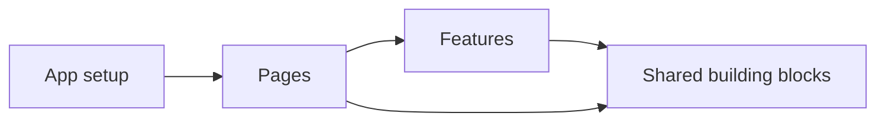

> [!summary]
> Frontend architecture scales when features have clear ownership, dependencies move in predictable directions, and state and side effects stay close to the code that needs them.

Map: [[Upskill/WebDev/Web Development|Web Development]]

> [!important]
> Frontend scalability is not only about traffic. It is the ability to add developers, features, and integrations without making every change slower or riskier.

## The Failure Pattern

Frontend code becomes difficult to change when UI, business rules, requests, state, and data conversion accumulate inside the same components. Features then import each other's internals, `shared/` becomes a miscellaneous drawer, and every new convention creates another architecture inside the same application.

The goal is not the perfect folder tree. The goal is to make ownership and dependency rules obvious.

## 1. Organize Around Features

Keep code that changes for the same business reason together. A feature may contain its UI, state, requests, data mapping, and tests without exposing every internal file.

```text
src/
  app/                 routing, providers, global setup
  pages/               route-level composition
  features/
    checkout/
      api/              requests and transport mapping
      model/            state and business rules
      ui/               feature components
      index.ts          small public API
  shared/               domain-neutral building blocks
```

This is a starting shape, not a law. A small application may need only `app`, `features`, and `shared`.

## 2. Give Each Feature a Boundary

Other areas should import a feature through its public entry point, not reach into its internal folders.

```ts
// Good: consumers depend on the feature contract.
import { CheckoutPanel } from "@/features/checkout";

// Fragile: consumers now depend on an internal file layout.
import { CheckoutPanel } from "@/features/checkout/ui/CheckoutPanel";
```

A good boundary exposes only what callers need. It lets the feature reorganize its internal API, state, or components without forcing unrelated files to change.

## 3. Keep Dependencies Predictable

Higher-level code composes lower-level code. Lower-level modules should not know about the pages or features that consume them.



Useful rules:

- Pages compose features; features do not import pages.
- Features do not import another feature's internal files.
- Shared code does not import business features.
- Third-party response types stop at an API adapter or mapper.
- Cross-feature workflows belong in a higher-level composition layer.

## 4. Local State by Default

Place state at the narrowest level that owns it.

- A dropdown's open state belongs in the dropdown.
- A multi-step checkout draft belongs in the checkout feature.
- Remote server data belongs in the data-fetching cache or feature data layer.
- Truly application-wide concerns such as the current session may belong in global state.

```tsx
function FiltersButton() {
  const [isOpen, setIsOpen] = useState(false);

  return (
    <Popover open={isOpen} onOpenChange={setIsOpen}>
      <Filters />
    </Popover>
  );
}
```

Moving this state to a global store would add indirection without adding useful sharing. React also recommends avoiding contradictory, redundant, and duplicated state because those shapes create impossible combinations.

## 5. Keep Components Focused

A route component may orchestrate a use case, but a single component should not fetch data, normalize transport objects, implement business rules, update global state, and render a large tree.

```tsx
function ProfilePage({ userId }: { userId: string }) {
  const profile = useProfile(userId);

  if (profile.isLoading) return <ProfileSkeleton />;
  if (profile.error) return <ProfileError error={profile.error} />;

  return <ProfileView profile={profile.data} />;
}
```

Here the hook owns data coordination, the page owns the screen-level states, and `ProfileView` owns presentation. Split by responsibility and reason to change, not by an arbitrary component size.

## 6. Keep `shared/` Boring

Shared code should be domain-neutral and stable: buttons, date formatting, HTTP primitives, logging helpers, and other foundations. `OrderSummary`, `RenewSubscription`, or `InvoiceRules` carry business meaning and should remain inside their features or domains.

Promote code to `shared/` only when its stable reusable responsibility is clear. Similar-looking code is not always the same abstraction.

## 7. Treat Performance as Feedback

Build measurement points early, but optimize demonstrated bottlenecks rather than wrapping every component in memoization.

- Split large bundles at route or feature boundaries.
- Start independent requests together and avoid [[Upskill/WebDev/Frontend/Request Waterfalls|Request Waterfalls]].
- Profile rendering before adding `memo`, `useMemo`, or `useCallback`.
- Keep large global subscriptions narrow so unrelated updates do not rerender the whole application.
- Track bundle size and important user journeys as the application grows.

## 8. Evolve Deliberately

Architecture should change when a real constraint appears, not whenever a new library or folder convention becomes popular.

- Write down the allowed dependency direction.
- Use one state strategy for each kind of state.
- Migrate incrementally, feature by feature.
- Enforce important import boundaries with lint rules when the team grows.
- Keep architectural refactors separate from feature behavior when practical.

## Review Checklist

- Which feature owns this behavior?
- Is the component rendering, deciding, or coordinating too many things?
- Is state stored at the narrowest useful scope?
- Does an import cross a feature's public boundary?
- Is code in `shared/` genuinely domain-neutral?
- Can a vendor or API response change without spreading through the UI?
- Is the performance work based on a measurement?
- Does this change follow the architecture already used nearby?

## Related

- [[Upskill/SysDes/LLD/Clean Code Patterns|Clean Code Patterns]]
- [[Upskill/SysDes/LLD/SOLID Principles|SOLID Principles]]
- [[Upskill/WebDev/Frontend/React|React]]
- [[Upskill/WebDev/Frontend/Redux|Redux]]
- [[Upskill/WebDev/Frontend/Request Waterfalls|Request Waterfalls]]

#frontend-architecture

---

## References

- [React: Choosing the State Structure](https://react.dev/learn/choosing-the-state-structure) - Keeping state minimal, consistent, and free of impossible combinations.
- [React: You Might Not Need an Effect](https://react.dev/learn/you-might-not-need-an-effect) - Separating rendering calculations, user events, and external synchronization.
- [Redux Style Guide](https://redux.js.org/style-guide/) - Deciding which state is truly global and which should remain local.
